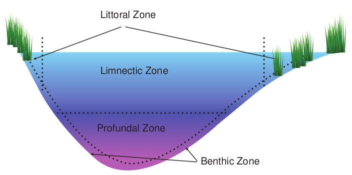
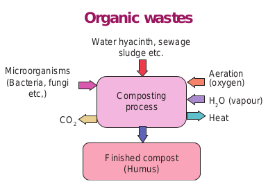
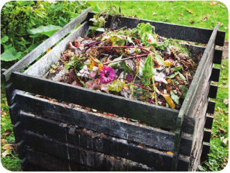

  

**Chapter** 9 **Environmental Microbiology Chapter Outline**

**9.1** Interrelationship with other Fields **9.2** Air Microbiology **9.3** Microbiology of Water **9.4** Water Pollution and Microbial

Contamination **9.5** Sewage Treatment **9.6** Recycling of Treated Sewage **9.7** Composting

**9.8** Biogas Production

Environmental Microbiology is the field of science that examines the relationship between microorganisms and their

fro ice tha pro

After studying this chapter the student will be able,

_• To gain knowledge of various layers of atmosphere and micro fauna of air._

_• To understand air pollution and air borne diseases._

_• To learn water borne diseases and water treatment procedures._

_• To know Eutrophication. • To know composting techniques. • To gain knowledge of biogas_

_production._

**Learning Objectives**  

biotic and abiotic environments. Microorganisms in the environment are diverse in origin and ubiquitous. Environmental Microbiology involves the study of the applied effects of microorganisms on the environment and on human activity, health and welfare.

It was in the 1970s that a new area of Microbiology emerged and developed into the field of Environmental Microbiology. The initial focus was on water quality pathogens in the environment in the context of public health safety. The developing field of environmental microbiology expanded to several other areas of applied research. These include microbial interactions with chemical pollutants in the environment and the use of microorganisms for resource production and resource recovery.

Microorganisms are found in every corner of the earth m miles below the surface to boiling hot springs to Antartic . Every ecosystem on earth contains microorganisms y occupy unique niches based on their specific metabolic perties.

  

Chemical pollutants in soil and ground water have pronounced effects on human population. The cost of cleanup or remediation of the contaminated sites is too high. The overall objective of this chapter is to define the important microbes involved in environmental microbiology, the nature of the different possible environments in which the microbes are situated, the methodologies used to monitor the microbes and their activities and finally the possible effects of the microbes on human activities.

**Occupation infection**

**Industrial Microbiology**

**Soil Microbiology**

**Biotechnology**

**Aeromicrobiology**

**Hazardo Bioreme**

**Environ Microb**

Modern environmental microbiology has a much wider scope. There are many different fields which recognises the problems in various fileds of Environmental Microbiology. It includes  

## Interrelationship with other Fields

Since environmental microorganisms affect so many aspects of life and are easily transported between environments, the field of Environmental Microbiology interfaces with a number of subspecialities. It includes soil, aquatic, aeromicrobiology, as well as bioremediation, Water quality, Occupational health, Infection control, Food safety and Industrial Microbiology.

**al health/ control**

**Diagnostic Microbiology**

**Water Quality**

**Aquatic Microbiology**

**Food safety**

**us waste diation**

**mental iology**

discovery and identification of new microbes and their products that may have practical application for protection of environment and human health and commercial applications.

|------|------|------|

|------|------|

|------|------|------|

|------|------|

  

## Air Microbiology

Earth’s environment is endowed with atmosphere, hydrosphere, lithosphere and biosphere. In the 1930s, **F.C. Meier** coined the term “Aerobiology”. Air is a natural resource and is fundamental to human life as it makes breathing possible. Its universal presence and requirement for the survival of human beings make air an important environmental factor. Air contains significant number of microorganisms. It also acts as a medium for the transmission of microorganisms including bacteria, viruses, fungi, yeast and protozoa. Air borne transmission is one of the important modes for the transmission of infectious diseases. Aeromicrobiology is the study of air borne microorganisms.

Miquel (1883) and Carnally & colleagues (1887) carried out the most systematic studies in airborne microorganisms.

**Infobits**

### Layers of Atmosphere

Earth’s atmosphere is divided into five major layers (Figure 9.1) they are: • Exosphere : 700 to 10,000 km • Thermosphere : 80 to 700 km • Mesosphere : 50 to 80 km • Stratosphere : 12 to 50 km • Troposphere : 0 to 12 km

The air in the troposphere, the layer close to the earth is constantly in motion and the temperature decreases with increasing altitude, reaching a low of -57°C at the apex of this region.  

Microorganisms are frequently found in the lower portion of the troposphere, where they are dispersed by the air currents. Most of the microbes present in the troposphere are either spore formers or microbes that are easily dispersed in air. The stratosphere has a temperature range of -80°C to -10°C. The temperature in the stratosphere can reach a maximum of several thousand degrees. Microorganisms are not found in the upper regions of the atmosphere because of the temperature extremes, scarcity of available oxygen, absence of nutrients and moisture, and low atmospheric pressure. The relatively low humidity in the atmosphere (especially during daylight hours) and UV rays from the sun, limit the types and number of microorganisms that are able to survive in this part of the biosphere.

Thermosphere

Mesosphere >700 km Stratosphere

Troposphere80–700 km

50–80 km 12–50 km

0–12 km

Exosphere

### Composition of Air

The air in our atmosphere is composed of different gaseous molecules. The most common gases are nitrogen (78%), CO2 (0.034%) oxygen (21%) argon (1%) and other molecules in trace level are present in the atmosphere.

  

**Table 9.1:** Composition of Air

**Gas Symbol Content** Nitrogen Oxygen Argon Carbon

dioxide Neon Helium Krypton Sulphur

dioxide Methane Hydrogen Nitrogen

oxide Xenon Ozone Nitrogen

dioxide Iodine

N2

O2

Ar CO2

Ne He Kr

SO2

CH4

H2

N2O

Xe O3

NO2

I2

78.084% 20.947% 0.934% 0.033%

18.20 ppm 5.20 ppm 1.10 ppm 1.00 ppm

2.00 ppm 0.50 ppm 0.50 ppm

0.09 ppm 0.07 ppm 0.02 ppm

0.01 ppm

### Microflora of Air

Human beings and animals are continuously inhaling the microbes present in the air that cause various infectious diseases. Most of the respiratory tract infections are acquired by inhaling the air pathogen. The microflora of air is studied under two categories such as indoor and outdoor microflora.

**Indoor microflora** The air found inside the closed environment (building/ room) is referred as indoor air and the microbes present in this region is called indoor microflora.

Example: _Staphylococcus, Bacillus, Penicillium_.

99.99%  

**Outdoor Microflora** The air in the exterior environment is called outdoor air and the microbes that reside there are called outdoor microflora.

Example: _Bacillus, Aspergillus_.

### Sources of Microorganisms in Air

Air is not a natural environment for microorganisms as it doesn’t contain enough moisture and nutrients to support their growth and reproduction. Soil microorganisms when disturbed by the blow of wind, gets liberated into air and remain suspended there for a long period.

Man-made actions like digging, ploughing the soil may also release soil borne microbes into the air. Microorganisms found in water may also enter air by wind action or tidal action in the form of droplets or aerosols. Air currents may bring the microorganism from plant or animal surfaces into air.

Commensal as well as pathogenic flora of the human beings may enter the air by activities like coughing, sneezing, talking and laughing. The microorganisms are discharged out in different forms of particles which are grouped on the basis of their relative size and moisture content. These are aerosols, droplets, droplet nuclei and infectious dust.

**Aerosols** An aerosols are mixture of small liquid or solid particles dispresed in air. Aerosols can be natural or anthropogenic. Example: Dust and smoke.

**Droplets** Droplets are formed by sneezing, coughing and talking which consists of saliva and

| Gas |Symbol |C ontent |
|------|------|------|------|
| NitrogenOxygen ArgonCarbondioxideNeonHeliumKr yptonSulphurdioxideMethane HydrogenNitrogenoxideXenon Ozone NitrogendioxideIodine |NOArCO22NeHe2KrSOCHH 2N O4Xe2O2NOI 322 |78.084%20.947%0.934%0.033%18.20 ppm5.20 ppm1.10 ppm1.00 ppm2.00 ppm0.50 ppm0.50 ppm0.09 ppm0.07 ppm0.02 ppm0.01 ppm |99.99% |

  

mucus (Figure 9.2). Droplets are relatively large, about 10µm or more in size, and they tend to settle rapidly in still air. When inhaled these droplets are trapped on the moist surfaces of the respiratory tract. Thus, the droplets containing pathogenic microorganisms may be a source of infectious disease.

**Droplet nuclei** Small droplets in a warm, dry atmosphere tend to evaporate rapidly and become

**Table 9.2:** Important airborne human diseas

**Human Diseases Bacterial diseases** Pulmonary tuberculosis Pneumonia Streptococcal respiratory infections **Fungal diseases** Aspergillosis Cryptococcosis **Viral diseases** Influenza Common cold **Protozoal diseases** Pneumocystosis  

droplet nuclei. These are 1-4µm in size. They can remain in air for longer period and transmit various infectious airborne diseases.

**Infectious Dust** Large aerosol droplets settle out rapidly from air on to various surfaces and get dried. Nasal and throat discharges from patient can also contaminate surfaces and become dry. Microorganisms can survive for longer period in dust. This creates a significant hazard, especially in hospital areas.

### Air Borne Diseases

Many microbial diseases are transmitted through the air (Table 9.2). The incidence of diseases caused by airborne transmission can be reduced by covering one’s nose and mouth during coughing or sneezing and by the use of face masks.

es and causative agents (pathogens)

**Pathogens**

_Mycobacterium tuberculosis Klebsiella pneumoniae Streptococcus pyogenes_

_Aspergillus fumigatus Cryptococcus neoformans_

_Influenza Virus Picorna Virus_

_Pneumocystis carinii_

| Huma n Dis e as es |Patho ge ns |
|------|------|
| Bac teri a l dis e as esPu lm onar y t ub er c u losi sPneum oni aSt rep to co cc a l r es pira tor y inf e c t io nsFun g a l dis e as esAsp er g i l losi sCr yp to co ccosi sVir a l dis e as esInf luenzaC omm on co ldProtoz o a l dis e as esPneum o c ys tosi s |Myc oba c te r ium  t ube rc ulo si sKlebsie lla  p ne umonia eStreptococcu s p yogen esAsper g illu s f umiga tu sCr y ptoco cc u s  ne ofor man sInf luenz a Vir u sPico r na  Vir u sPne um oc y sti s  c ar inii |
  

**Nosocomial infection** Hospital acquired infection are also known as a nosocomial infection. It is acquired in a hospital or other health care facility. Infection is spread to the susceptible patient in the clinical setting by various means, one of them being air droplets. The infection can originate from another infected patient, staff, or in some cases, the source of the infection cannot be determined. The most common pathogens that cause nosocomial infections are _Staphylococcus aureus, Pseudomonas aeruginosa,_ and _Escherichia coli._ One of the common nosocomial infections is respiratory pneumonia.

### Enumeration of Microorganisms in Air

There are several methods adopted to enumerate microorganisms in air. The most important methods are solid impingement and liquid impingement, filtration, sedimentation, centrifugation electrostatic precipitation. Many tools have been designed for the collection of air samples. Choosing an appropriate sampling device is based on many factors, such as availability, cost, volume of air to be sampled, sampling efficiency and the environmental conditions under which sampling will be conducted. One of the methods is Settle plate technique, where the microorganism carrying particles are allowed to settle onto the medium (solid impingement) for a given period of time and incubated at the optimum temperature (Figure 9.3). It works under the principle of gravitational force.  

Choice of the medium depends upon the kind of microorganisms to be enumerated. For bacterial isolation Nutrient agar and for fungal isolation Sabourauds dextrose agar (SDA) can be used.

During sampling it is better to keep the plates about one meter above the ground level. Then the plates are uncovered in the selected position for the required period of time. Immediately after exposure for the given period of time the plates are closed with the lids. Then the plates are incubated for 24 hrs at 37°C for aerobic bacteria and for 2 days at room temperature (27°C) for fungi. Enumeration results are expressed as numbers of viable organisms per unit area of air colony forming unit (CFU/ mm3).

Can microorganisms grow in clouds?

**HOTS**

  

## Microbiology of Water

Aquatic microbiology is the study of microorganisms and microbial communities in water environments. Aquatic environments occupy more than 70% of the earth’s surface. Water is essential for life and one of the most important natural resource. Thus, protection and preservation of aquatic environments are vital for the continuation of life. There are two kinds of water found on earth:

1\. Salt water (97%) 2. Fresh water (3%)

### Salt Water Microflora

Salt water contains a significant level of dissolved salts. The major bodies of salt water are oceans, seas, estuaries, and certain salt water lakes. Average salinity of ocean is 3.5 grams per 100 grams of water. The pH of salt water remains relatively constant at a range of 8.3 to 8.5. The temperature of seawater fluctuates depending on location, season and depth.

The hot, sulphur-rich, acidic is home to many Archaebacte from the different communiti water temperatures. _Pyrolobu_

is hyperthermophilic that can grow at the tem in thousands of miles deep in ocean near supe  

pool of yellow stone national park (U.S.) ria. The colour differences in the pool result

es of microbes that are able to thrive at extreme _s fumarii_ is a unique Archaebacteria, which perature of 113°C. Some Archaebacteria live rheated volcanic vents.

### Estuaries

A partly enclosed coastal body of water in which fresh water is mixed with seawater is called an estuary. As a consequence of this geographical location, estuaries are of salinity levels that range from less than 0.5 to 2.5 grams of dissolved salts per 100 grams of water at their mouths, where the water flows into the marine environment. Estuaries are ecologically sensitive environments and serve as habitats for fish and wide variety of marine life. There is an increasing concern about the quality of life in estuaries seriously damaged by human impact, including over development and pollution from industrial and waste water discharges. The bacterial population in estuaries consists of _Pseudomonas, Flavobacterium,_ and _Vibrio_, as well as enteric organisms. The quantities and types of organisms vary, and depend on the tide, rainfall, salinity, depth and temperature. Most of the bacteria found in water runoff come from animal and

  

fowl fecal matter deposited on the ground. Sometimes overflow from sewage systems contributes to these higher number of bacteria in the water. Microbiota are the primary producers in the aquatic ecosystem since they play a major role in food chain in water. Drifting microbial life of aquatic environment is called plankton. It is composed of phytoplankton and zooplankton. The bottom region of the water harbours largest number of microorganisms called as benthic microorganisms. Microorganisms have been found at all depths and at all latitudes within the ocean. Microorganisms are abundant near shore regions, where organic pollution as well as microbial pollution from the surrounding environment occurs.

Algae are common in these environ- ments. Because of their dependence on light as a source of energy, algae occur primarily in the upper strata of the oceans and seas. Although they constitute a vital part of the food chain in the marine environments, they also can be a nuisance and threat to other forms of life. Nutrient levels in such environments can significantly increase as a result of sewage plant discharges. Under such conditions algal blooms are common.

Fresh

Estuary

River

Bra

**Figure 9.4**  

Barophiles are bacteria that thrive deep in the ocean and live at pressures

of 400-700 atmosphere but die at 1 atmosphere. A strain MT-41, a bacteria is isolated from the marine sediments in the Mariana Trench near the Phillippines where the depth exceeds 10 kilometres. This strain has optimum growth at a pressure of 709 bar.

### Freshwater Microflora

The study of fresh water ecosystem is referred to as Limnology. The major bodies of fresh water are rivers, streams, swamps, marshes and lakes. The fresh water ecosystem is divided into lentic (still water) and lotic (flowing water) ecosystems. Lentic ecosystem is divided into zones based on light penetration and temperature. They are littoral, limnetic and profundal zones (Figure 9.5).

Most lakes are surrounded by rooted vegetation in a large littoral zone along the shore. Light penetrates the shallow littoral and open-water limnetic zone but is unable to reach the profundal zone in the deep portions of many lakes.

Salt

Ocean

ckish

**:** Estuary

  

As lake vegetation and animal life decompose, their organic matter provides a source of nutrients. Lakes that have very high concentrations of nutrients (particularly nitrogen and phosphorus) are termed eutrophic and have low oxygen concentrations because of extensive microbial decomposition of organic matter. In comparison, the lakes that receive small amounts of nutrients and are nutrient sparse are oligotrophic. Caulobacter grows well in oligotrophic lakes.

The common microorganisms found in fresh water are _Pseudomonas, Flavobacterium, Serratia, Chromobacterium, Micrococcus, Aeromonas_ and _Alcaligenes_.

As these waters reach the surface or inland bodies of water, they become contaminated with different types of microorganisms. Rivers flowing water (lotic) in close contact with the soil may contain large numbers of soil bacteria (Bacillus, _Actinomyces_ and _Streptomyces_), Fungi (_Polyphagus, Penicillium_ and _Aspergillus_), and algae (_Microcystis_ and _Nostoc_). These microorganisms frequently

Littoral Zone

Limnectic Zone

Profundal Zone

impart an earthy odour and taste to river water. Rivers also receive high concentration of bacteria and agricultural chemicals through surface runoff water from adjoining soil during heavy rains and irrigation. In many countries, rivers are heavily polluted with sewage bacteria, especially _Escherichia coli, Enterobacter fecalis, Proteus vulgaris_ and other intestinal bacteria.

**Red Tides** Red tide is a common name for a phenomenon known as an algal bloom which is caused by a species of Dinoflagellates (_Gymnodinium_) and the bloom takes on a red colour due to the presence of photosynthetic pigments with the production of toxins. The most conspicuous effects of red tides are associated with mortalities of marine species

**Infobits**

Benthic Zone

n zones of a freshwater lake

|------|------|

  

### Eutrophication

The addition of excess quantities of nutrients to aquatic ecosystems termed eutrophication often cause damage on the communities involved. Eutrophication is an enrichment of water by nutrients, especially nitrogen and phosphorus which are maintained at high levels that causes structural changes to the eco system. The sudden influx of abundant nutrients encourages a heavy surface growth of cyanobacteria and algae called a bloom (Figure 9.6). This heavy matt of biomass effectively shuts off the oxygen supply to the lakes below. The lack of oxygen greatly disturbs the ecological balance of the community. It causes massive death of strict aerobes. Fish invertebrates and anaerobic or facultative microbes will survive. **Effects of eutrophication** • Eutrophication can have serious, long

term effect. The most notable effect of eutrophication is **algal blooms**.

• When a bloom occurs, the river, lake or ocean becomes covered with algae, which is usually bright green.  

a polluted eutrophic lake

• Blue green algae like _Microcystis, Anabaena, Gonyaulax_ and other Dinoflagellates produce toxins which are poisonous to aquatic lives such as fish.

• Algal toxin may also contaminate the drinking water supply.

• Plankton blooms of green alga create problems of O2 supply in the water.

• Musty tastes and odors in drinking water are the other effects of Eutrophication.

• Excessive growth of aquatic weeds which impair fishing, swimming, boating, shell fish production.

• Irrigation canals may become clogged.

**Control measures** Five different methods have been suggested to control eutrophication they are, 1. Ecological management (control the

flow of nutrients into natural wastes) 2. Advanced treatments Example:

Phosphate removal is effected by precipitation with lime.

3\. Chemical algicides Example: copper sulphate

  

4\. Biological algicides Example: Bacteria 5. Destratification Example: physical/

mixing / forced aeration.

## Water Pollution and Microbial Contamination

Water is polluted by both natural as well as man-made activities. Polluted water is one which consists of undesirable substances rendering it unfit for drinking and domestic use.

**Sources of water pollutants** 1\. Industrial waste 2. Sewage waste 3. Mining activities 4. Marine dumping 5. Accidental oil leakage 6. Burning of fossil fuels 7. Chemical fertilizers and pesticides 8. Radio-active waste

The most prevalent biological contaminants in water are microbes, particularly bacteria and viruses. Most of the bacteria carried by storm runoff originate from animal fecal matter. Studies have shown that during storms, the water that drains off the land and into sewage systems also carries large quantity of bacteria and chemicals. The chemicals include pesticides applied to lawns, chemical wastes near industrial plants, and organic matter deposited o the ground by different sources. In addition to the chemical and biological contaminants, physical properties also affect the quality of biological life in water. Among these are pH, temperature, dissolved oxygen concentration and salinity.

**Potable Water** Clean water free from odour, disagreeable  

taste, harmful chemicals, turbidity and microorganisms is called potable water, which is safe to drink and can use for food preparation without risk of health problems.

**Biological oxygen demand (BOD)** Biological oxygen demand is one of the common parameter to monitor water quality and purity. BOD is the amount of dissolved oxygen needed by aerobic organisms to break down organic material present in a given water sample at certain temperature over a specific period of time. The amount of decomposable organic material in sewage is measured by the biochemical oxygen demand, or BOD. The BOD of the water sample is determined by aerating it, measuring the amount of oxygen in sample before incubation, placing the sample in a sealed container (BOD bottle) and incubating the container for five days at 20°C. During this five day period, microorganisms in the water grow and oxidize any organic materials in it. After incubation period, the BOD of the water can be determined by measuring the quantity of residual oxygen in the container. BOD of drinking water should be below 3ppm or 3mg/litre.

**Indicator Microorganisms** Indicator organism are frequently used to monitor bacterial contamination of water. These indicator organisms provide a representative index of the water contamination by pathogenic microbes. The indicator organisms generally used in water quality monitoring are those that are associated with the gastrointestinal tract

  

**Microbes at work:** One of the major environmental problem resulting from the activities related to t releases of petroleum products are of p Hydrocarbon components have been know and neurotoxic organic pollutants. Pet source of energy for industry and daily regularly during the exploration, produc petroleum and petroleum products. There bioremediation: (a) Bioaugmentation, in added to supplement the existing microb in which the growth of indigenous oil de nutrients or other growth-limiting cosubs and _Alcanivorax borkumens_ are the most and they work as primary degraders of sp is a potential source for clean and green en

The Marine Bacterium _Alcanivorax_ fe

Sea Water

Oil Droplet

1000 nanometres 1/1000 of a millimetre)

**Infob**  

s today is hydrocarbon contamination he Petrochemical Iindustry. Accidental articular concern in the environment. n to belong to the family of carcinogens

roleum-based products are the major life. Leaks and accidental spills occur tion, refining, transport, and storage of are the two main approaches to oil spill which known oil-degrading bacteria are ial population, and (b) Biostimulation, graders is stimulated by the addition of trates. Bacteria like _Pseudomonas putida_ active agents in petroleum degradation, illed oil in environment. Bioremediation vironment.

eds on oil

_Alcanivorax_ secretes natural emulsifiers which help to break up oil droplets

Biofim of _Alcanivorax_ at oil water interface

**its**

  

and fecal matter. The most common group of indicator organisms used in water quality monitoring are the coliforms, bacteria that are Gram negative, aerobic or facultative anaerobic, non-spore forming rods that ferment lactose with gas production within 48 hours at 35°C. Examples of coliforms are _Escherichia coli, Enterobacter aerogenes_ and _Klebsiella pneumonia_. Two analytical procedures were followed to check the presence of coliforms in water. They are Most Probable Number (MPN) and Membrane

**Table 9.3:** Waterborne diseases **Waterborne diseases Causative agent**

**Bacterial** Enteric fever _Salmonella typhi_

Cholera _Vibrio cholerae_ Leptospirosis (Weils Disease)

_Leptospira interrogan_

**Viral di** Infectious Hepatitis _Hepatitis A_

Gastroenteritis _Rotavirus_

Poliomyelitis _Coxsackie Virus_

**Protozoan** Giardiasis _Giardia lamblia_

Amoebiasis _Entamoeba histolytica_ Meningoencephalitis _Naegleria fowleri_

**Treamatod** Schistosomiasis _Schistosoma_

## Sewage Treatment

**Wastewater treatments** also called **sewage treatment** which removes the impurities from wastewater, or sewage, before  

Filteration (MF) technique. The number of coliforms per 100ml of water sample is estimated to find the quality of water and its suitability for drinking purposes. In addition to coliforms, coli phages, _Clostridia_ and human enteric viruses are also monitored in drinking water.

**Waterborne diseases** Waterborne diseases are posing a serious threat to health (Table 9.3).

**Symptoms diseases**

Fever & enlargement of spleen

Vomiting & watery diarrhea _s_ High fever, red eyes, muscle pain and

vomiting

**seases** Jaundice, vomiting & abdominal pain

Diarrhoea, vomiting

Head ache, neck stiffness, flaccid paralysis.

**diseases** Chronic diarrhoea, abdominal cramp, fatigue & weight loss Stomach pain, bloody stools, fever Ulceration, watery, bloody diarrhoea

**e disease** Drowsy, confusion, head ache, stiff neck, Diarrhoea

disposal into natural bodies of water. In broad terms, water is said to be polluted when it contains enough impurities to make it unfit for a particular use, such as

| Waterb orne dis e as es |C aus ativ e age nt |Sy mpt om s |
|------|------|------|
| Bac teri a l dis e as es |
| En ter ic f e ver |S almon ella  t y phi |Fe ver & en l argem en t o f s ple en |
| C holera |Vibr io  c hol e rae |Vomi t in g & wa ter y di ar rhe a |
| L ep tos pir osi s (Wei lsD is e as e ) |L eptospira i nter roga ns |Hig h f e ver, r e d e yes, m us cle p ain a ndvom it i ng |
| Vir a l dis e as es |
| In fec ti ous  He pa ti ti s |Hepatiti s  A |Jaun dice , v omi t in g & a b do min a l p ain |
| Ga st ro en ter it is |Rotav ir u s |Di ar rho e a, v omi t in g |
| Polio myeli t is |C oxs ackie Vir u s |He ad ac he, n e ck s t if f nes s, f l accidp ara lysi s. |
| Protoz o an dis e as es |
| Gi ard i as is |Gia rdia  la mblia |C hr onic di ar rho e a, a b do min a l cra mp,fa t igue & w eig ht los s |
| Am o eb i as is |Entamoeba  h i stol y tica |Stomac h p ain, b lo o dy s to ols, f e ver |
| Menin go en cep ha li t is |Naegl er ia f owler i |Ulcera t io n, wa ter y, b lo o dy di ar rho e a |
| Tre ama to d e dis e as e |
| S chi stos omi asi s |S chi sto s om a |Dr owsy, co nf usio n, h e ad ac he, s t if fne ck ,  D i ar rho e a |
  

List the major oil spills that occurred Is it practically possible to clean up these oi

**HOTS**

drinking, swimming, or fishing. Water pollution is caused primarily by the drainage of contaminated wastewater into surface water or groundwater. The wastewater treatment is a major element of water pollution control.

**Water (99.9%) Solid (0.1%)**

**Sewage**

**Inorganic (30%)**

**Organic (70%)**

**Goal of Sewage Treatment**

• To convert waste water into a reusable resources.  

recently in India and other countries. l spills using bacteria?

• To reduce the spread of pathogenic microorganisms

• To avoid health hazards while swimming and boating in the water.

• To prevent the development of objectionable colours and tastes The predominant method of wastewater

disposal in large cities and towns is discharge into a body of surface water. Suburban and rural areas rely more on subsurface disposal. In either case, wastewater must be purified or treated to some degree in order to protect both public health and water quality. Suspended particulates and biodegradable organics must be removed to varying extents. Pathogenic bacteria must be destroyed. It may also be necessary to remove nitrates, phosphates (plant nutrients) to neutralize or remove industrial wastes and toxic chemicals. The degree to which wastewater must be treated varies, depending on local environmental conditions and governmental standards.

  

**Sewage Treatment Methods**

Sewage treatment defined as an artificial process in which sewage is subjected to remove / alter its constituents to render it less offensive. There are three levels of wastewater treatment (Figure 9.7): primary, secondary, and tertiary (or advanced).

1\. Primary treatment 2. Secondary treatment 3. Tertiary / Final treatment

**Primary treatment** Primary treatment removes about 60 percent of total suspended solids and about 35 percent of BOD; dissolved impurities are not removed. It is the physical method which remove large floating and suspended solids from sewage water. Example: papers, leaves, bottles, rocks, pieces of metal or wood. These objects are removed by passing the sewage through screens (Figure 9.8) and grit chambers. The screened water is then sent to settling tanks or basin, where the suspended solids are allowed to settle as primary sludge. Materials such as oil or grease, which float on the surface,

Preliminary stage

Primary stage (A

Bar screens Grit

chamber Primary clarifier Aera

Primary sludge S

dig

Hospital influent (Raw sawage)

Secondary stage Tertiary stagectivated sludge process)

tion tank

Air Recycle sludge

Secondary clarifier

Tertiary filter

Disinfection zone

Final efluent for disposal

Sludge disposal

ludge estion tank

Secondary sludge

m of waste water treatment

are removed with a skimmer. The liquid wastewater remaining in the settling tank or basin is then ready for secondary treatment. The fluid from primary treatment is called primary effluent.

| AirRecycle sludge |
|------|------|------|------|

  

**Secondary treatment** Secondary treatment removes more than 85 percent of both suspended solids and BOD. Secondary treatment involves the oxidation of the primary effluent by microorganisms. The common types processes used are:

1\. Trickling filter process 2. Activated Sludge process 3. Oxidation ponds

A trickling filter consists of a large tank or basin filled with a bed of crushed stone, gravel, slag or other porous material. Sewage is sprayed in a fine mist over the rocks. As the sewage trickles through the bed, organic matter clings to the rocks, where it is digested by heterotrophic microorganisms (Figure 9.9). The microorganisms are contained within a biofilm which are produced by slime forming bacteria such as Zooglea and the organic matter, is oxidized to gases and inorganic products.

In the activated sludge process sewage is mixed with a slime forming bacteria (Zooglea) in a large aeration tank. As the mixture is aerated, large flocs, or clumps, form. These clumps contain not only the original slime forming bacteria but also large population of heterotrophs, which oxidize organic matter within these clumps. In this system wastewater is continuously pumped into the tank and the treated water is removed into a holding tank and the flocs are allowed to settle. The settled floc material is recycled into the tank as an inoculums to continue the process. The remaining floc is further treated or removed for burial or incineration.  

Oxidation ponds (Figure 9.10) are used in some communities to handle small loads of sewage. Small communities and isolated areas frequently use oxidation ponds for treatment of waste water. Sewage is channeled into an initial pond where the sludge settles out. The liquid portion of the sewage is then pumped into an adjacent series of ponds where aeration allows bacterial growth and degradation of organic matter. These secondary ponds often are seeded with algae which provide oxygen for the growth of aerobic, heterotrophic bacteria.

**Tertiary treatment** Tertiary processes can remove 99 percent of all the impurities from sewage. Although effluents from secondary treatment have a low BOD, they may contain eutrophication inducing salts (Phosphorus and Nitrogen compounds), organic and inorganic suspended solids, and poorly biodegradable organic materials. Advanced or tertiary treatment process are designed to reduce or eliminate these materials depends more on physical and chemical processes than biological processes. For phosphorus elimination the phosphates are converted to poorly soluble aluminum, calcium or iron compounds and removed by precipitation. Nitrogen in sewage effluent is removed primarily through nitrification by microorganisms. The extent of nitrification during tertiary treatment depends on adequate treatment plant designed and the proper removal of sludge so that these bacteria are grown under optimal conditions. Otherwise, large amounts of nitrogenous compounds may escape tertiary treatment and released in the effluent. Suspended

  

solids are eliminated in sewage through filtration or sedimentation. Poorly biodegradable substances can be removed by the use of specialized microorganisms capable of using them as substrates. Chlorine is frequently added to tertiary treated effluent to kill any remaining microorganism.

## Recycling of Treated Sewage

Water recycling is reusing treated wastewater for beneficial purposes such as agricultural and landscape irrigation, industrial processes, toilet flushing, and replenishing a ground water basin. Recycled water can satisfy most water demands, as long as it is adequately treated to ensure water quality appropriate for the use.

Sprinkler

Filter

Feed pipe

Filter support

Collection

The residue that accumulates in sewage treatment plants is called sludge.

**Sludge Digestion** Treatment of sewage sludge may include a combination of thickening, digestion, and dewatering processes. Among these digestion is mediated by microbes. Sludge digestion is a biological process in which organic solids are decomposed into stable substances. Digestion reduces the total mass of solids, destroys pathogens, and makes it easier to dewater or dry the sludge. Digested sludge is inoffensive, having the appearance and characteristics of a rich potting soil.

Most large sewage treatment plants use a two-stage digestion system in which organics are metabolized by bacteria anaerobically.

Air

Outlet

ter in sewage treatment

  

Sun Oxygen

Carbo dioxid

Aerobic

BacterAlgae O2

Anaerobic

Organics Organic acids, e

Sludge digestion may also take place aerobically The sludge is vigorously aerated in an open tank for about 20 days. Methane gas is not formed in this process.

**Septic tank** is a small scale an used in rural areas. It is simp operated. The septic tank c container into which sewag

short time. The organic matter in the sewa it is covered by a thin organic film that ex sediment digests the organic matter into The gases are then discharged through a v and overflow through an outlet pipe and a the water trickles through the soil any rem aerobic prokaryotes. Septic tank should no not all bacterial pathogens are removed by bottom of the septic tanks must be periodic  

n e

Wind action

zone

ia CO2 + NH3 + PO4

CO2 + NH3 + CH4

zone

tc.

idation Ponds

Digested sewage sludge is usually dewatered before disposal. Sludge-drying beds provide the simplest method of dewatering. A digested sludge slurry is spread on an open bed of sand and allowed

aerobic treatment process. It is commonly le, inexpensive and satisfactory if properly onsists of an underground sedimentation e from a home enter and is retained for a

ge settles to the bottom of the tank where cludes oxygen. Anaerobic bacteria in the simpler chemical compounds and gases. ent in the tank. Liquids in the tank rise re distribute in the surrounding soil. As aining organic matter is decomposed by t be located near water supplies because this treatment. Undigested solids in the ally removed.

|------|
| Sun |

  

to remain until dry. Drying takes place by a combination of evaporation and gravity drainage through the sand.

**Sludge Disposal**

The final destination of treated sewage sludge usually is the land. Dewatered sludge can be buried underground in a sanitary landfill. It also may be spread on agricultural land in order to make use of its value as a soil conditioner and fertilizer. Since sludge may contain toxic industrial chemicals, it is not spread on land where crops are grown for human consumption.

When a suitable site for land disposal is not available, as in urban areas, sludge may be incinerated. Incineration completely evaporates the moisture and converts the organic solids into inert ash. The ash must be disposed of, but the reduced volume makes disposal more economical. Air pollution control is a very important consideration when sewage sludge is incinerated. Appropriate air-cleaning devices such as scrubbers and filters must be used.

**Benefits of Sewage Treatment** • Water recycling has proven to be

effective and successful in creating a new and reliable water supply, while not compromising on public health.

• Water recycling can help us find ways to decrease the diversion of water from sensitive ecosystems

• Water users can supplement their demands by using recycled water.

• Decreases wastewater discharges • Reduces and prevents water pollution • Recycled water can be further used in

Thermal power plant (for cooling),  

Municipal use, Irrigation and Agricultural use.

## Composting

Compost is organic matter that has been decomposed and recycled as a fertilizer and soil amendment. It is a mass of rotted organic matter made from waste. Example: garbage, paper, sugarcane trash, paddy straw, aquatic weeds, other agricultural waste.

Composting is a natural process in which aerobic and anaerobic microorganisms decomposes organic matter into valuable manure called as compost. The primary objective of composting is to convert an unstable material into stable end product (Figure 9.11).

Microorganisms (Bacteria, fungi

etc,)

CO2

Finished compost (Humus)

Composting process

Heat

H2O (vapour)

Aeration (oxygen)

Water hyacinth, sewage sludge etc.

**Organic wastes**

**The humification of organic material occurs in three stages** 1\. **Mesophilic stage** - Mesophilic is the

initial stage of decomposition, lasting

There is a huge business opportunity in finding ways to use these waste dumps for productive purposes - energy, organic fertilizer. This requires methods of dealing with **old waste** that has been accumulating over the years as opposed to new/fresh waste.

**Infobits**

  

for about a week, during which sugars and other simple carbohydrates are rapidly metabolized. This is an exothermic process and may cause an increase in temperature by 40°C. Example: _Bacillus subtilis_

2\. **Thermophilic stage** - Thermophilic is the second stage, lasting for about two weeks, during which the temperature may rise to about 50 to 75°C. Such a drastic increase in temperature is accompanied by the decomposition of cellulose and other resistant materials. It is important that the material be thoroughly mixed and kept aerated during this stage. Example: _Bacillus stearothermophilus_

3\. **Curing stage** \- The temperature decreases during this final stage and the material being composted is recolonized by mesophillic organisms, which often produce plant-growth stimulating compounds.

The humification of organic material is characterized by an increase in concentration of humic acids approximately from 4 to 12 percent, and decreases during the composting process.

**What should you compost?** When selecting materials for your

compost pile avoid the following: • Wastes that attract pests • Diseased / insect ridden plants • Non-biodegradable things  

**Compost bed types** 1\. Pit method 2. Heap method

**Pit method** The compost pits dug in soil with dimension of 3.5m × 2.5m × 1.5m (L×B×H). The pits are filled layer by layer using green plants and animal excreta. The layering is repeated until the pit is filled. Finally a layer of mud is plastered on the top of the pit (Figure 9.12).

**Heap method** In regions with heavy rainfall, the compost may be prepared in heaps above the ground level and protected by a shed. The pile is made with dimension of 2m × 2m × 1.5m (L×B×H) (Figure 9.13).

  

**Indore method** This method was developed at Indore, India. In this method organic wastes are spread in the cattle shed to serve as bedding. Trenches are dug with dimension of 10ft × 6ft × 2ft.

Dry wastes with cattle dung and soil are added in ratio of 4: 2: 1 up to 2 inches layer in composting pit. A moisture level of about 40-50% is ideal for good composting. Odour and insect problems can be controlled by covering the piles with a layer of soil or wood chips.

The heap is left undisturbed for about 8 to 9 months. Turning the pile for every 15 days is important for coplete composting because pile needs a periodic influx of O2.

Plant residues, weeds, sugarcane leaves, grass, wood ashes, animal dung, and water urine soaked mud can also be used as raw materials for this type of composting.

**Bangalore method**

• This method was developed at Bangalore, India. It is recommended as a satisfactory method for disposal of town wastes and night soil.

• The compost pits dug in soil with dimension of 4.5m × 2.5m × 90cm

**Two types of microbes which h**

**Aerobes**

Example: _Bacillus subtilis_

which decompose organic matter matter in the presence of oxygen  

(L×B×H) • In the Bangalore method of composting,

dry waste material of 25cm thick is spread in a pit and a thick suspension of cow dung in water is sprinkled over for moistening.

• A thin layer of dry waste is laid over the moistened layer

• The pit is filled alternatively with dry layer of material and cow dung suspension till it rises 0.5m above the ground level and plastered with wet mud and left undisturbed for about 4-6 months or till required.

• This method saves labour cost because there is no need of turning & regular sprinkling of water.

**Benefits of compost**

• Compost improves the quality of soil hence called as a soil conditioner.

• Compost contains a variety of the basic nutrients required for healthy growth of the plant.

• Nitrogen, phosphorous, potassium and certain micronutrients _viz_, manganese, copper, iron and zinc are found in compost.

**elp in composting process are**

Example: _Clostridium thermocellum_

which decompose organic matter in the absence of oxygen

**Anaerobes**

  

**Role of microbes in vermicomposting:** Recycling organic wastes through Vermicultu an economically viable solution. Earthworm proliferate along with other microorganism biodegradation of wastes. Vermicomposting organic material through the interactions bet

Worms like to feed on slowly decomposin scraps. Worms produce castings that contain makes a great soil amendment. Worms efficient at breaking down food scraps and over half their body weight in organic matt day. Vermicasting, also called vermicompostin processing of organic wastes through earthw is a natural, odourless, aerobic process, much from traditional composting. Earthworm waste, then excrete casts – dark, odourless, n and organically rich, soil mud granules that excellent soil conditioner.

**Infob**

• The composted product is safe and easy to handle, and does not induce nitrogen deficiency in recipient plants by nitrogen stabilization in the compost.

• It suppresses disease infestation by partial sterilization and detoxifies pollutants.  

re Biotechnology (VBT) is being considered s are regarded as natural bioreactors which s and provide required conditions for the involves bio oxidation and stabilization of

ween earthworms and microorganisms. g organic materials like fruit and vegetable beneficial microbes and nutrients, which

are very can eat er every g, is the

orms . It different s ingest utrient-

make an

**its**

• Compost material is principally used for the reclamation of drastically disturbed. Example: mined soil, landscaping and agriculture.

• Compost finds unrestricted application in parks and gardens for ornamental plants, in land reclamation and highway beautification projects.

  

## Biogas Production

Worldwide energy consumption and demand are growing up since past 50 years. With the growth of population, demand for energy is also increasing leading to an uneven supply and distribution of resources. Therefore, the requirement of sustainable and eco friendly energy in India to satisfy the energy demand is inevitable. Along with the source of sustainable green energy, biogas production is an alternative way to produce clean energy through solid waste management.

Biogas is a type of renewable energy that can be produced from decomposition of animal and plant waste. It is composed of 50– 75% methane, 25–50% carbon dioxide, 0–10% nitrogen, 0–3% hydrogen sulphide, 0–1% hydrogen and traces of other gases. The term “anaerobic” suggests that the process occurs in the absence of free oxygen and produces CH4 through decomposition of waste in nature and reduces environmental pollution.

Biogas generating technology is a favorable dual purpose technology at present since used as fuel and fertiliser.

Inlet

SoilGobar

**FigFigure 9.14(a):** Biogas production schematic

diagram  

Leftover foods fruit & vegetable wastes and cow dung can be subjected to anaerobic digestion for energy production in a variety of ways.

**Production of Biogas** Biogas production is carried out in an airtight cylindrical tank called biogas digester Cow dung is mixed with equal volume of water and made into slurry and fed through the inlet of the biogas unit. The digestion proceeds at 37°C with sufficent amount of nitrogen and phosphorus. The production of biogas sets around 40-50 days, under anaerobic conditions. Production of biogas accomplished in 3 stages namely Hydrolysis, Acetogenesis and Methanogenesis

**Steps**

**Hydrolytic fermentative stage** In this step, several microbes secrete different enzymes, which cleave the complex macromolecules into simpler forms. Organisms that are active in a biogas process during the hydrolysis of polysaccharides include various bacterial groups such as _Bacillus_, _Clostridium_, _Cellulomonas_.

Compost tank

Gas tank

Soil

Cooking

Lighting

Out let Scum

\+ FertilizerManure

**ure 9.14(b):** Biogas Digester

  

**Acetogenic stage** Through various fermentation reactions, the products from hydrolysis are converted mainly into various organic acids (acetic acid, propionic acid, butyric acid, succinic acid, lactic acid), alcohols, ammonia (from amino acids), carbon dioxide and hydrogen. Facultative anaerobes and hydrogen producing bacteria Example: _Acetovibrio cellulosolvens, Bacteroid cellulosolvens_ are involved.

Particulate organic matter (carbohydrate, protein, lipid

Hydrolysis

Amino acid, sugar, alcohol, fatty acid

Acidogenesis

Intermediary products (volatile fatty acids, acetate, propionate, ethanol, lactate)

Acetogenesis

Acetate H2, CO2

Methanogenes (rate limiting step)

Hydrogenotrophic

Biogas (mainly methane)

Acetoclastic

**Methanogenic stage** In this step, obligate anaerobic methane producing bacteria produce Methane gas as the major end product along with Carbon dioxide, Hydrogen and traces of other gases. Methanogenesis has six major pathways, each converting a different substrate into Methane gas. The six major substrates used are Carbon dioxide, Formic acid, Acetic acid, Methanol, Methylamine, and Dimethyl sulphate. The methanogenic bacteria include _Methanococcus voltae_ and _Methanobacterium formicum_ (Figure 9.14 a, b).  

**Deenabandhu model** It is a biogas production model popular in India

which means “Friend of the helpless”

**Small scale biogas unit** The biogas production is carried out in an air tight cylindrical tank called biogas digester (Figure 9.15).

**Applications** 1\. Biogas used as fuel 2. Used to generate electricity 3. Biogas is used to run any type of heat

engine in order to generate electrical and mechanical power.

4\. Producing high quality fertilizer. 5. Reducing water and air pollution.

**Summary** Environmental microbiology is the field of science that examines the relationship between microorganism and their biotic and abiotic environments.

Identification of new microbes and their products have practical application on protecting the environment as well as human health. Areomicrobiology is the study of airborne microorganisms and is one of the important modes for the transmission of infectious diseases. The air in our atmosphere is composed of different gaseous molecules. The air present both interior and exterior of the environment is called indoor air and outdoor air. The microorganisms are discharged out in different forms which are grouped on the basis of their relative size and moisture content. They are aerosols, droplet, droplet nuclei and infectious dust. Hospital – acquired infection are also known

|------|------|

  

as nosocomial infection. Solid and liquid impingement, filtration, sedimentation, centrifugation, electrostatic, precipitation are used to enumerate microorganisms in air.

The Aquatic Microbiology is the study of microorgansims and microbial communities in the water environment. Eutrophication is an enrichment of water by nutrients, especially nitrogen and phosphorus, which makes the overgrowth of the “algal bloom”. Apart from microbes and chemicals, pH, temperature, dissolved oxygen concentration and salinity are the physical properties that affect the quality of biological life.

**BIO REME**  

BOD is the amount of dissolved oxygen needed by aerobic organisms to breakdown organic material present in a given water sample at certain temperature over a specific period of time. Indicator organisms are frequently used to monitor bacterial contamination of water.

Waste water treatment are called sewage treatment which removes the impurities from waste water and sewage. Trickling filter, activated sludge, oxidation ponds are generally used. Compost is a natural process in which aerobic and anaerobic microorganisms decomposes organic matter in to valuable manure called as compost.

**DIATION**

  

**Evalution**

**Multiple choice questions**

1\. In 1930, the term aerobiology was coined

by . a. F.C.Meier b. Miquel c. Carnelly and colleagues d. None of the above

2\. The gas molecules which are more in atmosphere. a. Nitrogen b. Oxygen c. Carbon dioxide d. Neon

3\. are water droplets containing several types of microorganisms released in to the air from the water sources. a. Droplet nuclei b. Infectious dust c. Droplet d. Aerosols

4\. Hospital acquired infections are otherwise called as a. Nosocomial infection b. Gastro intestinal infections c. Ocular infection d. All the above

6\. Is the amount of dissolved oxygen needed by aerobic organisms to breakdown organic materials? a. BOD b. COD c. DOB d. DOC

7\. is called as Indicator organisms a. _Escherichia coli_ b. _Staphylococcus aureus_ c. _Pseudomonas aeruginosa_ d. None of the above  

8\. In which process of treating sewage,99 percent of all the impurities from the sewage are removed. a. Primary treatment process b. Secondary treatment process c. Tertiary treatment process d. None of the above

9\. Primary treatment is a method a. Physical b. Chemical c. Biological d. All of the above

10\. Activated sludge process is an example for treatment a. Physical b. Chemical c. Biological d. Composting

11\. Chlorination is an example for treatment

a. Physical b. Chemical c. Biological d. None of the above

12\. is an open tank where algal forms are allowed to grow a. Trickling filter b. Oxidation pond c. Sludge digester d. None of the above

13\. Trickling filter is an example for treatment

a. Physical b. Chemical c. Biological d. None of the above

14\. Which one of the following is a good source for making compost? a. Plastic b. Aluminum foil c. Vegetable peel d. Polythene

15\. Algal boom in pond water is called a. Eutrophication b. Acclimatization c. Algalization d. Green manuring

  

16\. The most common toxic algal bloom among the following a. Euglena b. Microcystis c. Paramaecium d. Hydra

17\. Organism inhabiting the bottom sediment of aquatic environments constitute community a. Pelagic b. Benthic c. Abyssopelagic d. Episammon

18\. Study of flora and fauna of fresh water a. Ornithology b. Zoology c. Paleontology d. Limnology

19\. A partly enclosed coastal body of water in which river water is mixed with sea water a. Lake b. Estuary c. Creek d. Bay

20\. Chemical agent used for disinfecting water a. Glycols b. Chlorine c. Hydrogen peroxide d. None of the above

21\. The main component of natural gas is a. CO2 b. Carbon monoxide c. O2 d. Methane

22\. Biogas is a mixture of a. Methane, Nitrogen, Hydrogen b. Methane, Nitrogen, Oxygen c. O2, CO2, N2

d. None of these

**Student Activity**

1\. Set up a small scale anaerobic digester for a vegetable waste.

2\. Instruct the students to bring algal bloom 3. Visit nearby sewage treatment plant.  

23\. Which compost method is employed in the regions with heavy rainfall? a. Heap method b. Pit method c. Indore method d. Banglore method

**Answer the following** 1\. What are properties favour survival of

microorganisms in the atmosphere? 2. Define Nosocomial infections 3. What is droplet nuclei? 4. What is the purpose of bacteriological

analysis of water? 5. What is potable water? 6. What is sewage? 7. Define sludge. 8. Explain the sewage treatment

processes. 9. Is compost a fertilizer?

10\. Describe the process of composting? 11. What is Biogas? 12. What role can biogas play in supplying

our energy needs? 13. Draw the light penetration zones of a

fresh water lake. 14. What is Eutrophication? 15. Write a note on trickling filter. 16. Discuss the air borne diseases. 17. Write in detail about settle plate

technique. 18. Write in detail about biogas

production processes. 19. Discuss the Indore method of

composting in detail. 20. Discuss the sludge digestion methods. 21. Explain the benefits of waste water

treatment?

naerobic digestion using cow dung / fruits &

sample from their residential area.

