  

**Chapter** 13 **Immunology Chapter Outline**

**13.1** Historical Background **13.2** Organs of the Immune System **13.3** Cells of Immune System **13.4** Immunity **13.5** Antigens **13.6** Antibodies **13.7** Antigen– Antibody Reactions

After studying this chapter the student will be able,

_• To gain knowledge on the history of immunology and Know the Nobel prize winners in immunology._

_• To know the structure and functions of primary and secondary lymphoid organs._

_• To know the cells of immune system and understand the role of granulocytes, mast cells, macrophages, dendritic cells and lymphocytes._

_• To define immunity and Differentiate between innate immunity and acquired immunity._

**Learning Objectives**

of bar  

_• To understand the properties of antigen._

_• To describe the basic structure and function of immunoglobulin (antibodies)._

_• To explain the mechanism of antigen- antibody interactions and their applications in clinical laboratory._

Non specific immunity or Innate immunity has four types defense barriers namely anatomical barriers, chemical riers, phagocytic barriers and inflammatory barriers.

## Historical Background

Immunology is the study of immunity to diseases. Immunology began as a branch of Microbiology. Its origin is usually attributed to Edward Jenner who introduced variolation in 1796.

  

The success of vaccination enabled the World Health Organization to announce in 1979 that small pox had been eradicated. Late in 19th century Robert Koch proved that infectious diseases are caused by microorganisms. The discoveries of Koch

**Table 13.1:** Scientists and their contributions t

**Year Name of the Scientists**

1796 Edward Jenner

**Discovery of humoral and cellular immunity**

1890 Von Behring Kitasto (von earned the Nob in medicine in 1

1930’s Kabat

1883 Elie Metchnikof

1903 Sir Almoth Wrig

1996 Claman, Chaper Triplett  

stimulated the extension of Jenner’s strategy of vaccination to other diseases.

Pasteur used attenuated culture and called it vaccine (Latin vacca, cow) in honour of Edward Jenner. Table 13.1 and Figure 13.1 list and shows the scientist who contributed to the field of immunology.

_(Continued)_

o immunology

**Contributions to immunology**

Discovered that cowpox or vaccinia, induced protection against human small pox

and Behring el Prize 901)

Gave the first insights into the mechanism of immunity

Showed that gamma - globulin (now immunoglobulin) a fraction of serum exhibited the active component of immunity

f He observed that certain white blood cells, which he termed **phagocytes**, were able to ingest microorganisms and other foreign material

ht Reported that antibodies could aid in the process of phagocytosis. Wright called these antibodies ‘**opsonins**’

on and Discovered the presence and cooperation of B cells and T cells

| Year |Name of the Scientists |C ontributions to immunolog y |
|------|------|------|
| 1796 |Edward Jenner |Discovered  that  cowpox  or  vaccinia, induced p rotection a gainst h uman small pox |
| Discover y of humoral and cellular immunity |
| 1890 |Von B ehr in g a ndKit asto (v on B ehr in ge ar ne d t he N ob el P r izein m e dicin e in 1901) |Gave t he f irst in sights in to t he mechanism of immunity |
| 1930’s |Kabat |Showed t hat ga mma - g lobulin (n ow immunoglobulin) a fraction of serum exhibited t he ac tive co mponent o f immunity |
| 1883 |Elie Metchnikoff |He obser ved that certain white blood cells, w hich h e t ermed  phagoc ytes , were  able  to  ingest  microorganisms and other foreign material |
| 1903 |Sir Almoth Wright |Reported that antibodies could aid in the  process  of  phagocytosis.  Wright called these antibodies ‘opsonins ’ |
| 1996 |Claman, Chaperon and Triplett |Discovered t he p resence a nd cooperation of B cells and T cells |
  

**Year Name of the Scientists**

**Specificity of immune response**

Around 1900 Jules Bordet

Karl Landsteiner

**Molecular immunology**

1959 Porter

Edelman

1965 Putnam, Hirs and Craig

1979 Kung et al.

1982-83 Allison et a Haskins et al.

**Immunogenetics and Genetic Engineering**

1936 Gorer

1968 McDevitt and Ty

1974 Doherty and Zinkernagel

1978 Tonegawa et al.  

**Contributions to immunology**

Demonstrated that nonpathogenic substances, such as red blood cells from other species, could also serve as antigens

Showed that injecting an animal with almost any non-self, organic chemical could induce production of antibodies that would bind specifically to the chemical

Separated fragments of immunoglobulin

Heavy and light chains of antibodies were separated by him

chmann Discovered constant and variable regions of immunoglobulin

Described the first monoclonal antibody identifying a T cell subset

l and Isolated T cell receptor

Discovered the major histocompatibility antigens

an Showed that immune response genes were linked to the genes of the major histocompatibility complex (MHC)

Reported that recognition of antigen by T cells was restricted by MHC molecules

Demonstration of immunoglobulin gene rearrangement

| Year |Name of the Scientists |C ontributions to immunolog y |
|------|------|------|
| Specificity of immune response |
| Around 1900 |Jules B ordet |Demonstrated  that  nonpathogenic substances, s uch a s r ed b lood ce lls from o ther s pecies, co uld a lso s er ve as antigens |
| Karl Landsteiner |Showed t hat in jecting a n a nimal with a lmost a ny n on-self, o rganic chemical co uld in duce p roduction of a ntibodies t hat w ould b ind specifically to the chemical |
| Molecular immunolog y |
| 1959 |Porter |S ep ara te d f ra g men ts o fimm un og lo bu lin |
| Edelman |Heavy a nd lig ht c hains o f a ntibodies were separated by him |
| 1965 |Putnam,  Hirschmann and Craig |Discovered co nstant a nd va riable regions of immunoglobulin |
| 1979 |Kung et al. |Described t he f irst m onoclonal antibody identifying a T cell subset |
| 1982-83 |A l li s on et a l a ndHask in s et a l. |Isolated T cell receptor |
| Immunogenetics and Genetic Engineering |
| 1936 |Gorer |Discovered t he m ajor histocompatibility antigens |
| 1968 |McDevitt and Tyan |Showed t hat immune response genes were lin ked to t he genes of t he major histocompatibility complex (MHC) |
| 1974 |Doherty and Zinkernagel |Reported t hat r ecognition o f a ntigen by T ce lls wa s r estricted b y MH C molecules |
| 1978 |Tonegawa et al. |Demonstration  of  immunoglobulin gene rearrangement |
  

**Nobel Prizes for imm**

**Year Recipient Country 1908** Elie Metchnikoff

Paul Ehrlich

Russia

Germany

**1913** Charles Richet France

**1919** Jules Bordet Belgium

**1930** Karl Landsteiner United States

**1972** Rodney R. Porter

Gerald M. Edelman

Great Britain

United States

**1977** Rosalyn R. Yalow United States

**1980** George Snell

Jean Dausset

Baruj Benacerraf

United States

France

United States

**1984** Cesar Milstein

George E. Kohler

Britain

Germany

**1991** E. Donnall Thomas

Joseph Murray

United States

United States

**2002** Sydney Brenner

H. Robert Horvitz

J. E. Sulston

South Africa

United States

Great Britain

**2008** Harald zurHausen Françoise Barré- Sinoussi Luc Montagnier

Germany

France

France

**2011** Jules Hoff man

Bruce Beutler

Ralph Steinman

France

United States

United States

**Infob**  

**unologic research**

**Research** Role of phagocytosis (Metchnikoff) and antitoxins (Ehrlich) in immunity

Anaphylaxis

Complement-mediated bacteriolysis

Discovery of human blood groups

Chemical structure of antibodies

Development of radioimmunoassay

Major histocompatibility complex

Technological advances in the development of monoclonal antibodies

Transplantation immunology

Genetic regulation of organ development and cell death (apoptosis)

Role of HPV in causing cervical cancer (Hausen) and the discovery of HIV (Barré-Sinoussi and Montagnier)

Discovery of activating principles of innate immunity (Hoff man and Beutler) and role of dendritic cells in adaptive immunity (Steinman)

**its**

| Year |Re c ip i en t |C ou nt r y |Res e arch |
|------|------|------|------|
| 1908 |E lie M et chni kof fPau l E hr lic h |Russ i aG e r many |R ole o f p hago c yt osi s (M et chni kof f ) a ndant itoxin s (E hr lic h) in imm uni t y |
| 1913 |C harles R ic het |Fra nce |Ana phy l a x is |
| 1919 |Ju les B ordet |B elg ium |C omplem en t-m e di ate d b ac ter io lysi s |
| 1930 |Karl L andstein er |Uni te d S t ates |Di s co ver y o f h um an b lo o d g roups |
| 1972 |R o dn e y R . P or terG era ld M.E de lm an |Grea t  B ri ta i nUni te d S t ates |C hemic a l s t r uc tur e o f a nt ib o dies |
| 1977 |R os a ly n R . Ya lo w |Uni te d S t ates |D e velo pmen t o f radio imm un o ass ay |
| 1980 |G e orge  S nel lJe an D auss etB ar uj B en acer ra f |Uni te d S t atesFra nceUni te d S t ates |Maj or hi sto co mp at ibi li t y co mplex |
| 1984 |C es ar M i lsteinG e orge E. K oh ler |Bri ta i nG e r many |Te chn olog ic a l ad va nces in t he de velo pmen tof m ono clo na l a nt ib o dies |
| 1991 |E. D onn a l lT homasJos ep h M ur ra y |Uni te d S t atesUni te d S t ates |Tra nspl ant at io n imm un olog y |
| 2002 |Sydn e y B renn erH. R ob er t H or v itzJ. E. S u lston |S out h A f r ic aUni te d S t atesGrea t  B ri ta i n |G en et ic r egu l at io n o f o rga n de velo pmen tand ce l l de at h (a p optosi s) |
| 2008 |Hara ld zurH aus enFra nço is e B ar ré-Sin oussi L ucMont ag nier |G e r manyFra nceFra nce |R ole o f HPV in c ausin g cer v ic a l c ancer(Haus en) a nd t he di s co ver y o f HIV(B ar ré-S in oussi a nd M ont ag nier) |
| 2011 |Ju les H of f m anBr uce B eu t lerR a lph S teinm an |Fra nceUni te d S t atesUni te d S t ates |Di s co ver y o f ac t iva t in g p r in ci ples o f inn ateimm uni t y (H of f m an a nd B eu t ler)  and  roleof  den dr it ic  ce l ls  in  ad apt ive  imm uni t y(S teinm an) |
  

## Organs of the Immune System

The immune system consists of structurally varied organs that are distributed throughout the body. Based on function, the organs can be divided into primary and secondary lymphoid organs (Figure 13.2). The primary lymphoid organs are responsible for providing the appropriate microenvironments for the development and maturation of antigen sensitive B and T cells. The thymus is the primary lymphoid organ for development of T cells and the bone marrow is the primary lymphoid organ for development of B cells. The secondary

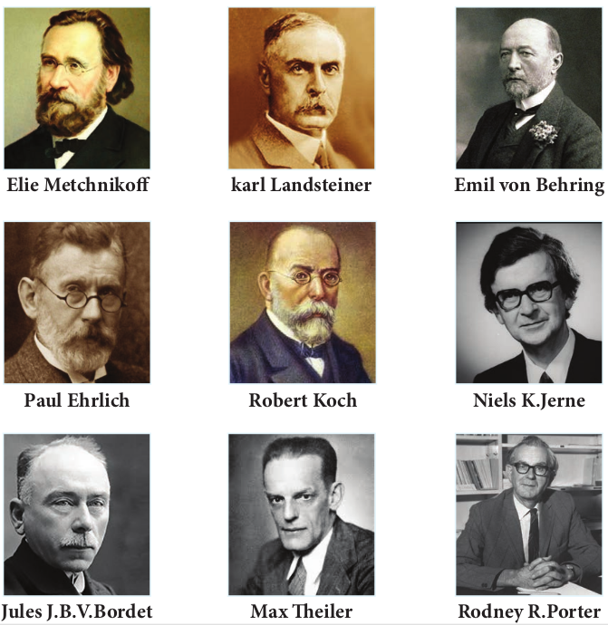

**Elie Metchnikoff**

**Paul Ehrlich**

**Jules J.B.V.Bordet**

**karl Land**

**Max Th**

**Robert**  

lymphoid organs serve as sites where lymphocytes interact with antigen and undergo proliferation and differentiation into antigen specific effector cells. The spleen, lymph nodes and mucosal associated lymphoid tissues (MALT) are secondary lymphoid organs. These are discussed in more detail below.

### Primary Lymphoid Organs

**a. Thymus** The thymus is a highly organized lymphoid organ located above the heart. The thymus consists of two lobes. Each

ibuted to the development of Immunology

**steiner**

**eiler**

**Emil von Behring**

**Niels K.Jerne**

**Rodney R.Porter**

**Koch**

  

lobe is surrounded by a capsule and is divided into several lobules by strands of connective tissue called trabeculae. Each lobule contains an outer cortex and an inner medulla. The cortex contains many dividing immature lymphocytes. The medulla consists of reticular and epithelial cells with fewer lymphocytes and isolated Hassall’s corpuscles (Figure 13.3). The primary function of the thymus is the production of mature T cells. Precursor cells from the bone marrow migrate into the outer cortex where they proliferate. As they mature, about 98% die. This is due to a

(a) **Thymus** (site of T cell development)

(b) **Bone marrow** (site of B cell development)

Bone marrow

SALT (skin- associated lymphoid tissue)

Cortex

Blood vessels

Medulla

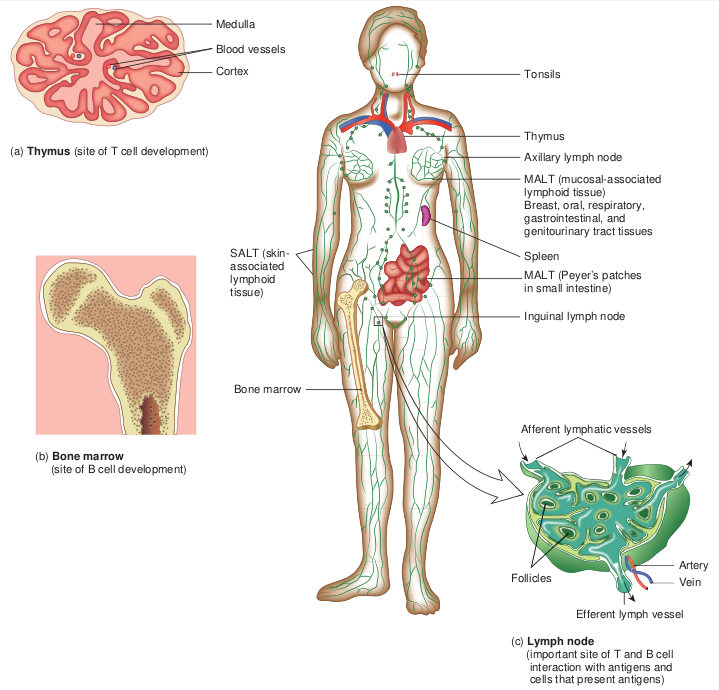

process known as thymic selection in which T cells that recognize host (self) antigens are destroyed. The remaining 2% move into the medulla of the thymus, become mature T cells and subsequently enter the blood stream. These T cells recognize non host (non self) antigens. b. Bone marrow In mammals, the bone marrow (Figure 13.4) is the site of B cell maturation. Stromal cells within the bone marrow interact directly with the B cells and secrete various cytokines that are required for B cell development. Like

(c) **Lymph node** (important site of T and B cell interaction with antigens and cells that present antigens)

Tonsils

Thymus

Axillary lymph node

MALT (mucosal-associated lymphoid tissue) Breast, oral, respiratory, gastrointestinal, and genitourinary tract tissues

Spleen

MALT (Peyer’s patches in small intestine)

Inguinal lymph node

Afferent lymphatic vessels

Follicles Artery

Vein

Efferent lymph vessel

f Lymphoid tissues in the body

  

thymic selection during T cell maturation, a selection process within the bone marrow eliminates non functioning B cells and those bearing self reactive antigen receptors. In birds, undifferentiated lymphocytes move from the bone marrow to the Bursa of Fabricius, where B cell mature; this is where B cells were first identified and how they came to be known as “ B” (for bursa) cells.

### Secondary Lymphoid Organs

**a. Spleen**

Trabecula Dividing thymocyte

Capsule Dead c

**Thym**

Macrophage

M ed

ul la

C or

te x

Blood vessel Hassall’s

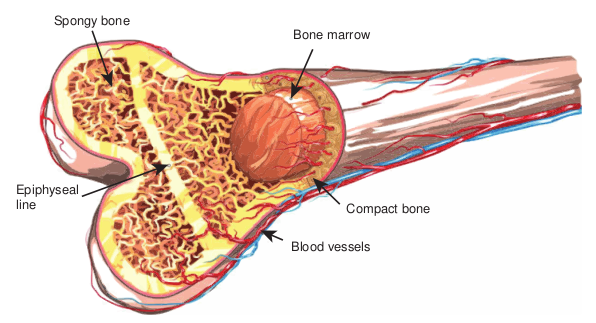

Spongy bone

Epiphyseal line  

section of a portion of the thymus

ell Thymocyte

**us**

Nurse cell Cortical epithelial

cell

corpuscles Medullary epithelial cell

Interdigitating dendritic cell

ucture of Bone marrow

Blood vessels

Bone marrow

Compact bone

The spleen is the most highly organized secondary lymphoid organ. The spleen is a fist sized organ just behind the stomach. It collects and disposes of aged red blood cells. Its organization is shown schematically in Figure 13.5. The bulk of the spleen is composed of red pulp which is the site of red blood cell disposal. The spleen is not supplied by lymphatic vessels. The lymphocytes surround the arterioles entering the spleen, forming areas of white pulp. The inner region of white pulp is

|------|

  

Cortex

Paracortex

Medulla Afferent lymphatic vessels

B lymphocytes

Primary lymphoid follicle

Capsule

Germinal centers

B lymphocytes

Lymphatic artery Lymphatic vein

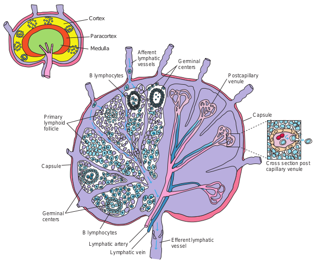

divided into a Periarteriolar Lymphoid Sheath (PALS) containing mainly T cells. The spleen filters the blood and traps blood borne microorganisms and antigens. Once trapped by splenic macrophages or dendritic cells, the pathogen is phagocytosed, killed and digested.

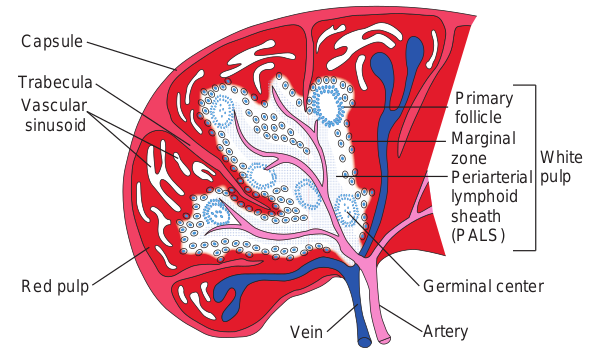

Capsule

Trabecula Vascular sinusoid

Red pulp

Ve  

Germinal centers

Postcapillary venule

Capsule

Cross section post capillary venule

Efferent lymphatic vessel

re of Lymph node

**b. Lymph nodes** The lymph nodes are encapsulated round structures located at the junction of major lymphatic vessels. Lymph node is morphologically divided into three regions: the cortex, the paracortex and the medulla (Figure 13.6). The outer most layer, the

cture of Spleen in Artery

Germinal center

Periarterial lymphoid sheath (PALS)

White pulp

Marginal zone

Primary follicle

  

cortex contains lymphocytes (mostly B cells), macrophages and follicular dendritic cells arranged in primary follicles. After antigenic challenge, the primary follicles enlarge into secondary follicles, each containing a germinal centre. Beneath the cortex is the paracortex which is populated largely by T lymphocytes and also interdigitating dendritic cells thought to have migrated from tissues to the node. These interdigitating dentritic cells express high levels of class II MHC molecules, which are necessary for presenting antigen to T helper (TH) cells. Lymph nodes are specialized to trap antigen from regional tissue spaces. As antigen is carried into a lymph node by the lymph, it is trapped, processed and presented together with

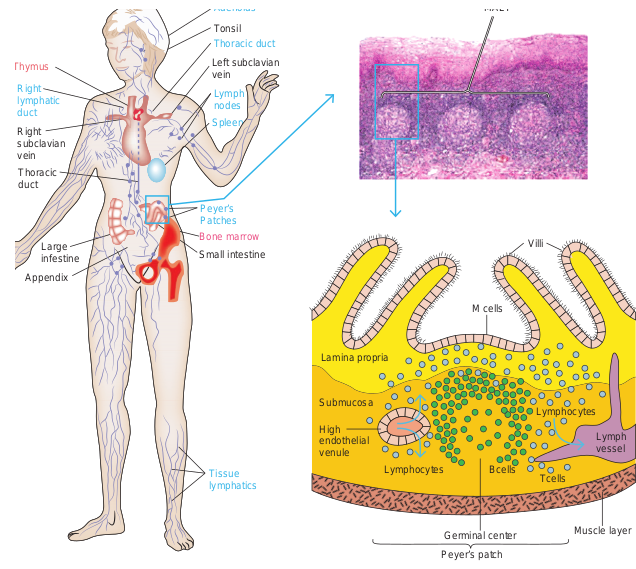

Small intestine

Appendix

Large infestine

Thoracic duct

Right subclavian vein

Left subclavian vein

Tonsil

(a)

Right lymphatic duct

Thymus

Peyer’s Patches

Tissue lymphatics

Spleen

Lymph nodes

Thoracic duct

Adenoids

Bone marrow  

class II MHC molecules by interdigitating dendritic cells in the paracortex, resulting in the activation of TH cells. Activated TH cells release cytokines needed for B cell activation. Thus lymph nodes represent one environment where B cells differentiate into memory cells and antibody – secreting plasma cells.

What happens when thymus is removed from the human body?

**HOTS**

**c. MALT and SALT** The specialized lymphoid tissue in mucus membranes is called mucosal associated lymphoid tissue (MALT). There are several

ociated Lymphoid Tissue (MALT)

(b)

MALT

M cells

Villi

Lymph vessel

Tcells BcellsLymphocytes

Lymphocytes Submucosa

Lamina propria

High endothelial venule

Muscle layerGerminal center

Peyer’s patch

  

types of MALT. The system most studied is the gut associated lymphoid tissue (GALT). GALT include the tonsils, adenoids, and appendix and specialized structures called peyer’s patches (Figure 13.7) in the small intestine, which collect antigen from the epithelial surfaces of the gastrointestinal tract. In peyer’s patches, the antigen is collected by specialized epithelial cells called M cells (Figure 13.8). The lymphocytes form a follicle consisting of a large central dome of B lymphocytes surrounded by small numbers of T lymphocytes. Similar but more diffusely organized aggregates of lymphocytes protect the respiratory epithelium, where they are known as bronchial- associated lymphoid tissue (BALT).

(a) M cells, situated in mucous membranes, endo respiratory, and urogenital tracts. The antigen i the large basolateral pocket. (b) Antigen transp an inductive site activates B cells in the underl differentiate into IgA-producing plasma cells, wh under the mucosa. The outer mucosal epithelia which many are T cells.

(a) The Peyer’s patch is a representative of th the intestine. (b) A stained tissue cross-sectio intestinal submucosa is schematically diagra contains loose clusters of lymphoid cells and

M cell Antigen

(a) (b)

Pocket

B cells

TH cell

Macrophage

Lamin propri

Mucos epithe

cytose antigen from the lumen of the digestive, s transported across the cell and released into orted across the epithelial layer by M cells at ying lymphoid follicles. The activated B cells ich migrate along the lamina propria, the layer

l layer contains intraepithelial lymphocytes, of

e extensive MALT system that is found in n of Peyer’s patch lymphoid nodules in the

mmed in (c). The intestinal lamina propria diffuse follicles.

a a

al lium

Antigen Intraepithelial lymphocyte

M cell

Plasma cell

Organized lymphoid follicle

IgA

IgA

Lumen

cells and production of IgA:

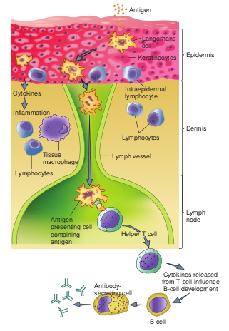

Lymph vesselTissue macrophage

Inflammation

Cytokines

Lymphocytes

Lymphocytes

Dermis

Intraepidermal lymphocyte

Antigen

EpidermisKeratinocytes

Langerhans cell

Lymph node

Helper T cell

Antigen- presenting cell containing antigen

Cytokines released from T-cell influence B-cell development

B cell

Antibody- secreting cell

  

Despite the skin’s defenses, at times pathogenic microorganisms gain access to the tissue under the skin surface. Here, they encounter a specialized set of cells called the skin associated lymphoid tissue (SALT) (Figure 13.9). The major function of SALT is to confine microbial invaders to the area immediately underlying the epidermis and to prevent them from gaining access to the blood stream. One type of SALT is the langerhans cell, a specialized myeloid cell that can phagocytose antigens.

## Cells of the Immune System

All blood cells arise from a type of cell called the hematopoietic stem cell(HSC).

Monocyte

Dendritic cell Myeloid progenitor

Granulocyte monocyte progenitor

Macrophage

Neutrophil

Eosinophil

Basophil

Platclets

Erythrocyte

Erythroid progenitor

Megakaryocyte

Basophil progenitor

Eosinophil progenitor

S re

He ste

Lymphoid progenitor

T-cell progenitor

B-cell progenitor

Natural killer (NK) cell

TH helper cell

TC cytotoxic T cell

B cell

Dendritic cell

elf- newing

matopoietic m cell

matopoiesis

Stem cells are cells that can differentiate into other cell types. They are self renewing and they maintain their population level by cell division. This chapter describes the formation of blood cells and the properties of the various cells of the immune system.

### Hematopoiesis

Hematopoiesis is the formation and development of blood cells of all types. In humans, hematopoiesis begins in the yolk sac in the first weeks of embryonic development. As gestation continues, the site of hematopoiesis gradually shifts to the bone marrow such that it becomes the principle site at the time of birth.

  

As hematopoietic stem cells can give rise to all of the different types of blood cells, they are often known as pluripotent stem cells. (Figure 13.10) The myeloid progenitor gives rise to erythrocytes, neutrophils, eosinophils, basophils, monocytes, mast cells and platelets. The common lymphoid progenitor gives rise to B lymphocytes, T lymphocytes and natural killer (NK) cells.

### Types of Leukocytes

The cells responsible for both innate immunity and acquired immunity are the leukocytes (Greek leukos, white and kytos cell). The average adult has approximately 7400 leukocytes (white blood cells) per cubic millimeter of blood (Table 13.2). The average value shifts substantially during an immune response. In defending the host against pathogenic microorganisms, leukocytes cooperate with each other first to recognize the pathogen as an invader and then to destroy it. The different types of leukocytes are now briefly described.

**a. Granulocytes** Granulocytes have irregularly shaped nuclei with two or five lobes. Their cytoplasm has granules that contain reactive substances that kill microorganisms and enhance inflammation. Three types of granulocytes exist: basophils, eosinophils, and neutrophils. Because of the many lobed (3-5) nuclei, neutrophils are also called polymorphonuclear neutrophils or PMNS (Figure 13.11).

Heard about stem cell treatment! Why do we need stem cells bank?

**HOTS**  

**Table 13.2:** Normal Adult Blood Count

**Cell type Cells/ mm3**

**% WBC**

**Red blood cells** 50,00,000 – **Platelets** 2,50,000 –

**Leukocytes** 7,400 100 **Neutrophil** 4320 60

**Lymphocytes** 2160 30 **Monocytes** 430 6 **Eosinophils** 215 3 **Basophils** 70 1

**b. Mast cells** Mast cells are bone marrow derived cells that differentiate in the blood and connective tissue. c. Monocytes and Macrophages Monocytes are mononuclear leukocytes. They are produced in the bone marrow and enter the blood, circulate for about eight

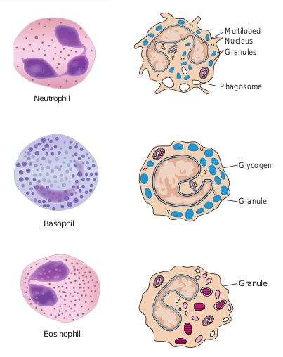

Neutrophil

Basophil

Granule

Eosinophil

Multilobed Nucleus Granules

Phagosome

Glycogen

Granule

| C el l  ty p e |C el ls/mm3 |% WB C |
|------|------|------|
| Re d b l o o d c el ls |50,00,000 |– |
| Pl atel e t s |2,50,000 |– |
| L e u ko c y tes |7,400 |100 |
| Ne utrop h i l |4320 |60 |
| Ly mpho c y tes |2160 |30 |
| Mono c y tes |430 |6 |
| E os ino phi ls |215 |3 |
| Bas op hi ls |70 |1 |
  

(a)

(b)

hours, enlarge, migrate to the tissues and mature into macrophages or dendritic cells (Figure 13.12 a).

Macrophages are derived from monocytes and are classified as mononuclear phagocytic leukocytes. These microbial molecules are examples of pathogen associated molecular patterns (PAMPs) (Figure 13.12 c).

PAMPs enable macrophages to distinguish between potentially harmful microbes and other host molecules. After the pathogen is recognized, the macrophages’, pattern recognition receptors (Example: Toll like receptors) bind the pathogen and phagocytose it. Macrophages also have receptors for antibodies and complement proteins. Both antibody and complement proteins can coat microorganisms and enhance their phagocytosis. This  

tes (b) Phagocytosis by a Macrophage itic Cell

Nucleus

Lysosome

Phagosome

(c)

enhancement is termed opsonization. Macrophages spread throughout the body and take up residence in specific tissues. Macrophages serve different functions in different tissues and are named according to their tissue location.

• Alveolar macrophages in the lung • Histiocytes in connective tissue • Kupffer cells in the liver • Mesangial cells in the kidney • Microglial cells in the brain • Osteoclasts in bone

**d. Dendritic cells** Dendritic cells are not a single cell type. They are a heterogeneous group of cells so named because of their Dendron (neuron) like appendages (Figure 13.12d). They arise

  

from various hematopoietic cell lineages. Most dendritic cells are tissue bound, where they play an important role in bridging innate immunity and acquired immunity. Dendritic cells can be classified by their location:

• Langerhans cells found in the skin and mucus membranes

• Interstitial dendritic cells which populate most organs (heart, lungs, liver, kidney, gastrointestinal tract)

• Interdigitating cells present in T cell areas of secondary lymphoid tissue and the thymic medulla.

• Circulating dendritic cells in the blood and lymph.

**e. Lymphocytes** Lymphocytes are the major cells of the specific immunity. Lymphocytes can be divided into three populations: T cells, B cells, and NK (natural killer) cells. Clusters of differentiation are group of monoclonal antibodies that identify the same cell surface molecule. The cell surface molecule is designated CD (cluster of differentiation followed by a number (CD1, CD2).

**i) B Lymphocytes** B lymphocytes mature within the bone marrow. When they leave bone marrow, each expresses a unique antigen binding receptor on its membrane. The B cell receptor is a membrane bound antibody molecule (Figure 13.13a). When a naive B cell, first encounters the antigen that matches its membrane bound antibody, the binding of the antigen to the antibody causes the cell to divide rapidly. Its progeny differentiate into memory B cells and effector B cells called plasma cells  

Memory B cells have a longer life span than native cells. They express the same membrane bound antibody as their parent naive B cell. Plasma cells do not express membrane bound antibody. Plasma cells secrete large quantities of antibodies. Secreted antibodies are the major effector molecules of humoral immunity.

**ii) T Lymphocytes** T lymphocytes also arise in the bone marrow. T cells then migrate to the thymus to mature. During its maturation within thymus, the T cells express a unique antigen binding molecule called the T cell receptor (Figure 13.13b) on its membrane. Unlike membrane bound antibodies on B cells, which can recognize antigen alone, T cell receptor can recognize only antigen that is bound to MHC molecules. There are two major types of MHC molecules. Class I MHC molecules are expressed by all nucleated cells. Class II MHC molecules are expressed only by antigen presenting cells. When a naive T cell encounters antigen combined with an MHC molecule on a cell the T cell proliferates and differentiates into memory T cell and various effector T cells.

There are two subpopulations of T cells: T helper (TH) and T cytotoxic (TC) cells. Although a third type of T cells called a T suppressor (TS) cell, has been postulated, recent evidence suggests that it may not be distinct from the TH and TC subpopulations. T cells displaying CD4 function as TH cells whereas; those displaying CD8 function as TC cells (Figure 13.14).

After a TH cell recognizes and interacts with an antigen-MHC class II molecule complex, the cell is activated. It becomes an effector cell that secretes cytokines. The secreted cytokines activate B cells, TC cells,

  

Heavy chain

recognition BCR

_B cell Receptor_

Light chain

ITAM

lgβ lgα

Signaling

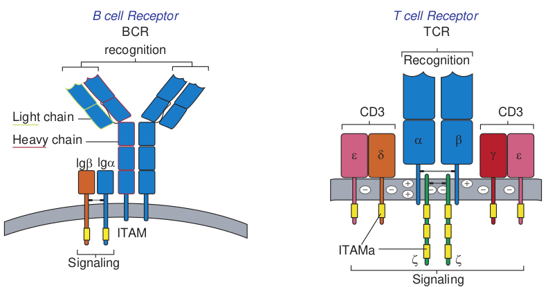

(b) TH cell

TCR

Antigen- binding receptor (antibody)

(a) B cell

macrophages and various other cells that participate in the immune response.

Under the influence of TH derived cytokines, a TC cell that recognizes an antigen-MHC class I molecule complex proliferates and differentiates into a cytotoxic T lymphocyte (CTL). Cells that display foreign antigen complexed with a class I MHC molecule are called altered self cells. CTL destroy virus infected cells and tumor cells.

**iii) Natural killer (NK) Cells (Null cells)** NK cells are a small population of large, non  

Recognition

TCR _T cell Receptor_

ITAMa

Signaling

ζζ

CD3CD3

δ α β

γ εε

ceptor. (b) T cell receptor

rane molecules on lymphocytes

TCR CD8CD4

(c) TC cell

phagocytic granular lymphocytes that play an important role in innate immunity. The major NK cell function is to destroy cancer cells and cells infected with microorganisms. They recognize their targets in one of two ways. They can bind to antibodies that coat infected or cancer cells. Thus the antibody bridges the two cell types. This process is called antibody dependent cell mediated cytotoxicity (ADCC) (Figure 13.15) The second way that NK cells recognize infected cells and cancer cells relies on the presence of specialized proteins on the surface of

|------|

  

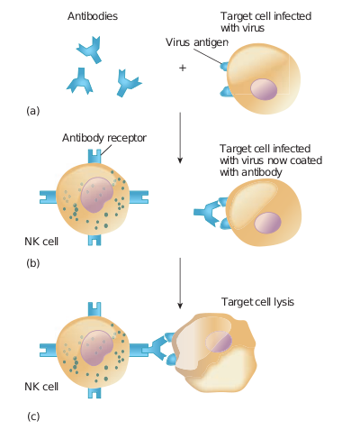

Antibodies

Antibody receptor

(a)

(b)

(c)

Target cell infected with virus now coated with antibody

Target cell lysis

NK cell

NK cell

Virus antigen

+

Target cell infected with virus

Complex Class I s

Natura killer ce

Inhibiting receptor

Normal cell

No attack

(a)

Abnorma cell lackin MHC clas molecule

Activating receptor

Ubiquitous molecule MHC cla

molec  

all nucleated host cells known as class II MHC molecules. If a hosts cell loses this MHC protein, as when some viruses or cancers overtake the cell, the NK cells kill it by releasing pore forming proteins and cytotoxic enzymes called granzymes (Figure 13.16).

## Immunity

To establish an infection, an invading microorganism must first overcome many surface barriers, such as skin, degradative enzymes and mucus. These surface barriers have either direct antimicrobial activity or inhibit attachment of the microorganism to the host. Any microorganism that penetrates these barriers encounters two levels of resistance: nonspecific resistance mechanisms and the specific immune response.

natural killer cells to recognize lack the Major Histocompatibility urface molecule

l ll

Kill

(b)

l g s I

Perforin and granzymes

ss I ule

  

13.4.1 Types of Immunity

The term immunity (Latin immunis, free of burden) refers to the general ability of a host to resist infection or disease. There are two interdependent components of the immune response to invading microorganisms and foreign material. They are non-specific immune response or innate immunity or natural immunity and specific immune response or acquired immunity or adaptive immunity. **I. Innate immunity** Innate immunity refers to those general defence mechanisms that are inherited as

Innate im

Physical barriers Cell

Skin, mucous membranes

**Pattern rec molec**

**PMN’s mo macrop eosino**

**NK c**

Cytokines Antibodies

B cells

Ag Specific

Acquired im

part of the innate structure and function of each animal (such as skin, mucus and lysozyme). Innate immunity is the first line of defence against any microorganism or foreign material encountered by the vertebrate host. Innate immunity defends against foreign invaders equally and lacks immunological memory.

**II. Acquired immunity** Acquired immunity refers to the type of specific immunity that develops after exposure to a suitable antigen (Figure 13.17). The effectiveness of acquired immunity increases on repeated exposure to foreign

munity

s Chemical barriers

pH, lipids, enzymes

**ognition ules nocytes, hages, phils, ells**

Cytokines Cytokines

T cells

receptors

munology

tween innate and acquired immunity

  

agents such as viruses, bacteria or toxins. So acquired immunity has memory. The innate immunity and acquired immunity work together to eliminate pathogenic microorganisms and other foreign agents. Although innate systems predominate immediately upon initial exposure to foreign substances, multiple bridges occur between innate and acquired immune system components.

### Mechanisms of Innate Immunity

A potential microbial pathogen invading a human host immediately confronts a vast array of nonspecific defence mechanisms. Many direct factors (nutrition, physiology, fever, age, genetics) and equally as many indirect factors (personal hygiene, socioeconomic status, living conditions) influence all host microbe relationships. In addition to these direct and indirect factors, a vertebrate host has the following four non specific defence mechanisms.

A. Physical barriers B. Chemical mediators C. Phagocytosis D. Inflammation

**A. Physical barriers**

**i) Skin** Intact skin contributes greatly to host resistance. It forms a very effective mechanical barrier to microbial invasion. Its outer layer consists of thick, closely packed cells called keratinocytes, The skin is slightly acidic (around pH 5-6) due to skin oil, secretion from sweat glands and organic acids produced by commensal _Staphylococci_. It also contains a high concentration of sodium chloride and is subject to periodic drying.  

**ii) Mucous membranes** The mucous membranes of the eye (conjunctiva), the respiratory, digestive and urogenital systems withstand microbial invasion. One antibacterial substance in these secretions is lysozyme, an enzyme that lyses bacteria. Mucous secretions possess the iron binding protein, lactoferrin. Lactoferrin sequesters iron from the plasma reducing the amount of iron available to invading microbial pathogens and prevents their ability to multiply. Mucous membranes produce lactoperoxidase, an enzyme that catalyzes the production of superoxide radicals, reactive oxygen intermediate that is toxic to many microorganisms.

**iii) Respiratory system** Microbes smaller than 10μm pass through the nasal cavity and are trapped by the mucociliary blanket and the trapped microbes are transported by ciliary action that moves them away from lungs. Coughing and sneezing reflexes clear the respiratory system of microorganisms by expelling air forcefully from the lungs through the mouth and nose, respectively. Salivation also washes microorganisms from the mouth and nasopharyngeal areas into the stomach.

**iv) Gastrointestinal tract** Most microorganisms that reach the stomach are killed by gastric juice. (pH 2-3). However, organisms embedded in food particles are protected from gastric juice and reach the small intestine. The mucous membranes of the intestinal tract contain paneth cells. These cells produce lysozyme and cryptins (toxic for bacteria).

**v) Genitourinary tract** Under normal circumstances, the kidneys, ureters and urinary bladder of mammals

  

are sterile. Urine within the urinary bladder is also sterile. In addition to removing microbes by flushing action, urine kills some bacteria due to its low pH and the presence of urea and other metabolic end products (uric acid, hippuric acid, indican, fatty acids, mucin, and enzymes). The acidic environment (pH 3-5) of the vagina is unfavorable to most microbes.

**vi) Eye** The conjunctiva is specialized mucus secreting epithelial membrane that lines the interior surface of each eyelid and the exposed surface of the eye ball. It is kept moist by the continuous flushing action of tears. Tears contain large amounts of lysozyme, lactoferrin, and antibody and thus provide chemical as well as physical protection (Figure 13.18).

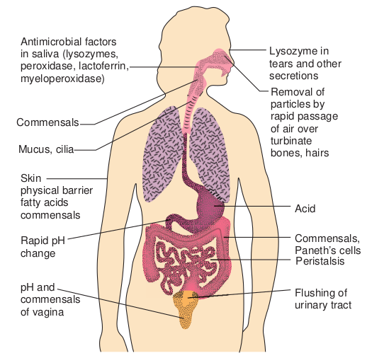

Skin physical barrier fatty acids commensals

Rapid pH change

pH and commensals of vagina

Mucus, cilia

Commensals

Antimicrobial factors in saliva (lysozymes, peroxidase, lactoferrin, myeloperoxidase)  

**B. Chemical mediators**

**• Antimicrobial peptides** They are low molecular weight proteins that exhibit broad spectrum antimicrobial activity toward bacteria. **i) Cationic peptides** Cationic peptides are found in humans. There are three generic classes of cationic peptides that have the ability to damage bacterial plasma membrane. Classes of Cationic Peptides are Cathelicidins, Defensins and Histatin

**ii) Bacteriocins** Bacteriocins are produced by gram negative and gram positive bacteria. For example, Escherichia coli synthesize bacteriocins called colicins. Colicins causes cell lysis.

ysical Barriers

Flushing of urinary tract

Peristalsis

Commensals, Paneth’s cells

Acid

Removal of particles by rapid passage of air over turbinate bones, hairs

Lysozyme in tears and other secretions

  

**• Cytokines** Cytokines are proteins made by cells that affect the behavior of other cells. When released from mononuclear phagocytes, they are called monokines. When released from T lymphocytes they are called lymphokines. When released from leukocytes they are called interleukins. Cytokines are required for regulation of both the nonspecific and specific immune responses. Interferons (IFNS) are a group of cytokines produced by virus infected cells. Several classes of interferons are recognized. IFN γ is synthesized by virus infected leukocytes, antigen stimulated T cells and natural killer cells. IFN α / β is derived from virus infected fibroblasts. Interferons prevent viral replication and assembly, thereby limiting viral infection.

Another group of noteworthy cytokines are endogenous pyrogens which elicit fever in the host. Examples of endogenous pyrogens include interleukin – 1, Interleukin – 6 and tissue necrosis factor. All are produced by host macrophages in response to pathogens. **• Complement system** The complement system is a part of the immune system, consists of a series of proteins that interact with one another in a highly regulated manner, in order to eliminate pathogens. Complements are soluble proteins and glycoproteins mostly produced by hepatocytes. More than 20 types of complements are present in serum found circulating normally in human body in inactive forms (called as zymogens or proenzymes). Complement activation is triggered by an antibody when it is bound to the antigen. It can also be triggered by some components of innate immunity. Thus the complement system works in both innate and acquired immunity.  

**Functions of complements** Some major functions of complements are:

• Opsonization and phagocytosis • Cell lysis • Chemotaxis • Activation of mast cells and basophils

and enhancement of inflammation • Production of antibodies • Immune clearance and inflamma-

tion by attracting macrophages and neutrophils.

**C. Phagocytosis** i. Phagocytosis is the ingestion by

phagocytic cells of invading foreign particles such as bacteria. After ingestion, the foreign particle is entrapped in a phagocytic vacuole (phagosome), which fuses with lysosomes forming the phagolysosome. The lysosomes release their powerful lytic enzymes which digest the particle. (Figure 13.19). Phagocytosis is conducted by blood monocytes, neutrophils and tissue macrophages. Phagocytosis may be enhanced by a variety of factors collectively referred to as opsonins which consist of antibodies and various serum components of complement.

ii. Phagocytic cells use two basic mechanisms for the recognition of microorganisms. Opsonin dependent and opsonin independent

iii. Phagocytes use pathogen recognition receptors to detect pathogen associated molecular patterns on microorganisms. Toll like receptors are a distinct class of pathogen recognition receptors.

  

**D. Inflammation** Tissue damage caused by a wound or by an invading pathogenic microorganism induces a complex sequence of events collectively known as inflammatory response. Inflammation can either be acute or chronic. The gross features were described over 2000 years ago and are still known as the cardinal signs of inflammation: redness (rubor), warmth (calor), pain (dolor), swelling (tumor), and loss of function (functiolaesa)

The cardinal signs of inflammation reflect the three major events of an inflammatory response.

1\. Vasodilation (an increase in the diameter of blood vessels) of nearby capillaries occurs as the vessels that carry blood away from the affected area constrict. This results in engorgement of the capillary network. The engorged capillaries are responsible for tissue redness (erythema) and an increase in temperature.

(a)  

2\. An increase in capillary permeability facilitates an influx of fluid and cells from the engorged capillaries into the tissue. The fluid that accumulates (exudate) has much higher protein content. Accumulation of exudate contributes to tissue swelling (edema)

aph of alveolar macrophage phagocytosis of d vessel in the lung pleural cavity. (b) Steps

Bacterium is ingested, forming phagosome.

Phagosome fuses with lysosome.

Bacterium is killed and then digested by lysosomal enzymes.

Digestion products are released from cell.

Bacterium becomes attached to membrane evaginations called pseudopodia.

(b)

1

2

3

4

5

**Reactive Nitrogen Species:** Highly cytotoxic antimicrobial compounds formed by the combination of nitric oxide and superoxide anion within phagocytes such as neutrophils and macrophages.

**Reactive Oxygen Species (ROS):** Highly reactive compounds such as superoxide anion O2, hydroxyl radicals (OH)(OH–), hydrogen peroxide (H2O2), and hypochlorous acid (HClO) that are formed from oxygen under many conditions in cells and tissues, including microbe-activated innate responses of phagocytic cells; have anti-microbial activity.

**Infobits**

  

3\. Influx of phagocytes from the capillaries into the tissues is facilitated by increased capillary permeability. As phagocytic cells accumulate at the site and begin to phagocytoses bacteria, they release lytic enzymes, which can damage nearby healthy cells. The accumulation of dead cells, digested material and fluid forms substances called pus.

### Acquired Immunity

Lower animal forms possess so called innate or non-specific immune mechanisms such as phagocytosis of bacteria by specialized cells. Higher animals have evolved an adaptive or acquired immune response. This acquired immune response provides a flexible, specific and more effective reaction to different infections.

**• Definition of Acquired (Adaptive) Immunity**

Acquired (adaptive)immunity refers to the type of specific immunity that a host develops after exposure to a suitable antigen.

**• Important features of acquired immunity**

This is the immunity one develops throughout life time. Adaptive or acquired immunity has four important features namely (1) Memory (2) Specificity (3) diversity and (4) discrimination between self and non self.

**1) Memory** We rarely suffer twice from diseases such as measles, mumps, chicken pox, whooping cough and so on. The first contact with an infectious organism clearly imprints some memory so that the body is effectively prepared to repel any later invasion by that organism.  

**2) Specificity** The establishment of immunity by one organism does not provide protection against another unrelated organism. After an attack of measles we are immune to further infection but are susceptible to polio or mumps viruses. Thus the body can differentiate specifically between the two organisms.

**3) Diversity** The immune system is able to generate an enormous diversity of molecules such as cellular receptors and soluble proteins, including antibodies that recognize trillions of different foreign substances.

**4) Discrimination between self and nonself** The specific immune system almost responds selectively to non self and produces specific responses against the stimulus. This is possible because host cells express a unique protein on their surface, making them as residents of that host or as self. Thus the introduction of materials lacking that unique self marker results in their attack by the host. ### Humoral and Cellular Immunity

Two branches or arms of specific immunity are recognized: humoral (antibody mediated) immunity and cellular (cell mediated) immunity (Figure 13.20).

**Humoral (antibody mediated) immunity** The antigen specific arm of the humoral immunity consists of the B cells. Each B cell expresses a unique antigen binding receptor on its membrane. The B cell receptor (BCR) is membrane bound antibody molecule. When a naive B cell first encounters the antigen that matches its membrane bound

  

Antige

Foreign Proteins

Intemalized antigen digested by cell

Altered self-ce presents antige

T cell receptors recognize antigen to MHC molecules

Binding antigen-MH activates T cells

Activated TH cell sec cytokines that contrib activation of B cells, and other cells

B cells interact with antigen and differentiate into antibody secreting plasma cells

Antigen

Humoral response

Cell-mediated response

+

B cell

Class II MHC

TH cell

Activated TH cell

Viruses Bacte

1

2

3

4

5

7

**Passive Immuno- therapy:** Treatment of an infectious disease by administration

of previously generated antibodies specific for the infectious pathogen.  

ns

ll n

bound

C

retes ute to

TC cells,

Antibody binds antigen and facilitates its clearance from the body

Ab-secreting plasma cells

Activated CTLs recognize and kill altered self-cells

Cytotoxic T lymphocyte (CTL)

Class I MHC

TC cell

ria Parasites Fungi

6

8

d cell-mediated branches of the immune teract with antigen and then differentiate secreted antibody binds to the antigen y. In the cell-mediated response, various presented on self-cells. TH cells respond

ls respond to antigen by developing into diate killing of altered self-cells (Example:

antibody, the binding of the antigen to the antibody causes the cell to divide rapidly. Its progeny differentiate into memory B cells and antibody secreting plasma cells. A single plasma cell can secrete more than 2000 molecules of antibody per second. Circulating antibodies bind to

| 6 |
|------|------|------|
| Activated CTLs |
| recognize and killaltered self-cells |
  

microorganisms, toxins and extracellular viruses, neutralizing them or tagging them for destruction by phagocytes and other mechanisms.

The cellular (cell mediated) immunity consists of the T cells. Each T cell expresses antigen receptors called T cell receptors (TCRS). Unlike membrane bound antibody on B cells, which can recognize antigen alone, T cell receptors can recognize only antigen that is bound to MHC molecules. There are two major types of MHC molecules. Class I MHC molecules are expressed by all nucleated cells. Class II MHC molecules are expressed only by antigen presenting cells such as dendritic cells, macrophages and B cells. When a naive T cell encounters antigen combined with an MHC molecule on a cell, the T cell proliferates and differentiates into memory T cells and various effector T cells (helper T cells, cytotoxic T cells and regulatory T cells). Specific kinds of T cells directly attack target cells infected with viruses or parasites, transplanted cells or organs and cancer cells. T cells can induce target cell suicide (apoptosis), lyse targets cells, or release chemicals (cytokines) that enhance specific immunity and non specific defences such as phagocytosis and inflammation.

### Types of Specific Immunity

Specific immunity can be acquired by natural means actively through infection or passively through receipt of preformed antibodies as through colostrum. Specific immunity can be acquired by artificial means actively through immunization or passively through receipt of preformed antibodies as with antisera.  

13.5 Antigens

Substances capable of inducing a specific immune response are called antigens. The molecular properties of antigens and the way in which these properties ultimately contribute to immune activation are central to our understanding of the immune system.

### Immunogenicity Versus Antigenicity

Two properties are exhibited by antigens; they are immunogenicity and antigenicity. Immunogenicity is the ability of an antigen to induce a humoral and / or cell mediated immune response.

B cells + antigen effector B cells (Plasma cells) + memory B cells

T cells + antigen effector T cells (TC, TH cells) + memory T cells

Although a substance that induces a specific immune response is usually called an antigen, it is more appropriately called an immunogen. Antigenicity is the ability of an antigen to combine specifically with the final products of the above responses. (antibodies and/or cell surface receptors). All immunogens are antigens but all antigens are not immunogens. Some small molecules called haptens are antigenic but incapable, by themselves, of inducing a specific immune response. In other words haptens lack immunogenicity. Examples of haptens are dinitrophenol, penicillin and m-amino benzene sulphonate.

### Factors that Influence Immunogenicity

Immunogenicity is not an intrinsic property of an antigen but rather depends on a number of properties of the particular biological system that the antigen encounters. The

  

factors that influence immunogenicity can be divided under two categories. 1. Contribution of the immunogen to

immunogenicity 2. Contribution of the biological system to

immunogenicity

**1\. Contribution of the immunogen to immunogenicity** Immunogenicity is determined in part, by the following four properties of the immunogen.

**A. Foreignness** The immune system normally discriminates between self and non self, so that only molecules that are foreign to the host are immunogenic. For example, albumin isolated from the serum of a rabbit and injected back into the same or another rabbit will not induce an immune response but the same protein when injected into other vertebrate species (rat) will induce an immune response.

**B. Molecular size** There is a correlation between the size of a macromolecule and its immunogenicity. The best immunogens tend to have molecular mass approaching 100,000 daltons (Da). Generally, substances with a molecular mass less than 5000-10000 Da are poor immunogens; however a few substances with a molecular mass less than 1000 Da have proven to be immunogenic.

**C. Chemical composition and complexity** Proteins are the most potent immunogens with polysaccharides ranking second. In contrast, lipids and nucleic acids of an infectious agent generally do not serve as immunogens unless they are complexed  

with proteins or polysaccharides (examples- lipoprotein or nucleo - protein). For example, attachment of tyrosine chains to the weakly immunogenic protein gelatin markedly enhances its immunogenicity.

**D. Susceptibility to antigen processing and presentation**

The development of both humoral and cell mediated immune responses requires interaction of T cells with antigen that has been processed and presented together with MHC (Major Histocompatibility Complex) molecules. To TH cells, the antigen must be presented with class II MHC molecules on an antigen presenting cell; to TC Cells the antigen must be presented with class I MHC molecule on an altered self cell. 2. Contribution of the biological system to immunogenicity

Even if a macromolecule has the properties that contribute to immunogenicity, its ability to induce an immune response will depend on the following properties of the biological system that the antigen encounters.

**A. Genetic constitution of the host animal**

The genetic constitution (genotype) of an immunized animal plays an important role in determining whether a given substance will stimulate an immune response. Genetic control of immune responsiveness is largely made by genes mapping within the MHC

**B. Immunogen dosage and route of administration**

Whether an immunogen will induce an immune response also depends on the dose and mode of administration. A quantity of an immunogen that has no effect when injected intravenously may evoke a good antibody

  

response when injected subcutaneously, particularly if it is accompanied by an adjuvant.

**C. Adjuvants** The response an immunogen is often enhanced if it is administered as a mixture with adjuvants. Adjuvants are substances that enhance the immunogenicity of an antigen. Example: Freund’s incomplete antigen, Freund’s complete antigen, Mycobacterium tuberculosis, Aluminum potassium sulphate (alum) and Bacterial lipopolysaccharide (LPS).

### Epitopes

Immune cells do not interact with or recognize an entire immunogen molecule instead; lymphocytes recognize discrete sites on the macromolecule called epitopes or antigenic determinants. Epitopes are the immunologically active regions of an immunogen that bind to antigen specific membrane receptors on lymphocytes or to secreted antibodies. Antigenic epitopes may consist of a single epitope or have varying number of the same epitope on the same molecule (Example: polysaccharides).

### Haptens and the Study of Antigenicity

The pioneering work of Karl Landsteiner in the 1920s and 1930s created a simple, chemically defined system for studying the binding of an individual antibody to a unique epitope on a complex protein antigen. Landsteiner employed various haptens(small organic molecules that are antigenic but not immunogenic). Chemical  

coupling of a hapten to a large protein called a carrier, yields an immunogenic hapten- carrier conjugate.

### Cross-Reactivity

When two antigens possess structurally similar antigenic determinants, the antibodies obtained to one of these antigens tend to react with the other antigen. These reactions are called cross reactions.

**Penicillin Allergy:** New antigens are produced by altering epitopes. This can be done by conjugating haptens to the molecule. A classic example in human medicine is the **allergic response** of some persons to penicillin. A derivative of penicillin, **penicilloic acid** acting as a hapten, can couple with body protein and elicit an immune response that can be harmful, even life threatening, thus excluding this antibiotic from use in certain individuals.

**Infobits**

## Antibodies

The first real chemical information regarding the structure of antibodies was provided by Tiselius and Kabat in the early 1940s. They demonstrated that the gamma globulin fraction of serum proteins that migrated most slowly in electrophoresis contained most of the serum antibodies. This section deals with the structural and biological properties of antibodies (immunoglobulins).

**Definition of antibodies** Antibodies are glycoproteins present in serum gamma globulins produced by

  

B-lymphocytes (B cells) or Plasma cells in response to exposure to antigen. Antibodies are also known as immunoglobulins. They react specially with that antigen in vivo or in vitro and are hence a part of the adaptive immune response specifically, humoral immunity.

### Structure of an Immunoglobulin

**1\. Basic unit**

The basic structural unit (monomer) of an immunoglobulin molecule consists of four polypeptide chains linked covalently by disulfide bonds (Figure 13.21). The four- chain structure is composed of two identical light (L) and two identical heavy (H) polypeptide chains. Every immunoglobulin can be represented by the general formula (H2L2)n.

**a) Light chains**

Light Chains have a molecular weight of

COO– COO

S

S

S S

S

S

S

S S C

L

C H l

V H

V L

S

–S-S–

COO –

214

NH 3 +

NH 3 +

CHO

Hinge

H µ

C H 2

C H 3 C

H 3

C H 2

–S–S– –S–S–

–S–S–

–S–S–

–S–S–

–S–S–

approximately 25000 Da and are composed of about 220 amino acids. Light chains are common to all immunoglobulin classes and are of two types – kappa (κ) or lambda (λ) - based on their structural differences. A given immunoglobulin molecule may contain either identical κ or λ chains but never both.

**b) Heavy chains**

Heavy chains have a molecular weight of approximately twice that of light chains (57000-70000 Da) and twice the number of amino acids (about 440). Five antigenically distinct isotypes of heavy chains are recognized-gamma (γ), alpha (α), mu (μ), delta (δ) and epsilon (ε) – based on structural differences in the carboxy terminal portion of heavy chains. The heavy chains isotypes form the basis of five classes of immunoglobulin molecules – IgG (contains γ chain), IgA (contains α chain),

–

COO –

S

S S

S

S

S

C H l

V H

V L

C L

–S-S–

Antigen binding

Biological activity

eavy chain ,γ,α,δ, or ∈

Light chain κ or γ

CHO

NH 3 +

NH 3 +

f Immunoglobulin

| NH+3 |SV SH |
|------|------|------|
| VLS |
| C |

| SV H |NH33 + |
|------|------|------|
| V LS |
| AntigeS |

| 2HC |
|------|
| 3HC |

| CH2C |
|------|
| H3 |
  

IgM (contains μ chain), IgD (contains δ chain) and IgE (contains ε chain). Five heavy chain classes of immunoglobulin can be easily remembered as GAMDE. Heavy chain classes are again subdivided into subclasses of molecules.

i. Four known subclasses of the γ chain exist – γ1, γ2, γ3 and γ4 - which yield IgG1, IgG2, IgG3 and IgG4.

ii. Two subclasses of the α chain are known – α1 and α2 - which yield IgA1 and IgA2.

iii. Two subclasses of the μ chain are known – μ1 and μ2 - which yield IgM1 and IgM2.

iv. No subclasses of the δ and ε (IgD and IgE) are known.

**2\. Disulfide bonds**

Disulfide bonds hold together the four polypeptide chains in normal immunoglobulin molecules and are of two types namely interchain bonds and intrachain bonds.

Papain digestion

H chain Pepsin digestion

L chainDisulfide bonds

Mercapt redu

Fab Fab

Fc

\-s-s--s- s-

\-s- s- -s-s-

\-s-s- -s-s-

\-s-s- -s-s-  

**3\. Regions**

Each heavy and light chain consists of two segments, the variable region and the constant region. The variable (V) region shows a wide variation in amino acid sequence in the amino terminal portion of the molecule.

4\. Domains

Each immunoglobulin chain consists of a series of globular regions enclosed by disulphide bonds. Each heavy chain consists of four or five domains - one in the variable region (VH ) and three or four in the constant region (CH1, CH2, CH3, and CH4). Each light chain consists of two domains – one in the variable region (VL)and one in the constant region (CL).

**5\. Fragments.**

Proteolytic (peptide bond -splitting) enzymes such as papain and pepsin are used to degrade immunoglobulin molecules into definable fragments to facilitate study of their structure Figure (13.22).

of IgG, showing chain structure isulfide bonds

Fc fragments +

oethanol ction

F(ab)2

HS HS

SH SH

SH

SH

\+ +++

SH

SH L chains

H chains

\-s-s--s- s- -s-s--s-s-

|------|------|

| -s-s- |

| Pepsindigestion |
|------|------|------|------|------|------|------|

| -s-s- |
| Mercaptoethanolreduction |
| -s-s- |

|------|

|------|

  

**6\. Hinge region** Hinge region is the portion of heavy chain between the CH1 and CH2 domains. It is highly flexible and allows for movement of the Fab arms in relation to each other. The S values (sedimentation coefficient that is expressed in Svedberg units(s)) of immunoglobulins range from 7S- 19S.

### Immunoglobulin Function

There are three major effector functions that enable antibodies to remove antigens and kill pathogens. Opsonization promotes antigen phagocytosis by macrophages and neutrophils. Complement activation by IgM and IgG can activate a pathway that leads to the generation of a collection of proteins that can perforate cell membranes. Antibody- dependent cell-mediated cytotoxicity (ADCC) can cause NK cell mediated death of target cells when antibody bound to the target cells associates with Fc receptors of natural killer (NK) cells.

Which antibody protects the new born for few months against infections?

**HOTS**

### Properties and Activities of Immunoglobulin Classes

Each immunoglobulin class differs in its general properties, distribution in the body and interaction with other components of the host defensive systems.

**i) IgG** 1\. IgG is the major immunoglobulin in

human serum, accounting for 80% of the immunoglobulin pool.  

2\. It is present in blood plasma and tissue fluids. It has a monomeric structure.

3\. IgG class acts against bacteria and viruses by opsonizing the invaders and neutralizing toxins and viruses.

4\. IgG molecules are capable of fixing complement, except for IgG4.

5\. It is the major antibody in the secondary immune response and it has half life of 23 days.

6\. IgG is the only immunoglobulin molecule able to cross the placenta and provides natural immunity in utero and to the neonate at birth.

**ii) IgA** It is present in the serum and in various bodily secretions and thus takes two forms – serum IgA and secretory IgA (sIgA)

**A) Serum IgA** 1\. It accounts for about 12% of serum

immunoglobulin. 2. In humans, over 80% of serum IgA

exists in a monomeric form and the remaining existing as polymers in the form of dimers, trimers or tetramers. In polymeric IgA, the monomeric units are linked by disulphide bonds and joining (J) chain.

3\. Serum IgA fixes complement via the alternative pathway. It has a half life of 5 days.

**B) Secretory IgA** 1\. Secretory IgA is the

primary immunoglobulin of mucosal associated lymphoid tissue (MALT). It is also found in saliva, tears, and breast milk.

  

2\. It consists of two monomeric units plus J chain and secretory component (Figure 13.29).

3\. The dominant subclass of sIgA is sIgA2 which is unique for its absence of a covalent bond between the light and heavy chains. In this subclass, light chains are linked by disulphide bonds.

4\. It has a half life of 5-6 days. It is responsible for local immunity.

5\. The sIgA molecules protect mucosal surfaces by reacting with the surface of potential pathogens and interfering with their adherence and colonization. It also plays a role in the alternative complement pathway.

**iii) IgM** 1\. IgM accounts for about 5-10% of the

serum immunoglobulin pool.

Heav

Light

lgM

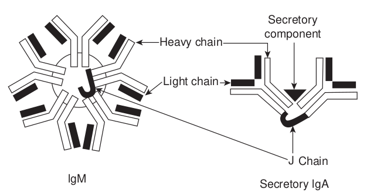

2\. It has a pentameric structure consisting of five monomeric units linked by J chain and disulphide bonds at the Fc fragment (Figure 13.23).

3\. It is the predominant antibody in the primary immune response to most antigens and the predominant antibody produced by the fetus.

4\. It is the first immunoglobulin made during B cell maturation and individual IgM monomers are expressed on B cells, serving as the antibody component of the B cell receptor (BCR).

5\. IgM tends to remain in the bloodstream, where it agglutinates (clumps) bacteria, activates complement by the classical pathway and enhances the ingestion of pathogens by phagocytic cells.

y chain

Secretory component

chain

ChainJ

Secretory lgA

cretory IgA. IgM has a pentameric structure ry IgA has a dimeric structure plus J chain e dominant IgA2 subclass, which is unique

the light and heavy chains. Light chains are

| Light chain |
|------|------|------|

  

6\. It has a half life of approximately 5 days.

**iv) IgD** 1\. IgD accounts for about less than 1%

of the total immunoglobulin pool. 2. One unique structural feature is the

presence of only a single H-H inter chain bond along with two H-L interchain bonds.

3\. It has a monomeric structure similar to that of IgG.

4\. IgD antibodies are abundant in combination with IgM on the surface of B cells and thus are part of the B cell receptor complex. Therefore their function is to signal the B cell to start antibody production upon initial antigen binding.

5\. It has a half life of 2-3 days.

**v) IgE** 1\. IgE accounts for only 0.004% of

serum immunoglobulin. It has a

**Polyclonal Antibody:** A m of B-cell clones that have r of the antibodies react with each other in amino acid se

**Breast Milk:** Breast milk is uniquely needs and is a live substance with unparallel properties that protect against a host of illn children. All five classes of immunoglobulin far the most abundant type is IgA, specifica

**Antitetanus Serum:** Antitetanus serum (TIG) is made up of antibodies against the in those who have a wound that is at high with tetanus toxoid. It is also used to treat relaxants. It is given by injection into a mus  

monomeric structure. It is also called reagin or reaginic antibody.

2\. The skin sensitizing and anaphylactic antibodies belong to this class.

3\. The Fc portion of IgE can bind to Fc receptors specific for IgE that are found on mast cells, eosinophils and basophils. Thus these cells can become coated with IgE molecules. When two cell- bound IgE molecules are cross linked by binding to the same antigen, the cells degranulate. This degranulation releases histamine and other mediators of inflammation.

4\. IgE also stimulates production of an excessive number of eosinophils in the blood (eosinophilia) and increased rate of movement of the intestinal contents (gut hypermotility) which aid in the elimination of helminthic parasites. IgE has a half life of 2-3 days.

ixture of antibodies produced by a variety ecognized the same antigen. Although all the immunizing antigen, they differ from quence. suited to the human infant’s nutritional ed immunological and anti-inflammatory esses and diseases for both mothers and s have been found in human milk, but by

lly the form known as secretory IgA. , also known as tetanus immune globulin tetanus toxin. It is used to prevent tetanus risk and have not been fully vaccinated tetanus along with antibiotics and muscle cle.

  

### Antigenic Determinants on Immunoglobulins

Since antibodies are glycoproteins, they can themselves function as potent immunogens to induce an antibody response. Such anti-Ig antibodies are powerful tools for the study of B cell development and humoral immune response. The antigenic determinants or epitopes, on immunoglobulin molecules fall into three major categories: isotypic, allotypic and idiotypicdeteminants, which are located in characteristic portions of the molecule.

**i) Isotype** Isotypic determinants are constant region d heavy chain class and subclass and each ligh Each isotype is encoded by a separate consta carry the same constant region genes. With express all isotypes in the serum. Different genes and therefore express different isotyp species is injected into another species, the as foreign, inducing an antibody response t antibody.

**ii) Allotype**

Although all members of a species inherit alleles exist for some of the genes. These all called **allotypicdeterminnats**that occur in

The unique amino acid sequence of the V function not only as an antigenic binding site Therefore, the idiotypic determinants are ge and light chain variable regions. Each ind and the sum of the individual idiotopes i produced by injecting antibodies that have allotypes, so that the idiotypic difference ca

**Infob**  

## Antigen – Antibody Reactions

Antigen and antibody combine with each other specifically and in an observable manner. The exquisite specificity of antigen-antibody interactions has led to the development of a variety of immunological assays. These assays can be used to detect the presence of either antibody or antigen. These assays are also helpful in diagnosing diseases, monitoring epidemiological surveys and identifying molecules of biological or medical interest. Antigen- antibody reactions in vitro are known as serological reactions.

eterminants that collectively define each t chain type and subtype within a species.

nt region gene and all members of a species in a species, each normal individual will species inherit different constant region es. Therefore, when an antibody from one isotypic determinant will be recognized

o the isotypic determinants on the foreign

the same set of isotype genes, multiple eles encode subtle aminoacid differences, some.

H and VL domains of a given antibody can but also as a set of antigenic determinants. nerated by the conformation of the heavy

ividual determinant is called an idiotope s the idiotype. Anti-idiotype antibody is minimal variation in their isotypes and n be recognized.

**its**

  

### Three stages of Antigen – Antibody Reactions

**a) Primary stage**

The reactions between antigen and antibody occur in three stages. The primary stage is the initial interaction between the two without any visible effects. This reaction is rapid and obeys the general laws of physical chemistry and thermodynamics. The reaction is reversible. The combination between antigen and antibody is effected by the weaker intermolecular forces such as electrostatic forces, hydrogen bonds, Van der Waals forces and hydrophobic forces.

b) Secondary stage

The primary stage is followed by the secondary stage leading to demonstrable events such as precipitation, agglutination, lysis of cells, killing of live antigens, neutralization of motile organisms, complement fixation and enhancement of phagocytosis.

**c) Tertiary stage**

Some antigen-antibody reactions occurring in vivo initiate chain reactions that lead to neutralization or destruction of injurious antigens or to tissue damage. These are the tertiary reactions and include humoral immunity against infectious diseases as well as clinical allergy and other immunological diseases.

### General Features of Antigen – Antibody Reactions

Antigen-antibody reactions have the following general characteristics:

1\. The antigen-antibody reaction is specific. An antigen combines only  

with its homologous antibody and vice versa.

2\. An entire molecule reacts and not fragments.

3\. There is no denaturation of the antigen or the antibody during the reaction.

4\. The combination occurs at the surface.

5\. TBoth antigen and antibody participate in the formation of agglutinates or precipitates.

### Measurement of Antigen and Antibody

Many methods are available for the measurement of antigens and antibodies participating in the primary, secondary and tertiary reactions. Measurement may be in terms of mass (Example: mg Nitrogen) or more commonly as units or titre. The antibody titre of a serum is the highest dilution of the serum which gives an observable reaction with the antigen in the particular test. The titre of a serum is influenced by the nature and quantity of the antigen and the type and conditions of the test. Antigens may also be titrated against sera.

The various tests used for detection of antigen and antibodies are given below:

1\. Precipitation tests 2. Agglutintion tests 3. Complement Fixation test 4. Immunofluorescence 5. Radio immuno assay 6. Enzyme linked immuno sorbent assay

  

7\. Western Blotting technique 8. Neutralization test

**1\. Precipitation reactions** When a soluble antigen combines with its antibody in the presence of electrolytes (NaCl) at a suitable temperature and pH, the antigen-antibody complex, forms an insoluble (visible) precipitate and this reaction is called precipitation. When instead of sedimenting, the precipitate remains suspended as floccules, the reaction is known as flocculation.

**• Applications of precipitation reactions** The following types of precipitation tests are in common use: **a) Ring test** Examples of ring precipitation test are the C- reactive protein test, Ascoli’s thermoprecipitin and the grouping of streptococci by the Lancefield technique. **b) Slide test** When a drop of antigen and a drop of antiserum are placed on a slide and mixed by shaking, floccules appear. The VDRL test for syphilis is an example of slide flocculation. **c) Tube test** A quantitative tube flocculation test is used for the standardization of toxins and toxoids. Precipitation reaction in gels

There are several advantages in allowing precipitation to occur in a gel rather than in a liquid medium. The reaction is visible as a distinct band of precipitation, which is stable and can be stained for preservation, if necessary. Imunodiffusion is usually performed in 1% agarose gel. Different modifications of the test are available.  

• Single Diffusion in One Dimension (Oudin Procedure)

• Double Diffusion in One Dimensions (Oakley-Fulthorpe Procedure)

• Single Diffusion in Two Dimensions (Mancini Procedure)

• Double Diffusion in Two Dimensions (Ouchterlony Procedure)

**Immunoelectrophoresis** Immunoelectrophoresis was devised by Grabar and Williams (1953). This method consists of two steps. The first step is agarose electrophoresis of the antigen. Rectangular trough is then cut into the agarose gel parallel to the direction of the electric field and is filled with the antiserum. By diffusion, lines of precipitation develop with each of the separated compounds (Figure 13.24). This method is used to detect normal and abnormal serum proteins.

2

3

1

5

6

4

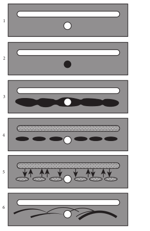

  

1\. Semisolid agar layered on the glass slide. A well for antigen and a trough for antiserum cut out of agar.

2\. Antigen well filled with human serum. 3. Serum separated by electrophoresis. 4. Antiserum trough filled with antiserum

to whole human serum. 5. Serum and antiserum allowed to diffuse

into agar. 6. Precipitin lines form for individual

serum proteins • Counterimmunoelectrophoresis • Rocket Electrophoresis

**2\. Agglutination reactions** When a particulate antigen is mixed with its antibody in the presence of electrolytes at a suitable temperature and pH, the particles are clumped or agglutinated, and the reaction is called agglutination. ADirect agglutination test In the direct technique, a cell or insoluble particulate antigen is agglutinated directly by antibody. An example is the agglutination of group A erythrocytes by anti-A sera.

**Indirect (Passive) agglutination test** Passive agglutination refers to agglutination of antigen coated cells or inert particles (ben- tonite or latex particles) which are passive carriers of soluble antigens. An example is the latex agglutination for detection of rheu- matoid factor.

**• Applications of agglutination reactions**

**a) Slide agglutination** Slide agglutination is a routine test for

the identification of many bacterial isolates from clinical specimens. It is also the method used for blood grouping and cross matching.  

**b) Tube agglutination** This is a standard quantitative method for measurement of antibodies. Widal test done for typhoid and Weil Felix test done for rickettsial infections are examples of Tube agglutination. **Latex agglutination test** Here latex particles are used as passive carriers for adsorbed soluble antigens. The most widespread application of latex agglutination has been in the detection of rheumatoid factor. Latex agglutination tests are also employed in the clinical laboratory for detection of HBs Ag, ASO (Antistreptolysin O) and CRP (Carbohydrate Reactive Protein) **Coombs test (antiglobulin test)** This test was devised by Coombs, Mourant and Race (1945) for the detection of anti-Rh antibodies that do not agglutinate Rh-positive red blood cells in saline. The Coombs test may be of the direct or the indirect type. **Applications of coombs test**

1\. Erythrocyte typing in blood banks. 2. The evaluation of hemolytic disease

of the newborn. 3. The diagnosis of autoimmune

hemolytic anemia.

  

**Summary**

Immunology began as a study of the response of the whole animal to infection. Over the years, it has become progressively more basic, passing through phases of emphasis on serology, cellular immunology, molecular immunology and immunogenetics.

The thymus and bone marrow are the primary lymphoid organs. The primary lymphoid organs provide sites for the development and maturation of B and T lymphocytes.

The secondary lymphoid organs function to capture antigen and provide sites where lymphocytes interact with that antigen and undergo clonal proliferation and differentiation into effector cells. The lymphatic system drains the tissue spaces and interconnects many organized lymphoid tissues. The spleen, lymphnodes and mucosal associated tissues (GALT and SALT) are secondary lymphoid organs. Lymph nodes are specialized to trap antigen from regional tissue spaces, whereas the spleen traps blood- borne antigens.

The cells that participate in the immune response are white blood cells or leukocytes. All of the white blood cells develop from a common pluripotent stem cell in hematopoiesis. Lymphocytes are the central cells of the immune system and are responsible for acquired immunity. The other types of white blood cells play ancillary roles such as engulfing and destroying microorganisms, presenting antigens and secreting cytokines. Basophills and mast cells are non phagocytic granulocytes that play a role in allergic responses. Eosinophils are motile phag ocytic cells. Their phagocytic role is less important than that of  

neutrophils. They play a role in the defense against parasitic organisms. Macrophages and neutrophils are the accessory cells of the immune system that phagocytose and degrade antigens. Dendritic cells are antigen presenting cells. They play an important role in TH cell activation by processing and presenting antigen bound to class II MHC molecules. Lymphocytes can be subdivided into B lymphocytes, T lymphocytes and null cells (NK cells). The two major subpopulations of T lymphocytes are T helper (TH) cells and T cytotoxic (TC) cells.

Antibodies are a group of glycoproteins present in the blood tissue fluids and mucous membranes of vertebrates. All immunoglobulins have a basic structure composed of four polypeptide chains (two lights and two heavy) connected to each other by disulphide bonds. In any given antibody molecule, the constant region contains one of five basic heavy chain sequences (γ, α, μ, δ and ε) and one of two basic light chain sequences (k or γ). There are three major effector functions of immunoglobulins are Opsonization, Complement activation and Antibody-dependent cell-mediated cytotoxicity (ADCC).

  

**How are we protected from microbes?**

**STEPS:** • Use the link or Scan the QR code give

open. You can select any topic you wish • ‘Making Antibodies’ page will open. Y

Produce Antibody’, ‘Antigen Processin • From the top of the page click on ‘Vid

Select ‘Cytotoxic T Cells’. • From the top select ‘Study’ and then ‘Q

you choose.

**ICT CORNER**

**Step3**

**Step1**

**Immu**

**URL:** https://www.cellsalive.com/toc\_micro.htm  

n below. “Cells Alive-Immunology” will . For example click “Making Antibodies” ou can go through How ‘Lymphocytes

g’, etc…. eo’ and select ‘watch’ view video topics.

uiz’ to answer the questions for the topic

**Step4**

**Step2**

**nology**

  

**Evaluation**

**Multiple choice questions**

1\. Who coined the term vaccine? a. Jenner

b. Pasteur c. Koch d. Roux

2\. Who advanced the idea that immunity was primarily due to white blood cells? a. Metchinikoff b. Ehrlich c. Wright d. Kitasato

3\. Which of the following does apply uniquely to secondary lymphoid organs? a. Presence of precursor B and T cells. b. Circulation of lymphocytes. c. Terminal differentiation. d. Cellular proliferation.

4\. Which of the following is the major function of the lymphoid system? a. Acquired immunity. b. Innate immunity. c. Inflammation. d. Phagocytosis.

5\. Lymph nodes taken from neonatally thymectomized mice have unusually few cells in the a. Paracortex b. Cortex c. Medulla d. Thymus

6\. The myeloid progenitor gives rise to a. Erythrocytes, neutrophils,

eosinophils, basophils, monocytes, mast cells and platelets.

b. Erythrocytes, eosinophils, basophils, monocytes, mast cells, platelets and  

B lymphocytes. c. Erythrocytes, eosinophils, basophils,

monocytes, mast cells, platelets and T lymphocytes.

d. Erythrocytes, eosinophils, neutrophils, basophils, monocytes, mast cells and NK cells.

7\. Which of the following is a correct statement about NK cells? a. They kill target cells by phagocytosis

and intracellular digestion. b. They proliferate in response to

antigen. c. They kill target cells in an

extracellular fashion. d. They are a subset of

polymorphonuclear cells.

8\. Which of the following cells play an important role in the development of allergies? a. Neutrophils b. Mast cells c. Monocytes d. Dendritic cells

9\. All of the following will act as opsonins except a. Complement b. Antibody c. Acute – phase proteins d. Lactoferrin

10\. Which of the following is not the important feature of acquired immunity? a. Phgocytosis b. Memory. c. Specificity d. Discrimination between self and

non-self 11. Cell mediated immunity is brought

about by

  

a. B cells b. T cells c. NK cells d. Null cells

12\. Vaccines induce immunity that is a. Naturally acquired active immunity. b. Naturally acquired passive

immunity. c. Artificially acquired passive

immunity. d. Artificially acquired active

immunity.

13\. Haptens a. Require carrier molecules to be

immunogenic. b. Interact with specific antibody, even

if the haptens are monovalent. c. Cannot stimulate immune responses

without carriers. d. All of the above.

14\. The protection against small pox virus infection afforded by prior infection with cowpox represents a. Antigenic specificity b. Antigenic cross reactivity. c. Innate immunity. d. Passive protection.

15\. An adjuvant is a substance that a. Enhances the immunogenicity of

haptens. b. Increases the chemical complexity

of the immunogen. c. Enhances the immune response to

the immunogen. d. Enhances the immunologic cross –

reactivity. 16. Antigenic sites with which antibodies

react are called  

a. Immunogens b. Carriers c. Epitopes d. haptens

17\. Basic structural unit of an immunoglobulin molecule includes a. Identical λ light chains only. b. One constant and three variable

regions. c. Two identical heavy and two

identical light chains. d. A total of five domains.

18\. J chain is a glycopeptides chain associated with which of the following immunoglobulins? a. IgA b. IgG c. IgD d. IgE

19\. Primary interactions between antigens and antibodies involve all of the following except which? a. Van der Waals forces b. Hydrophobic forces c. Electrostatic forces d. Covalent bonds

20\. When instead of the antigen, the antibody is adsorbed to carrier particles in test for estimation of antigen, this technique is known as a. Indirect agglutination b. Direct agglutination c. Reverse passive agglutination d. Hemagglutination inhibition

**Answer the following**

1\. What is immunology?

2\. Define the term vaccination.

3\. What are M cells?

  

4\. What is the role of primary lymphoid organs and secondary lymphoid organs?

5\. Define hematopoiesis.

6\. What are pluripotent stem cells?

7\. What is acquired immunity?

8\. What is immunological memory?

9\. Define the term active/passive immunity.

10\. What is immunogenicity?

11\. Define the term immunogen.

12\. What are haptens?

13\. What is antigenicity?

14\. Define epitopes.

15\. Define the term antibodies.

16\. What is opsonization?

17\. What is immunity/complement?

18\. What is precipitation/agglutination?

19\. Write short notes on eosinophils/ neutrophils.

20\. Give a short account of natural killer cells.

21\. How do intact mucous membranes resist microbial invasion of the host?  

22\. Briefly explain the various stages involved in phagocytosis.

23\. Write short notes on interferons.

24\. Write short notes on primary immune response/secondary immune response?

25\. How do adjuvants function?

26\. Explain immunoglobulin structure and function?

27\. Describe briefly the structure and function of thymus.

28\. Describe the structure and function of spleen/lymph node.

29\. Describe the characteristics of macrophages

30\. Write the characteristics of B/T cells.

31\. Briely explain the three major events in the inflammatory response.

32\. Briefly explain humoral immunity.

33\. Write an account of cell mediated immunity.

34\. Mention the properties of IgM.

35\. List out the general features of antigen- antibody reactions.

