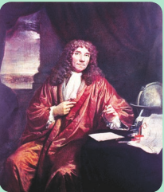
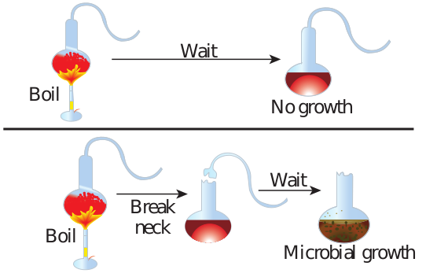
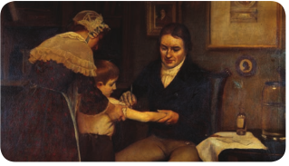
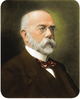
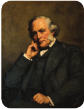

  

**Chapter** 1 **Introduction to Microbiology Chapter Outline**

**1.1** Groups of Microorganisms

**1.2** Contributors to Microbiology

**1.3** Branches of Microbiology

Pr 3,5 lif an

_Science knows no country, because knowled which illumina_

After studying this chapter the student will be able,

_• To know the features of microorgan- isms._

_• To know the contributions of different scientists._

_• To know the branches of Microbiology._

**Learning Objectives**

Microbiology is one of the fascinating fields of science. Microorganisms and their activities are the major concerns of society both nationally and internationally. The  

developments in biotechnology, genetic engineering and nanotechnology have placed Microbiology in the limelight. Microorganisms provide the model for interdisciplinary research and for studying fundamental life processes. There is growing recognition of microorganisms and their potential in many applied areas like Environmental science, Agriculture, Food and Pharmaceutical industries. The uses of microorganisms are becoming increasingly attractive. Some microorganisms are beneficial to human and cannot live without them.

Microorganisms - Bacteria, Fungi, Algae, otozoa and Viruses - have been around for at least 00 million years. Microbes affect every aspect of

e on earth. They have an amazing variety of shapes d sizes. They can exist in a wide range of habitats.

_ge belongs to humanity, and is the torch tes the world._

**Louis Pasteur**

**Bacteria**

**Fungi**

**Algae**

**Viruses**

**Protozoa**

**Microbiology includes the study of**

  

However microorganisms can be harmful in many ways and bring about undesirable changes. These microorganisms can cause diseases that can make us sick or even kill us. Although much more is known today about microbial life than ever before, the vast majority of this invisible world remains unexplored. Microbiologists continue to identify new ways that microbes benefit and threaten humans.

Microbiology is the study of living organisms of microscopic size, which include bacteria, fungi, algae, protozoa, and viruses. Microbiology is concerned with form, structure, reproduction, physiology, metabolism, and classification of microorganisms. It includes the study of

• their distribution in nature, • their relationship to each other and to

other living organisms, • their effects on human beings, animals

and plants, • their abilities to make physical and

chemical changes in our environment, • their reaction to physical and chemical

agents.

## Groups of Microorganisms

There are many kinds of microorganisms present in the universe. They are broadly classified into the following groups.

**Bacteria:** They are unicellular prokaryotic organisms or simple association of similar cells. Cell multiplication usually happen by binary fission.

Example: _Escherichia coli, Bacillus subtilis_

**Fungi:** They are eukaryotic organisms which is devoid of chlorophyll. They are  

usually multicellular. They range in size and shape from single celled microscopic yeasts to giant multicellular mushrooms and puffballs.

Example: _Aspergillus niger, Agaricus bisporus_

**Protozoa:** They are unicellular eukaryotic organisms. Their role in nature are varied. The best known protozoa cause disease in human beings and animals.

Example: _Giardia lamblia, Plasmodium vivax_

**Algae:** They range from unicellular, colonial to multicellular forms. All algal cell contain chlorophyll and are capable of photosynthesis. They are found most commonly in aquatic environments and damp soil.

Example: _Spirogyra, Chlamydomonas_ **Viruses:** In the study of Microbiology,

we encounter “organisms” which may represent the borderline of life. Viruses are simpler in structure and composition than other living cells. A virus is made up of nucleic acids and proteins. Viruses are obligate parasites. They grow only within an appropriate host cell (plant, animal, humans or microbe). They cannot multiply outside a host cell.

Example: HIV_,_ Rabies virus

Prions are infectious agents composed entirely of protein material. Creutzfeldt–

Jacob Disease (CJD) is one of the human prion diseases.

  

## Contributors to Microbiology

Many scientists contributed to the science of Microbiology from the 17th century to the present day. Some prominent microbiologists who have made significant contribution to the study of microorganisms are given below:

### Antony Van Leeuwenhoek

Antony Van Leeuwenhoek (1632-1723) of Holland (Figure 1.1) developed microscopes. He was a Dutch merchant and a skilled lens maker. He made a variety of lenses with magnifying power 50-300X.

He was the first person to invent simple microscope. It has a single biconvex lens with a magnification of about 200X (Figure 1.2). His microscopes resolved bodies with diameters measuring below 1micron. He examined water, mud, saliva and found living organisms. He called these microorganisms as **Animalcules** (little animals). Bacteria like cocci, bacilli and spirochetes were recognized. He proposed that the size of bacteria is one sixth the diameter of Red Blood Cells.

He observed the growth of bacteria in infusions. The existence of spermatozoa and RBC was revealed by him. Animal histology was established by him. He described capillary circulation and added a new dimension to Biology. All kinds of unicellular microorganisms were accurately described by him including human oral microbial flora. He is commonly known as the ‘**Father of Microbiology’**.

### Louis Pasteur (1822-1895)

Louis Pasteur was a French chemist and a crystallographer (Figure 1.3). His greatest contribution to microbiology made him to be the ‘**Father of Modern Microbiology’**.  

Antony Van Leeuwenhoek wrote many letters. He wrote them in Dutch, the only language that he knew. These letters, described his complete scientific output. Antony Van Leeuwenhoek in a letter dated 12th June 1716, wrote “... _my work, which I’ve done for a long time, was not pursued in order to gain the praise I now enjoy, but chiefly from a craving after knowledge, which I notice resides in me more than in most other men. And therewithal, whenever I found out anything remarkable, I have thought it my duty to put down my discovery on paper, so that all ingenious people might be informed thereof_”.

**Contribution to science as a chemist** Louis Pasteur was working with tartaric acid crystals. He could pick up the dextro and levo rotatory crystals by seeing the morphology of the crystals. Later he was called to solve some of the problems in fermentation industry and turned his attention to biological process of fermentation.

  

**Contribution to Microbiology**

**To wine industry** Louis Pasteur discovered alcohol production from grape juice was due to yeast. The presence or contamination of rod shaped bacteria resulted in large amounts of lactic acid production in wine. He also found that microorganisms in fermented fruits and grains, resulting in alcohol production. He coined the term “**fermentation**”.

**Pasteur disproved spontaneous generation** Spontaneous generation states that life could arise spontaneously from inanimate (non-living) materials (Abiogenesis). Pasteur disproved the

Sample Mounting pin

Lens

Observer’s e

Focusing screws

theory of spontaneous generation. He strongly supported theory of Biogenesis (life orginates from pre-existing life forms). To prove this he carried out several experiments. Pasteur poured meat infusions into flasks and then drew the top of each flask into a long curved neck that would admit air but not dust (Figure 1.4). He found that if the infusions were heated, they remained sterile (free from any growth) until they were exposed to dust. After opening them on a dusty road and resealing them, he demonstrated the growth of microorganisms in all the flasks. The unopened flasks were sterile. Thus he disproved the theory of spontaneous generation.

**Pasteurization** Louis Pasteur used heat to destroy undesirable microbes in fruit juices. He employed 62.8°C (145°F) for 30 mins to kill microbes. This process is called Pasteurization which is commonly used in distillaries and dairy industry.

**Discovery of diseases** Louis Pasteur found that Pebrine disease in silk worm was caused by a protozoan parasite. He suggested that Pebrine disease could be eliminated by using only healthy,

hoek’s Microscope

ye

  

disease free silk worms. Wool Sorter’s disease was named as “Anthrax” by him. He isolated _Bacillus anthracis_ from the blood of infected animals. Chicken cholera bacterium was also isolated by Louis Pasteur using pure culture. He proved that many diseases were caused by the presence of foreign microorganisms (**Germ theory of disease**). He discovered various infection causing microorganisms such as _Staphylococcus, Streptococcus_ and _Pneumococcus._

**Vaccination** Pasteur found out that bacteria could be attenuated by growing them in unnatural conditions. He coined the term “**attenuation**”. It is a process wherein bacteria lose their virulence due to repeated subculturing under laboratory conditions. He used attenuated cultures as vaccines for immunizing and protecting

Boil

Wait

Break neckBoil

an individual against the disease. He developed vaccines for anthrax and rabies.

### Edward Jenner (1749-1823)

In ancient observation, persons who had suffered from a specific disease such as small pox (causative agent of small pox is varicella virus) or mumps, resisted the infection on subsequent exposures. They rarely contracted these infections for second time. Edward Jenner, a country doctor in England noted a pustular disease on the hooves of horses called the grease. This was carried by farm workers to the nipples of cows (cow pox). This was again carried by milk maids. They got inflamed spots on the hands and wrists. The people who got this cow pox were protected from small pox. He reported that 16 farm workers who had recovered from cow pox (causative agent of cow pox is vaccinia virus) were resistant to small pox infection.

He took the material (pus) from the cow pox and inoculated into the cut of 8 year old boy on 14th May 1796 (Figure 1.5). Two

No growth

Wait

Microbial growth

n neck flask experiment

  

months later Jenner inoculated the same boy with material taken from small pox patients. This was a dangerous but accepted procedure at that time. This procedure was called variolation. The boy was protected against small pox. His exposure to the mild cow pox disease had made him immune to the small pox disease. In this manner Jenner began the Science of Immunology, the study of the body’s response to foreign substances. Edward Jenner was regarded as the **‘Father of Immunology’**.

### Robert Koch (1843-1910)

Robert Koch was a German physician and microbiologist (Figure 1.6). He was the founder of Modern Bacteriology. Robert Koch discovered _Bacillus anthracis_ (Anthrax bacillus), _M y c o b a c t e r i u m tuberculosis_, and _Vibrio cholerae_. For the first time he showed the evidence that a specific germ (Anthrax bacillus) was the cause of a specific disease (splenic fever in sheep) and introduced scientific approach in Microbiology.

He modified Ziehl-Neelsen Acid Fast staining procedure which was introduced by Ehrlich. He devised solid medium to grow microorganism. He developed powerful method to isolate the microorganisms in pure culture from diseased tissue. He also perfected the techniques of identification of the isolated bacteria.

He introduced Koch’s thread method to find out the efficacy of disinfectants. He established certain rules that must be followed to establish a cause and effect relationship between a microorganism and a disease. They are known as Koch’s Postulates. He also described the Koch’s Phenomenon. He was regarded as the **‘Father of Medical Microbiology’**.

**Koch’s Thread Method** Robert Koch carried out systematic experiments on disinfection, using pure cultures of bacteria. By means of his Thread Method, he investigated the effect on anthrax spores of the popular disinfectants at that time. Koch’s Thread Method also called as carrier test. A carrier such as silk is contaminated by submerging in a liquid culture of the _Bacillus anthracis,_ a test organism. The carrier is further dried and immersed in the disinfectant solution for a given exposure time. Thereafter the thread is cultured in a nutrient broth. No growth after incubation indicated that the product (disinfectant) is active.

**Infobits**

**Koch’s Postulates** Four criteria were established by Robert Koch to identify the causative agents of an infectious disease. These include

  

1\. A specific organisms can always be found in association with a given disease. If we take typhoid as an example it is caused by a bacterium _Salmonella typhi._

2\. The organism can be isolated and grown in pure culture in the laboratory. _Salmonella typhi_ are grown in soild media under laboratory conditions.

3\. The pure culture will produce the diseases when inoculated into a susceptible animal. Almost all the pathogenic organisms

produce the same disease in experimental animals. Usually rats, mice, rabbits or guinea pigs are used as experimental animals. _Pneumococci_ produce pneumonia in animals. _Salmonella_ species do not produce typhoid fever in rat, mice or rabbit. So chimpanzee is taken as experimental animal and it produces fever in chimpanzee.

The same microorganisms are present in every case of the disease.

The microoraganisms are isolated from the tissues of a dead animal, and a pure culture is prepared.

Microorganisms from the pure culture are inoculated into a healthy , susceptible animal. The disease is reproduced.

**Koch**

**Postulate 1**

**Postulate 2**

**Postulate 3**

4\. It is possible to recover the organism in pure culture from the experimentally infected animals and it is observed to be the same as originally inoculated pathogen. Figure 1.7 explains the Koch’s postulates.

**Limitations** Some organisms have not yet been grown in artificial culture media

Example: _Mycobacterium leprae_ and _Treponema pallidum_. **Modern addition to Koch’s Postulates** Today we recognize additional criteria of causal relation between a microorganism and a disease. The important one is the demonstration of abnormally high concentration of specific circulating antibodies to the organism in the infected host or the presence of abnormally high degree of specific immunity or hypersensitivity to the infecting agent in

The identical micro- organisms are isolated and recultivated from the tissue specimens of the experimental animal.

Anthrax bacilli

**postulates**

**Postulate 4**

tes for infectious diseases

  

a recently recovered host. In addition to culture techniques, serological techniques are also used for diagnosis of diseases.

**Usefulness of Koch’s Postulates** • It is useful in determining pathogenic

organisms. • To differentiate the pathogenic and

nonpathogenic microorganism. • For the classification of organisms. • To detect the susceptibility or resistance

of the laboratory animals.

### Joseph Lister(1827-1912)

Joseph Lister was a British surgeon (Figure 1.8). He found out that m i c r o o r g a n i s m s were responsible for wound infections. He developed a system of antiseptic surgery. He used bandages soaked in phenol solution to prevent wound infection. He sterilized instruments by heat and sprayed diluted phenol over surgical area and prevented contamination of wounds. He was the first person to isolate bacteria in pure culture using liquid culture. Thus, he was considered as co-founder of Medical Microbiology with Koch, who later isolated bacteria on solid media.

### Alexander Fleming (1881-1955)

He was a British Bacteriologist. He observed a mold (_Penicillium notatum_) growing on a plate of _Staphylococcus aureus_. The growth of _Staphylococcus aureus_ around the mold colony was

inhibited (Figure 1.9). He also showed that the culture filtrate of mold inhibited the growth of _Staphylococcus aureus_. He called this substance Penicillin, which acted on Gram positive bacteria. For the discovery of this antibiotic Fleming (Figure 1.10), Florey and Chain got Nobel Prize in 1945. Penicillin eventually came into use during world war II as a result of the work of a team of scientists led by Howard Florey of the University of Oxford.

Alexander Fleming, the discoverer of penicillin warned about the possibility

of antibiotic resistant bacteria due to antibiotics misuse, as early as in 1920s.

penicillin was made by Alexander Fleming

  

### Selman Abraham Waksman (1888-1973)

Waksman was from Rutger University, USA (Figure 1.11). His research was largely on soil microorganisms. He showed antimicrobial activity of streptomyces that led to the discovery of Streptomycin and several other antibiotics.

Waksman and his co-workers isolated Actinomycin in 1940, Streptothrecin in 1942, Streptomycin in 1943, and Neomycin in 1949.

Streptomycin is produced by _Streptomyces griseus_. It is a secondary metabolite produced by _Streptomyces_

**Table 1.1:** Branches of Microbiology

**Based on Taxonomical characteristics**

Bacteriology The study of

Mycology The study of

Protozoology The study of

**Based on Taxonomical characteristics**

Phycology (or algology) The study of

Parasitology The study of

Immunology The study of

Virology The study of

Nematology The study of  

_griseus_ which is not required for its growth but may help it to compete with other bacteria for food and space in the environment. Streptomycin is used in the treatment of tuberculosis. Waksman got Nobel Prize in 1952. for his work on Streptomycin

Antibiotics are usually not effective for sore throats and common colds. They

are commonly caused by viruses rather than bacteria. Taking antibiotics for such illnesses is considered more harmful than beneficial.

## Branches of Microbiology

Microbiology can be classified into Pure and Applied Microbiology. Pure Microbiology is classified based on taxonomical and integrative characteristics. Table 1.1 shows various branches of microbiology.

bacteria

fungi

protozoa

algae

parasites

the immune system

viruses

the nematodes

| Bas e d o n Tax ono mi c a l cha r ac teris ti cs |
|------|------|
| B ac ter io log y |Th e s tud y o f b ac ter i a |
| Myco log y |Th e s tud y o f f un g i |
| Protozo olog y |Th e s tud y o f p rotozo a |
| Bas e d o n Tax ono mi c a l cha r ac teris ti cs |
| Phyco log y (o r a lg olog y) |Th e s tud y o f a lgae |
| Para si tolog y |Th e s tud y o f p ara si tes |
| Imm un olog y |Th e s tud y o f t he imm un e sys tem |
| Vir olog y |Th e s tud y o f v ir us es |
| Nem atolog y |Th e s tud y o f t he n em ato des |
  

**Based on integrative characteristics**

Microbial Cytology The study of of microorga

Microbial Physiology The study of also includes metabolism a

Microbial Ecology The study of their environ

Microbial Genetics The study of microbes in r

Cellular Microbiology A discipline b

Evolutionary Microbiology The study of

Microbial Taxonomy The study of n

Microbial Systematics The study of microorganis

Systems Microbiology A discipline b

Generation Microbiology The study o characters as

Molecular Microbiology The study of processes in m

Nano Microbiology The study of

Exo Microbiology (or Astro Microbiology)

The study of

Biological Warfare The study of

**Applied microbiology**

Medical Microbiology The study o of microbes microbial pat to the study o

Pharmaceutical Microbiology

The study of production o and other pha  

microscopic and sub microscopic details nisms

biochemical functions of microbial cell. It the study of microbial growth, microbial nd microbial cell structure

relationship between microorganisms and ment

gene are organisation and regulation in elation to their cellular functions.

ridging microbiology and cell biology

the evolution of microbes

aming and classification of microorganisms

the diversity and genetic relationship of ms

ridging systems biology and microbiology

f microorganisms which have the same their parents

the molecular principles of physiological icroorganisms

microorganisms at nano level

microorganisms in outer space

microorganisms used in weapon industries

f the pathogenic microbes and the role in human illness. Includes the study of hogenesis and Epidemiology and is related f disease, Pathology and Immunology

microorganisms that are related to the f antibiotics, enzymes, vitamins, vaccines, rmaceutical products

| Bas e d o n in te g r ativ e cha r ac teris ti cs |
|------|------|
| Micr obi a l C yt olog y |Th e s tud y o f micr os co pic a nd s ub micr os co pic det ai lsof micr o orga ni sm s |
| Micr obi a l P hysio log y |Th e s tud y o f b io chemic a l f un c t io ns o f micr obi a l ce l l. I ta ls o in cludes t he s tud y o f micr obi a l g rowt h, micr obi a lmet ab oli sm a nd micr obi a l ce l l s t r uc tur e |
| Micr obi a l E co log y |Th e s tud y o f r el at io nshi p b et we en micr o orga ni sm s a ndt heir en v ir onm en t |
| Micr obi a l G en et ics |Th e s tud y o f g en e a re o rga ni s at io n a nd r egu l at io n inmicr ob es in r el at io n t o t heir ce l lu l ar f un c t io ns. |
| C el lu l ar M icr obio log y |A di s ci plin e b r idg in g micr obio log y a nd ce l l b io log y |
| Evolut io nar y M icr obio log y |Th e s tud y o f t he e volut io n o f micr ob es |
| Micr obi a l Tax onomy |Th e stud y of namin g and cl assif ic at io n of micro orga ni sm s |
| Micr obi a l S ys tem at ics |Th e s tud y o f t he di ver si t y a nd g en et ic r el at io nshi p o fmicr o orga ni sm s |
| Sys tem s M icr obio log y |A di s ci plin e b r idg in g sys tem s b io log y a nd micr obio log y |
| G en era t io n M icr obio log y |Th e s tud y o f micr o orga ni sm s w hic h h ave t he s amecharac ter s a s t heir p aren ts |
| Mole c u l ar M icr obio log y |Th e s tud y o f t he m ole c u l ar p r in ci ples o f p hysio log ic a lpro ces s es in micr o orga ni sm s |
| Nano M icr obio log y |Th e s tud y o f micr o orga ni sm s a t n ano le vel |
| E xo M icr obio log y (o r A st roMicr obio log y) |Th e s tud y o f micr o orga ni sm s in o uter s p ace |
| Bio log ic a l War fa re |Th e s tud y o f micr o orga ni sm s u s e d in w e ap on in dust r ies |
| App li e d mi cr obi o l o g y |
| Me dic a l M icr obio log y |Th e  stud y  of  t he  p at hog enic  micr ob es  and  t he  roleof micr ob es in h um an i l ln es s. I ncludes t he s tud y o fmicr obi a l p at hog en esi s a nd E pidemio log y a nd i s r el ate dto t he s tud y o f di s e as e, P at holog y a nd I mm un olog y |
| Phar maceu t ic a lMicr obio log y |Th e s tud y o f micr o orga ni sm s t hat a re r el ate d t o t hepro duc t io n o f a nt ibio t ics, enzy mes, v it amin s, vaccin es,and o t her p har maceu t ic a l p ro duc ts |
  

**Summary**

Microbiology is the study of microorganisms that includes bacteria, fungi,algae,protozoa and viruses. Many scientists contributed to the science of microbiology.

Antony Van Leuwenhoek made simple microscope. For the first time, Antony Van Leuwenhoek described the microorganisms. Louis Pasteur disproved the theory of spontaneous generation. Germ theory of disease came from the work of Pasteur and Robert Koch. Vaccines for Anthrax and rabies was developed by Pasteur. Direct relationship between the suspected pathogen and disease was established by Koch’s postulates. Koch developed the technique of pure culture on solid medium. Joseph lister developed antiseptic surgery. Alexander Fleming discovered Penicillin. Waksman showed antimicrobian activity that led to the discovery of Streptomycin and other antibiotics. The branches of microbiology can be classified into pure and applied microbiology. Pure microbiology is classified based on taxonomical and integrated characteristics. Microbiology has got vast areas open for job opportunities.

Industrial Microbiology The study of e processes. Ex waste water t an important

Microbial Biotechnology The study of genetic and m

Food Microbiology and Dairy Microbiology

The study of m illness and fo  

xploitation of microbes for use in industrial amples include industrial fermentation and reatment. This field also includes brewing, application of microbiology

manipulation of microorganisms at the olecular level to generate useful products

icroorganisms in food spoilage, foodborne od production.

**Student Activity**

1\. Want to see spontaneous generation of life? Take chicken soup or meat soup boil it in a bottle. Keep it over the shadow of your window/or in a open place with mouth open. Observe for a week. You will see maggots (worms) growing. Observe and record your findings.

2\. For you to enjoy-like Antony Van Leeuwenhoek !! Get a palmist lens, see through it a paper print. You will see letter becomes big, bigger, and at one point it is no longer magnifying the letter. A simple convex lens is magnifying things. Leeuweenhoek used such lens only. (as seen above) You know useful and useless magnification.

| Indust r i a l M icr obio log y |Th e stud y of explo it at io n of microb es for us e in indust r i a lpro ces s es. E xa mples in clude in dust r i a l fer men t at io n andwa ste wa ter t re at men t. Thi s f ie ld a ls o in cludes b re w in g ,an im p or t ant a pplic at io n o f micr obio log y |
|------|------|
| Micr obi a l B io te chn olog y |Th e s tud y o f m ani pu l at io n o f micr o orga ni sm s a t t hegen et ic a nd m ole c u l ar le vel t o g en era te u s ef u l p ro duc ts |
| Fo o d M icr obio log y a ndD air y M icr obio log y |Th e stud y of micro orga ni sm s in fo o d sp oi l age, fo o db or nei l ln es s a nd f o o d p ro duc t io n. |

  

**ICT CORNER**

**SteStep1**

**Micro**

**URL:** http://nptel.ac.in/courses/102103015/41#

**STEPS:** • Use the URL or scan the QR code to o • Click ‘History’ and ‘Scope of Microbio • Select history of microbiology and cli • Select ‘Members of the Microbial wor

**Lets meet our micro friends**  

**Step3p2**

**biology**

pen ‘NPTEL’ page. logy’ to know the history of microbiology.

ck ‘Start Course’ at the bottom. ld’ to know about it.

  

**Evaluation Multiple choice questions**

1\. Theory of spontaneous generation was disproved by whom? a. Robert Koch b. Edward Jenner c. Louis Pasteur d. All of them

2\. Which of the following did Edward Jenner used to protect the boy against small pox? a. Cow pox material b. Small pox material c. Both the above d. Rabbit pox

3\. Among the following scientists, who discovered solid medium? a. Louis Pasteur b. Edward Jenner c. Robert Koch d. None of them

4\. Which of the following organisms does not obey Koch’s postulates? a. Cow pox virus b. Small pox virus c. Treponema pallidum d. M.Tuberculosis

5\. Who modified Ziehl-Neelsen staining technique? a. Louis Pasteur b. Robert Koch c. Ziehl-Neelsen d. All the above

6\. Which of the following fungi grow on Alexander Fleming’s plate? a. _Penicillium chrysogenum_ b. _Penicillium notatum_  

c. _Streptomyces griseus_ d. _Penicillium mornefii_

7\. Which of the following antibiotics were discovered by Selman Abraham Waksman? a. Streptomycin b. Neomycin c. Actinomycin d. All the above

**Answer the following**

1\. Name the causative agent of cow pox and small pox.

2\. Explain the method of Edward Jenner used to protect people against small pox.

3\. List two organisms that do not obey Koch’s postulates.

4\. Give the usefulness of Koch’s postulates.

5\. What are the modern additions to Koch’s postulates?

6\. List the contribution of Alexander Fleming.

7\. What is the theory of spontaneous generation?

8\. How was spontaneous generation theory disproved?

9\. Highlight the contribution of Waksman.

10\. State the characteristics of streptomycin.

11\. Give a list of contribution of Louis Pasteur to wine industry.

12\. Explain Koch’s postulates? 13. Describe the microscope made by

Antony Van Leeuwenhoek. 14. What are the contributions of Antony

Van Leeuwenhoek to microbiology?

