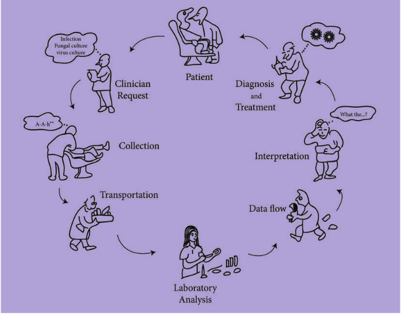
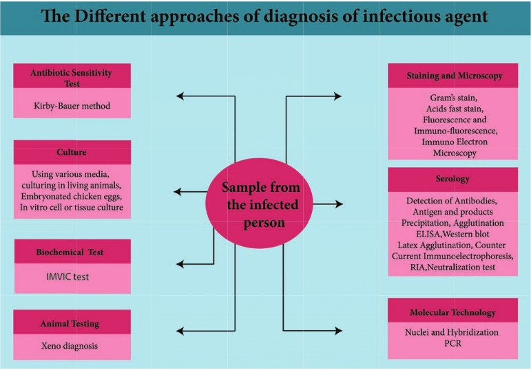
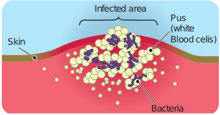
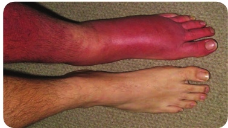
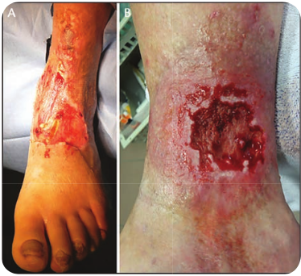
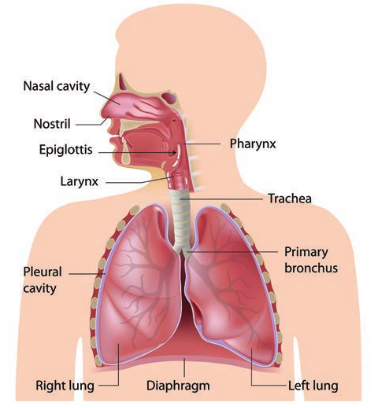
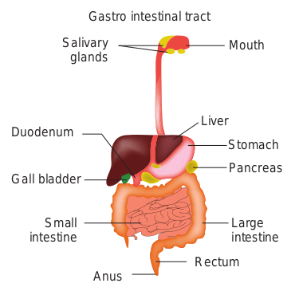
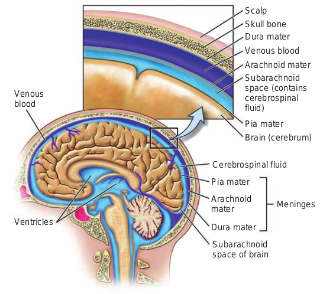

  

After studying this chapter the student will be able,

_• To describe the importance of medical microbiology._

_• To understand the types and sources of infections._

_• To know the types of infectious diseases and virulence factors of the pathogen._

_• To tell the etiological agents of skin wound respiratory, gastro intestinal, ocular, urinary, reproductive, ner- vous system and systemic infections._

_• To know the causative agents of varoius human diseases and their portal of entry._

**Chapter** 12 **Medical Microbiology Chapter Outline**

**12.1** Microbial Infections of the Human Body

**12.2** Skin and Wound Infections **12.3** Respiratory Tract Infections **12.4** Gastrointestinal Tract Infections **12.5** Ocular Infections **12.6** Urinary Tract Infections **12.7** Reproductive Tract Infections **12.8** Infections of the

Nervous System **12.9** Systemic

Infections

an tes inn inf

**Learning Objectives**  

Medical Microbiology or Clinical Microbiology plays important role by providing the necessary diagnostic ting, means of epidemiological detection, and future ovation required in an era of emerging and reemerging

ectious diseases.

## Microbial Infections of the Human Body

Medical microbiology is the branch of microbiology which deals with prevention, diagnosis and treatment of infectious diseases. There are four kinds of microorganisms that cause infectious diseases. They are bacteria, fungi, parasites and viruses. Any disease that spreads from one host to another, either directly or indirectly is said to be a communicable disease. Chicken pox, measles, genital herpes, typhoid fever and tuberculosis are examples of such diseases, that are easily spread from one person to another.

A non communicable disease does not spread from one host to another. For example, _Clostridium tetani,_ a soil

|------|
| Me dic a l M icr obio log y o r C linic a l M icr obio log y p l aysan im p or t ant r ole b y p rov idin g t he n e ces s ar y di ag nos t ictes t in g , m e ans o f ep idemio log ic a l det e c t io n, a nd f utur einn ova t io n  re quir e d  in  an  era  of  em er g in g  and  re em er g in ginf e c t io us di s e as es. |
  

inhabitant, produces Tetanus when it is introduced into a wound or an abrasion. Tetanus is thus an infectious disease, but not communicable.

Infectious disease occurs when the infecting microorganism causes damage to the host. The term infection refers to the establishment of the microorganisms in the tissues resulting in injury or harmful effect to the host. Infection is a pathological condition due to the growth of microorganisms in a host. To initiate an infection, a pathogenic microbe enters the tissues of the body by a characterization route, the portal of entry.

### Routes of Infections

There are various ways in which microorganisms enters into the host are explained below.

**a. Contact** Infection may be acquired by contact which may be direct or indirect. Sexually transmitted diseases such as syphilis and gonorrhea spread by direct contact. Indirect contact may be through the agency of inanimate objects such as clothing, pencils or toys which may be contaminated by a pathogen from one person to another. Pencils shared by school children may act as fomites in the transmission of diphtheria, and face towels in trachoma.

**b. Inhalation** Respiratory infections such as influenza and tuberculosis are transmitted by inhalation of the pathogen in droplet and droplet nuclei that are shed by the patients during sneezing, speaking or coughing. Common cold virus, Adenovirus is  

some of the virus producing respiratory infections.

**c. Ingestion** Intestinal infections are generally acquired by the ingestion of food or drinks contaminated by pathogens. Infection transmitted by ingestion may be waterborne (cholera), food borne (typhoid) or fecal-oral route (dysentery).

**d. Inoculation** Pathogens, in some instances, may be inoculated directly into the tissues of the host. Tetanus spores implanted in the depth of wounds, rabies virus deposited subcutaneously by dog bites, inoculation through unsterile syringes and surgical equipments are examples that enter through direct inoculation.

**e. Congenital** Some pathogens are able to cross the placental barrier and infect the fetus in uterus. Bacteria like _Treponema pallidum_, viruses like _Rubella, Cytomegalovirus_ parasite like _Toxoplasma gondi_ are some of the organisms that enter through placenta and cause disease in the newborn.

### Types of Infections

Infections may be classified in various ways. Initial infection with a parasite in a host is called a primary infection. Subsequent infections by the same parasite in the host are termed reinfections. When a new parasite sets up an infection in a host whose resistance is lowered by a preexisting infectious disease, this is termed secondary infection.

When in a patient already suffering from a disease, a new infection is setup

  

from another host or other external sources it is termed cross infection. Cross infections occurring in hospitals are called nosocomial infections. Iatrogenic infection refers to physician induced infections resulting from investigative, therapeutic or other procedures.

Depending on whether the source of infection is from the host’s own body or from external sources, infections are classified as **endogenous** or **exogenous**, respectively.

**Endogenous infection** Endogenous infections are acquired from the host himself from the normal flora of the body.

Microorganisms are present in certain areas of the body in all human beings. They are called normal flora. The common areas are Nose, Mouth, Teeth, Throat, Intestine, Urethra, Vagina and Skin (Figure 12.1).

_Staphylococcus sp._

Bacterial flora in a normal person in the community

Upper respiratory tract

Skin

Gastrointestinal tract

Genital tract

_Streptococcus sp. Streptococcus pneumoniae–_

_– Viridans streptococcus Haemophilus sp. Anaerobes_

_Staphylococcus sp. Coryneform bacteria or ‘‘Diptheroids’’ Propionibacterium sp._

_Anaerobes_

_Streptococcus sp._

_Enterococcus sp. Enterobacteriaceae – Escherichia coli_

_– Streptococcus agalactiae_

_– Klebsiella sp._

_Lactobacillus sp._

_Lactobacillus sp. Streptococcus sp._

1\. When the skin is breached normal flora enters the tissues.

2\. When the urethral organisms ascend, they cause urinary tract infection

3\. When a patient is treated with antibiotics, normal flora is eliminated and replaced by potential pathogens

4\. When the intestine is perforated, normal flora enter the previously sterile body parts

5\. Similarly when the pH of the vagina increases potential pathogens occupy the space.

However normal flora helps host against pathogen and benefits the host in many ways • Normal flora of skin produces fatty

acids which inhibit other species • Intestinal bacteria secrete antibacterial

substances (bacteriocins, colicins) and many metabolic products that prevent other species to survive.

s present as normal flora n a site. Only few are listed)

  

• Because of their large numbers other species do not have space in the intestine

• Acidic environment created by vaginal Lactobacilli suppresses growth of other bacteria.

How do normal flora help host against pathogenic microorganisms?

**HOTS**

**Exogenous sources of infections Human beings:** The commonest source of infections in human are from other human beings. The parasite may originate from a patient or a carrier. A patient is a person who harbours the pathogenic microorganism and suffers from ill effect because of it. A **healthy carrier** is the one who harbours the pathogens but has never suffered from the disease caused by the pathogen. A **convalescent carrier** is one who has recovered from the disease and continues to harbor the pathogen in his body (Figure 12.2).

**Animals:** Many pathogens are able to infect both human beings and animals. Infectious disease transmitted from animals to human beings are called zoonoses. Zoonotic diseases may be bacterial (Example: plague from rats) or viral (Example: rabies from dogs).

**Insects:** Blood sucking insects may transmit pathogens to human beings. The diseases so caused are called arthopod borne diseases. Insects such as mosquitoes, ticks, mites, flies, fleas and lice that transmit infections are called vectors.  

Transmission may be mechanical or biological. Mechanical transmission is the passive transport of the pathogens on the insects feet or other body parts. Example: Houseflies can transfer the pathogens of Typhoid fever and Bacillary dysentery

**The story of typhoid Mary** The classic example of role of carriers in disease transmission is the story of Mary Mallon.

Mary Mallon was an Irish immigrant who worked as a cook in New York in the early twentieth century. Over seven years, from 1900 to 1907, Mallon worked for number of different households. Unknowingly spreading illness to the people who lived in each one. Later George Soper, tracked Mallon linked 22 cases of typhoid fever through her. He discovered that Mallon was a carrier for typhoid but was immune to it herself. Although active carriers had been recognized before, this was the first time that an asymptomatic carrier of infected had been identified. Epidemiologists were able to trace 51 cases of typhoid fever and three deaths directly to Mallon, who is remembered as “Typhoid Mary”. She was forced to prison and then released under the conditions that she could no longer be a cook. She assumed a false name and began cooking again and of course, infecting numerous people. She was again prisoned where she died 26 years later of pneumonia.

**Infobits**

  

(shigellosis) from feces of infected people to food. Such vectors are called mechanical vectors.

Biological transmission is an active process and is more complex. The pathogens multiply in the body of the vectors often undergoing part of a developmental cycle in it. Such vectors are termed biological vectors. Example: _Aedes aegypti_ mosquito transmitting dengue, _Anopheles_ mosquito transmitting malaria.

**Soil:** Some pathogens are able to survive in the soil for very long periods. Spores of tetatus bacilli may remain viable in the soil for several decades and serve as the source of infection.

**Water:** Water may act as the source of infection due to contamination with pathogenic microorganisms. Example: Cholera causing _Vibrio_ _cholerae_.

**Food:** Contaminated food materials may act as source of infection. The presence of pathogens in food may be due to external contamination. Example: Food contaminated by _Staphylococcus_.

### Types of Infectious Diseases

Infectious diseases may be localised or generalised.

**Localised infections:** An infection that is restricted to a specific location or region within the body of the host is called localised infection.

**Generalised infections:** An infection that has spread to several regions or areas in the body of the host. This involves the spread of the infecting agent from the site of entry through tissue spaces or channels, along the lymphatics or through the bloodstream.

Circulation of bacteria in the blood is known as **Bacteremia**. **Septicemia** is the condition where bacteria circulate and multiply in the blood, form toxic products and cause high fever. **Pyemia** is a condition where pyogenic bacteria produce septicemia with multiple abscesses in the internal organs such as the spleen, liver and kidney.

**Occurrence of a disease** To understand the full scope of a disease, we should know about its occurrence. Epidemiology involves in the study of the frequency and distribution of disease and other health related factors in defined populations. The incidence of a disease is the number of people in a population who develop a disease during a particular time period. The prevalence of a disease

n a microbe causes disease in a host

  

is the total number of existing cases with respect to the entire population.

Depending on the spread of infectious disease in the community, they may be classified into different types.

• Endemic diseases are those which are constantly present in a particular area. Typhoid fever is endemic in most parts of India.

• Epidemic disease is one that spreads rapidly, involving many persons in an area at the same time. Example: Epidemic of Dengue in 2017.

• A pandemic is an epidemic that spreads through many areas of the world involving very large numbers of persons within a short period. Example: H1N1 Influenza outbreak in 2009. Ebola outbreak in 2014-2016 in West Africa was the largest in history and first ever epidemic, affecting multiple countries.

• If a particular disease occurs only occasionally, it is called a sporadic disease. The most commonly occurring sporadic diseases in India are Diphtheria and Hepatitis A and E.

**Severity or duration of a disease** Another useful way of defining the scope of a disease is in terms of its severity or duration. • An **acute** disease is one that develops

rapidly but lasts for a short time. • A **chronic** disease develops more

slowly, and the body’s reactions may be less severe, but the disease is likely to be continual or recurrent for long periods.

• A disease that is intermediate between acute and chronic is described as a subacute disease.  

**Facts about Fever:** Fever is as more healthful than harmful. An experiment with vertebrates shows that fever increases the rate of antibody synthesis. Increased temperatures

stimulate the activities of T cells and increase the effectiveness of interferon. Fever appears to enhance

phagocytosis. Fever almost never occurs as a single response; it is usually accompanied by chills. The explanation lies in the natural physiological interaction between the thermostat in the hypothalamus and the temperature of the blood. For example: If the thermostat has been set (by pyrogen) at 102°F but the blood temperature is 99°F, the muscles are stimulated to contract involuntary (shivering) as a means of producing heat. In addition, the vessels in the skin constrict, creating a sensation of cold and the piloerector muscles in the skin develops ‘goose bumps’.

• A latent disease is one in which the causative agent remains inactive for a time but then becomes active to produce symptoms of the disease.

### Interaction between Microbes and Host

Pathogen is a microorganism which causes disease.

Pathogenecity is the ability of a pathogen to produce disease.

Virulence is the degree of pathogenecity of a microorganism. Virulence is not generally attributable to a single property

  

but depends on several parameters related to the organism, the host and their interaction.

Microorganisms first enter the body, survive, multiply and elaborate many factors and produce the disease.

**Adhesion:** The initial event in the pathogenesis of many infections is the attachment of the bacteria to body surfaces. Adhesions may occur as organized structures, such as fimbriae and pili. Adhesions serve as virulence factors.

**Capsule:** It is an envelope or slime layer surrounding the cell wall of certain microorganisms. Capsule plays important roles in immune evasion as it inhibit’s phagocytosis, as well as protecting the bacteria while outside the host.

**Toxins:** Toxins are specific chemical products of microbes, plants and some animals that are poisonous to other organisms. Toxigenicty is the power to produce toxins.

A toxin is named according to specific target of action: Neurotoxin acts on the nervous system. Enterotoxin acts on the

**Table 12.1:** Differences between endotoxin a

**Exotoxins** Heat labile proteins, secreted by certain species of bacteria and diffuse readily into the surrounding medium Proteins with a strong specificity to a target cell and extremely powerful sometimes deadly Highly immunogenic Toxoids can be made by treating toxins with formalin Produced mainly by Gram positive bacteria but also by some Gram negative bacteria  

intestine, Haemotoxin lyses red blood cells, and Nephrotoxins damages the kidneys.

A toxin molecule secreted by a living bacterial cell into the infected tissue is an **exotoxin**. A toxin that is not actively secreted but is shed from the outer membrane is an **endotoxin**. the difference between exotoxin and endotoxin were given in Table 12.1.

**Production of enzymes** Some enzymes like proteases, DNAases and phospholipases are produced and they help in destruction of the cell structure and to hydrolyse host tissues.

**Antigenic variation** Microorganisms evade the host immune responses by changing their surface antigens. Antigenic drift and antigenic shift are common in influenza viruses. The distinction between the commensal and the organism associated with disease.

### Diagnostic Cycle

Specific diagnosis is important for better patient care, use of appropriate antibiotics

nd exotoxin

**Endotoxins** Heat stable polysaccharide proteins, lipid complex which form an integral part of the cellwall of Gram negative bacteria A Lipopolysaccharide (LPS), which is part of the outermembrane of gram negative cell walls Less immunogenic Toxoids cannot be made

Produced by Gram negative bacteria

| E xotoxins |E nd otoxins |
|------|------|
| He at l abi le p rotein s, s e cr et e d b y cer t ainsp e cies o f b ac ter i a a nd dif f us e r e adi ly in tot he s ur roun din g m e di um |He at s t able p olys acc har ide p rotein s, li pidco mplex w hic h f or m a n  in teg ra l p ar t o f t hece l lwa l l o f G ra m n ega t ive b ac ter i a |
| Protein s w it h a s t rong s p e cif ici t y t o a t argetce l l  and  ext rem ely  p ower f u l  s omet im esde ad ly |A L ip op olys acc har ide  (LPS), w hic h i s  p ar tof  t he o uter mem bra ne o f  g ra m  nega t ivece l l wa l ls |
| Hig h ly imm un og enic |L es s imm un og enic |
| Toxoid s c an b e m ade b y t re at in g t oxin sw it h f or ma lin |Toxoid s c ann ot b e m ade |
| Pro duce d main ly by Gra m p osi t ive bac ter i abut a ls o b y s ome G ra m n ega t ive b ac ter i a |Pro duce d b y G ra m n ega t ive b ac ter i a |
  

and to initiate appropriate preventive measures. The diagnostic cycle begins when the clinician takes a microbiological sample and ends when a clinician receives the laboratory report and uses the information to manage the condition (Figure 12.3).

**The steps in diagnostic cycle are**

1\. Clinical request and provision of clinical information.

2\. Collection and transport of appropriate specimens.

3\. Laboratory analysis. 4. Interpretation of microbiology report

and use of the information. Specimen Collection and transport:

It is important to collect the specimen appropriately and protect it from contamination. Transport media are used that are compatible with the organism

believed to be present in the clinical sample. Quality of patient specimens and their transport to the laboratory is important.

**Infections and samples used** Respiratory tract infections: Nasal and bronchial washings, throat and nasal swabs, sputum.

Eye infections: Conjunctival swab or scraping.

Wound infections: Pus, skin scraping, wound swap.

Gastrointestinal infections: Stool, rec- tal swabs.

Genital infections: Vesicle fluid or swab.

Urinary tract infections: Urine. Blood borne infections: Blood. Nervous system infections: Cerebro-

spinalfluid (CSF).

s in diagnostic cycle

  

**Laboratory diagnosis of infectious agents Direct diagnosis:** It is the

demonstration of the presence of an infectious agent, antigen or nucleic acids

**Indirect diagnosis**: It is the demonstration of presence of antibodies to a particular infectious agent, cytopathic effects, haemagglutination, inclusion bodies and neutralization.

The different approaches for diagnosis or identification of infectious agents are shown in Figure 12.4.

## Skin and Wound Infections

The skin, which covers and protects the body, is the body’s first line of defense against pathogens. As a physical barrier, it is almost impossible for the pathogens to penetrate it. However, microorganisms

can enter through skin breaks that are not readily apparent, and the larval forms of a few parasites can penetrate the intact skin. The skin has up to seven layers (Figure 12.5) of ectodermal tissue and guards the underlying tissues viz; muscles, bones, ligaments and internal organs. Nearly all human skin is covered with hair follicles. Because it interfaces with the environment, skin plays an important role in protecting the body against pathogens and excessive water loss. Its other functions are insulation, temperature regulation, sensation, synthesis of vitamin D, and the protection of vitamin B folates. Severely damaged skin will try to heal by forming scar tissue. This is often discolored and depigmented.

pproaches of diagnosis

  

### Normal Microbiota of the Skin

The skin’s normal microbiota contains relatively large numbers of Gram positive bacteria, such as _Staphylococci_ and _Micrococci_. Bacteria in the skin tends to be grouped into small clumps. Vigorous washing can reduce their numbers but will not eliminate them. Microorganisms remaining in hair follicles and sweat glands after washing will soon reestablish the normal populations. Areas of the body with high moisture, such as armpits and between the legs, have higher populations of microorganisms. They metabolize secretions from the sweat glands and are the main contributors to body odour.

Also part of the skin’s normal microbiota are Gram positive pleomorphic rods called diphtheroids. Some diphtheroids, such as _Propionibacterium acnes_, are typically anaerobic and inhabit hair follicles. These bacteria produce propionic acid, which helps maintain the low pH of skin, generally between 3 and 5

### Wound Infection

Wound can be defined as any interruption of continuity of external or internal surfaces caused by violence

Wounds may occur following: surgery, trauma or injections

Wound infections may occur mainly after surgical procedures

Wound sepsis is the result of cross infection from human sources and from other outside sources.

**Bacteria associated with wound infections** Many bacteria are associated with wound infection (Figure 12.6). The normal flora  

may also cause infection. The most common normal flora of the skin are: _Staphylococci_, and various _Streptococci_, _Sarcina_ sp, anaerobic Diphtheroids, Gram negative rods and others.

Pus (white Blood celis)

Infected area

Bacteria

Skin

**Post operative infections** Gasgangrene organisms like _Clostridium_ _perfringens, Staphylococcus aureus_ and _Clostridium tetani_ may cause post operative infections.

1\. What are the possible infecting agent you could pick up when you are injured while playing on the ground? List them and name the diseases that they could cause.

2\. What are the possible infectious agent that can infect you when you are injured by a rusted nail?

**HOTS**

**Route of entry** Wounds may occur following surgery, trauma or injections. Wound infections may occur mainly after surgical procedures. Wound sepsis is the result of cross infection from human sources and from other outside sources. Infections of skin are listed in Table 12.2.

  

**Mechanisms of damage** 1\. Organisms enter through the skin,

multiply there and produce the disease in the skin. For example, impetigo, abscess and cellulitis (Figure 12.7) are caused by _Staphylococcus aureus_ and _Streptococcus pyogenes_.

As soon as the organisms enter the skin they multiply and produce various toxins that kill the cells and produce cellulitis. Further damage leads to necrosis and ulcer formation (Figure 12.8).

**Table 12.2:** Bacterial Infections of the skin

**Disease Pathogen Si**

Cellulitis _Streptococcus pyogenes_

Loca of d hypo warm the t

Erysipelas _Streptococcus pyogenes_

Infla of sk may

Impetigo _Staphylococcus aureus, Streptococcus pyogenes_

Vesi som nose

Wound infections _Pseudomonas aeruginosa,_ others

Form or o  

2\. Organisms multiply in the skin and produce disease in internal organs. For example some Group A _Streptococci_ multiply in the skin and produce disease known as Acute Glomerulonephritis causing damage to the kidneys. Some times _Corynebacterium diphtheriae_ may multiply in the skin and affect the heart due to the toxin

**gns and Symptoms Transmission**

lised inflammation ermis and

dermis; skin red, , and painful to

ouch

Through cut or abrasion

med, swollen patch in, often on face;

be suppurative

Through cut or abrasion

cles, pustules, and etimes bullae around and mouth

Highly contagious, especially via contact

ation of biofilm in n wound

Exposure of wound to microbes in environment; poor wound hygiene

| Dis e as e |Patho ge n |Sig ns a nd S y mptoms |Tr ans miss i on |
|------|------|------|------|
| C ell ul iti s |Strep toc oc c u spyogen es |L o c a li s e d inf l amm at io nof der mi s a ndhyp o der mi s; s k in r e d,wa r m, a nd p ainf u l t ot he t ouc h |Thr oug h c ut o r a bra sio n |
| Er ysi p el as |Strep toc oc c u spyogen es |Inf l ame d, sw ol len p atchof s k in, o f ten o n face;may b e s uppura t ive |Thr oug h c ut o r a bra sio n |
| Imp et ig o |Staphyloc oc c u saureu s, S treptococcu spyogen es |Vesic les, p ustu les, a nds omet im es b u l l ae a roun dno s e  a nd  mo ut h |Hig h ly co nt ag io us,es p e ci a l ly v i a co nt ac t |
| Woun d inf e c t io ns |Ps e udom on a saer ug inos a,  ot he rs |For mat io n o f b io f i lm inor o n w oun d |E xp os ur e o f w oun dto micr ob es inenv ir onm en t; p o orwoun d h yg ien e |
  

3\. Sometimes organism may multiply in the skin and produce the toxin which affect the Central Nervous System (CNS) and the effects seen. In the case of _Clostridium tetani_ infection, convulsions and paralysis occur due to the production of a powerful toxin.

## Respiratory Tract Infections

With every breath, we inhale several microorganisms and therefore the respiratory system is a major portal of entry for pathogens. In fact, respiratory system infections are the most common type of infections and among the most damaging. Some pathogens that enter via respiratory route can infect other parts of the body, such as skin incase of measles, mumps and rubella.

The upper respiratory system has several anatomical defenses against airborne pathogens. Coarse hairs in the nose, filter large dust particles from the air. The nose is lined with a mucous membrane that contains numerous mucous secreting cells and cilia. The upper portion of the throat also contains a ciliated mucous membrane. The mucous moistens inhaled air and traps dust and microorganisms. The cilia help to remove these particles by moving them towards the mouth for elimination.

### Structure of Respiratory Tract

The structure of respiratory tract is divided into two main parts viz: upper respiratory tract (URT) and lower respiratory tract (LRT).

Upper respiratory tract includes mouth, nose, nasal cavity, sinuses, throat or pharynx, epiglottis and larynx.  

Lower respiratory tract includes trachea, bronchi, bronchioles, lungs and alveoli (Figure 12.9).

### Normal Defenses against Infections

Respiratory tract infection are divided into upper respiratory tract (URT) tract infection and lower respiratory tract (LRT) infection. Infection of the respiratory tract are listed in the Table 12.3.

**URT:** Infections are Sinusitis, Pharyn- gitis Laryngitis and Epiglotitis

**LRT:** Infections are Trachiitis, Tracheo bronchitis, Bronchitis, Alveolitis and Pneumonia.

  

**Upper respira Diseases Pathogen**

**Bacterial** Epigottitis _Haemophilus influenzae_ Streptococcal pharyngitis (strep throat)

_Streptococci_, especially _Streptococcus pyogenes_

Diphtheria _Corynebacterium diphth_

Otitis media Several agents, espe _Staphylococcus au Streptococcus pneumoni Haemophilus influenza_

**Viral di** Common cold Rhino virus

**Lower respira Bacterial**

Pertussis (whooping cough)

_Bordetella pertussis_

Tuberculosis _Mycobacterium tubercu_

**Viral di** Respiratory syncytial virus (RSV)

Respiratory syncytial vi

**Fungal d** Blastomycosis _Blastomyces dermatitidi_

**Bacterial pn** Pneumococcal pneumonia

_Streptococcus pneumoni_

Haemophilus influenzae pneumonia

_Haemophilus influenzae_  

**tory system Symptoms**

**diseases** Inflammation of the epiglottis Inflamed mucous membranes of the throat;

_eriae_ Bacterial exotoxin interferes with protein synthesis; damages heart, kidney, and other organs; membrane forms in throat; cutaneous form also occurs;

cially _reus,_

_a_ and

Accumulations of pus in middle ear build up painful pressure on eardrum

**seases** Familiar symptoms of coughing, sneezing, running nose.

**tory system diseases**

Cilia in upper respiratory tract inactivated, mucus accumulates, spasms of intense coughing to clear mucus;

_losis_ Tubercle bacilli entering lungs survive phagocytosis, reproduce in macrophages; tubercles formed to isolate pathogen; defenses eventually fail, and infection becomes systemic;

**seases** rus A serious respiratory disease of infants;

**iseases** _s_ Abscesses; extensive tissue damage; **eumonia**

_a_ Infected alveoli of lung fill with fluids; interferes with oxygen uptake Symptoms resemble pneumococcal pneumonia

| Upp er r es pir ator y s ystem |
|------|------|------|
| Dis e as es |Patho ge n |Sy mpt om s |
| Bac teri a l dis e as es |
| Epi gott it is |Haem ophilu s i nf luenz ae |Inf l amm at io n o f t he ep ig lo tt is |
| St rep to co cc a lphar y ng it is (s t rept hr o at) |Strep toc oc c i , es p e ci a l lyStreptococcu s p yogen es |Inf l ame d  muco us  mem bra nes  of  t het hr o at; |
| Di pht her i a |C or y nebac te r ium  d iphthe r iae |B ac ter i a l ex otoxin in ter fer es w it hprotein sy nt hesi s; d amages h e ar t,k idn e y, a nd o t her o rga ns; m em bra nefor ms  in t hr o at;  c ut ane ous f or m  a ls oo cc ur s; |
| Oti ti s  m ed i a |S e vera l a gen ts, es p e ci a l lyStaphylococcu s a ureu s,Streptoco cc u s  pne umo nia  and Haem ophilu s i nf luenz a |Acc um u l at io ns o f  pus in  midd le  e arbui ld u p p ainf u l p res sur e o n e ardr um |
| Vir a l dis e as es |
| C omm on co ld |R hin o v ir us |Fami li ar sy mptoms o f co ug hin g ,sn e e zin g , r unnin g n os e. |
| L owe r  r e sp i r ator y  s yst em |
| Bac teri a l dis e as es |
| Per tussi s (w ho opin gco ug h) |B ordetella  p e r tu ssi s |Ci li a  in  upp er  res pira tor y  t rac tin ac t iva te d, muc us acc um u l ates, sp asm sof in ten s e co ug hin g t o c le ar m uc us; |
| Tub er c u losi s |Myc oba c te r ium  t ube rc ulo si s |Tub er cle b aci l li en ter in g l un gssur v ive p hago c yt osi s, r ep ro duce inmacr ophages; t ub er cles f or me d t ois ol ate p at hog en; def en s es e ven tu a l lyfa i l, a nd inf e c t io n b e co mes sys temic; |
| Vir a l dis e as es |
| R es pira tor y sy nc yt i a lv ir us (RSV ) |R es pira tor y sy nc yt i a l v ir us |A s er io us r es pira tor y di s e as e o f infa nts; |
| Fun g a l dis e as es |
| Bl astomycosi s |Bla stomyc es  de r matitid i s |Abs ces s es; ext en si ve t issue d amage; |
| Bac teri a l p ne umo ni a |
| Pneum o co cc a lpneum oni a |Streptoco cc u s  p ne umo nia |Inf e c te d a lve oli o f l un g f i l l w it h f luid s;in ter fer es w it h o xyg en u pt a ke |
| Haem ophi lusinf luenzae p neum oni a |Haem ophilu s i nf luenz ae |Sy mptoms r es em ble p neum o co cc a lpneum oni a |
  

## Gastrointestinal Tract Infections

Human systems function by the energy produced from the digested food molecules. The food is swallowed through mouth and digested in the gastro intestinal tract. The food we consumed should be free of contaminations. The contaminated food causes gastrointestinal infections.

Through contaminated food and water the pathogens are ingested and they enter the GIT. In the small intestine they initiate an infection. Many times the pathogens that cause intestinal infections multiply in the GIT and produce their pathogenic effect in the intestine itself. Example: Shigellosis, Cholera.

The gastrointestinal tract (GIT) or alimentary canal includes the mouth, pharynx, throat, oesophagus (food Tube lead to the stomach), stomach, small and large intestine. It also includes accessory structures salivary glands, liver, gall bladder and pancreas lying outside the GIT. Secretions of these organs enhance the digestion of food molecules (Figure 12.11).

MouthSalivary glands

Gastro intestinal tract

Stomach

Liver Duodenum

Gall bladder

Small intestine

Anus Rectum

Pancreas

Large intestine

**Difference between infection and intoxication** Microbial diseases of digestive system are typically transmitted by a fecal oral route. Most such diseases result from the ingestion of food or water contaminated with pathogenic microorganisms or their toxins. These pathogens usually enter the food or water supply after being shed in the feces of people or animals infected with them.

• Each milliliter of saliva can contain millions of bacteria

• Stomach/small intestine has very few microorganisms because of hydrochloric acid present in the stomach.

• Large intestine harbours microbial population exceeding 100 billion of bacteria per gram of feces (40% fecal masses contain microbial cell material)

• Large intestine microbial population mainly contain anaerobes and facultative anaerobes.

After ingestion of pathogenic microorganisms, localization and multiplication of organisms takes place in the GIT and is called infection. Microorganisms may penetrate into intestinal mucosa and grow there or they may penetrate to other organs. Gastroenteritis is usually classified as either infection or intoxication. Food borne diseases can arise from either infection or intoxication. In both cases, bacterial toxins are typically responsible for producing disease signs and symptoms. In a food infection the microbial agent ingested

  

colonise in the gut and then produces toxins that damage host cells.

In case of food intoxication the toxins produced by bacteria in the food are ingested. Infection and intoxication differ in their onset of symptoms. Infections are characterized by a delay in the appearance of gastrointestinal disturbance until the pathogen increases in number or affects invaded tissue. Infection is correlated with onset of fever, one of the basic body’s general responses to an infective organism. In case of intoxication, the symptoms are characterized by sudden appearance of gastrointestinal disturbances like cramping, nausea, vomiting or diarrhoea.

What is likely to happen to a child who drinks contaminated water?

**HOTS**

### Microbial Flora of Gastrointestinal Tract

The stomach and gastrointestinal tract are not sterile and are colonized by the organisms that perform functions beneficial to the host, including the manufacture of essential vitamins. _Escherichia coli_ found in the intestine help the body to produce vitamin K and _Bifodobacteria_ can synthesizes vitamins such as vitamin B12, folate, and riboflavin. Humans cannot produce these vitamins. The normal flora changes according to the diet, age, cultural conditions and the use of antibiotics (Table 12.4).

### Terms used in GIT Infections

Gastroenteritis: Inflammation of lining of stomach and intestine. It is a syndrome  

characterized by nausea, vomiting, diarrhea, abdominal discomfort.

Stomach is acidic because of the pres- ence of hydrochlo- ric acid. So in this

acidic condition organisms gen- erally not survive except one bac- terium _Helicobacter pylori._ This bacterium is the leading cause of stomach ulcers. This bacterium has maximum evidence of correlation with the development of stomach and intestinal cancer.

Stomach

_H. pylori_

Diarrhea: Condition in which feces, are discharged from the bowels frequently and in a liquid form.

Botulism is a special case of intoxication because, the ingestion of the preformed toxin

affects the nervous system rather than GIT.

Infant Botulism is the infectious form of Botulism which results when spores of _Clostridium botulinum_ swallowed colonise in the intestine. Botulism spores can be found in honey.

  

Dysentery: Inflammatory disorder of the G

Gastritis: Inflammation of the stomach lin

Enteritis: Inflammation of the intestinal m

Colitis: Inflammation of the colon

Hepatitis: Inflammation of the liver

Enterocolitis: Inflamation involving the mu

Peritonitis: Inflammation of peritoneum lining of the abdominal cavity). Infections of

**Table 12.5:** Diseases of the digestive system

**Infection Pathogen**

**Bacterial** Staphylococcal food poisoning

_Staphylococcus aure_

Shigellosis (bacillary dysentery)

_Shigella sp-_

Salmonellosis _salmonella enterica_ Typhoid fever _Salmonella typhi_

Cholera _Vibrio Cholerae_ Yersinia gastroenteritis _Yersinia enterocoliti_

**Viral Di** Mumps _Mumps virus_

_Paramyxoviridae_ Viral gastroenteritis _Rotavirus_

**Fungal D** Ergot poisoning _Claviceps purpurea_

Aflatoxin poisoning _Aspergillus flavus_

**Table 12.4:** Normal flora of human gastroint

At human birth Stoma Breast fed babies _Lactob_ Bottled milk fed babies Enter

_Clostr_ Small intestine _Lactob_ Large intestine Anaer

_Bifido_  

IT associated with pus and blood in feces.

ing that results in swelling.

ucosa

cosa of both large and small intestine.

(it is the serous membrane that forms the digestive system are listed in Table 12.5.

**Symptoms**

**Diseases** _us_ Nausea, vomiting, and diarrhea

Tissue damage and dysentery

Nausea and diarrhea High fever, significant mortality

Diarrhea with large water loss _ca_ Abdominal pain and diarrhea,

usually mild; may be confused with appendicitis

**seases** Painful swelling of parotid glands

Vomiting, diarrhea for 1 week **iseases**

Restricted blood flow to limbs; hallucinogenic

Liver cirrhosis; liver cancer

estinal tract

ch and intestine are sterile _acillus bifidus_

ic bacteria, _Lactobacillus_ bifidus, _Enterococci, idium_ sp _acilli, Enterococcus faecalis, Escherichia coli_ obic bacteria, _Streptococci_, _Bacteroides, bacteriumbifidum_

| At h um an b ir t h |Stomac h a nd in tes t in e a re s ter i le |
|------|------|
| Bre ast f e d b abies |L ac tob ac illu s  b if idu s |
| B ott le d mi l k f e d b abies |En ter ic bac ter i a, L ac tob ac illu s  bif id us, Enter ococci,C lostr idium  sp |
| Sma l l in tes t in e |L ac tobaci lli, Enter ococcu s faecali s, E s cher ichia coli |
| L arge in tes t in e |Anaer obic b ac ter i a,  Strep toc oc c i ,  B ac te roi des ,Bif idob ac te r iumbif idum |

| In fe ct io n |Patho ge n |Sy mpt om s |
|------|------|------|
| Bac teri a l Dis e as es |
| St aphy lo co cc a l f o o dp oi s on i ng |Staphyloc oc c u s  a ure u s |Naus e a, v omi t in g , a nd di ar rhe a |
| Shig el losi s (b aci l l ar ydys en ter y) |Shige lla s p- |Tissue d amage a nd d ys en ter y |
| Sa lm onel losi s |s almo nella  e nte r ica |Naus e a  a nd  d i ar rhe a |
| Typ hoid f e ver |S almon ella  t y phi |Hig h f e ver, sig nif ic ant m or t a li t y |
| C holera |Vibr io Ch oler ae |Di ar rhe a w it h l arge wa ter los s |
| Yer sini a ga st ro en ter it is |Ye rs inia  e nte roc olitic a |Ab do min a l p ain a nd di ar rhe a,usu a l ly mi ld; m ay b e co nf us e d w it happ en dici t is |
| Vir a l Dis e as es |
| Mum ps |Mumps  v ir u sParamy x ov ir idae |Painf u l sw el lin g o f p arot id g l ands |
| Vira l ga st ro en ter it is |Rotav ir u s |Vomi t in g , di ar rhe a f or 1 w e ek |
| Fun g a l Dis e as es |
| Er got p ois onin g |C lav ic ep s  p ur purea |R es t r ic te d b lo o d f lo w t o lim bs;ha l lucin og enic |
| Af l atoxin p ois onin g |Aspe rg ill u s  f lav u s |L iver cir rhosi s; li ver c ancer |
  

## Ocular Infections
 A number of microorganisms cause infection when introduced into the mucosa of the eye. In general, bacterial eye infections can lead to inflammation, irritation, and discharge, but they vary in severity. Some are typically short-lived, and others are chronic and lead to permanent eye damage. Prevention requires limiting the exposure to contagious pathogens. When infections do occur, prompt treatment with antibiotics can often limit or prevent permanent damage.

The external surfaces of the eye viz. the conjunctiva and cornea are susceptible to infection. These are exposed to external world and are easily accessible to infective agents. Particularly the conjunctiva is susceptible because it is covered with eyelid that provides warm, moist and enclosed environment in which contaminating organisms can quickly establish a focus of infection. However, eyelid and tears

**Table 12.6:** Bacterial infections of the eye

**Disease Pathogen S** Acute bacterial conjunctivitis

_Haemophilus influenza_

In co p

Bacterial keratitis _Staphylococcus epidermidis_, _Pseudomonas aeruginosa_

R o se p sc le

Neonatal conjunctivitis

_Chlamydia trachomatis_, _Neisseria gonorrhoeae_

In co d an co b  

**igns and Symptoms Transmission** flammation of njunctiva with

urulent discharge

Exposure to secretions from infected individuals

edness and irritation f eye, blurred vision, nsitivity to light;

rogressive corneal arring, which can ad to blindness

Exposure to pathogens on contaminated contact lenses

flammation of njunctiva, purulent

ischarge, scarring d perforation of rnea; may lead to

lindness

Neonate exposed to pathogens in birth canal of mother with chlamydia or gonorrhea

Infected eyelid and conjunctiva

Eyelid margin

Infected eyelid

Pus accumulation

protect the external surfaces of the eye, both mechanically and biologically. **Infection of Eyelid** Most common cause of eyelid infection is _Staphylococcus aureus_.

Infection involves lid margins and cause blepharitis.

When the eyelid glands or follicles are affected stye (sticky eye) is seen (Figure 12.14).

**Conjunctivitis (inflammation of conjunctiva)** Conjunctivitis or pink eye can be caused by many different kinds of viruses and bacteria.

| Dis e as e |Patho ge n |Sig ns a nd S y mptoms |Tr ans miss i on |
|------|------|------|------|
| Ac ute b ac ter i a lc onju nc t iv it is |Hae mo philu sinf lu e n z a |Inf l amm at io n o fco njun c t iva w it hpur u len t di s charge |E xp os ur e t os e cr et io ns f rominf e c te d in di v id u a ls |
| B ac ter i a l k era t it is |Staphyloc oc c u sep ide r mid i s , Ps e udom on a sae r ug ino s a |R e dn es s and irr it at io nof e ye, b lur re d v isio n,s en si t iv it y t o lig ht;prog res si ve  co r ne a ls c ar r in g , w hic h c anle ad t o b lin dn es s |E xp os ur e t op at hog en s o nco nt amin ate dco nt ac t len s es |
| Neo nat alc onju nc t iv it is |C hla myd iatrac ho mati s , Nei ss er iag ono r rho eae |Inf l amm at io n o fco njun c t iva,  pur u len td is charge ,  s c ar r i ngand p er fora t io n o fco r ne a; m ay le ad t oblin dn es s |Ne onate exp os e d t op at hog en s in b ir t hc ana l o f m ot herw it h c h l amydi a o rgono r rhe a |
  

**Trachoma**

**Trachoma**, or **granular conjunctivitis**, is a common cause of preventable blindness that is rare in the United States but widespread in developing countries, especially in Africa and Asia. The condition is caused by the same species that causes neonatal inclusion conjunctivitis in infants, _Chlamydia trachomatis_. _Chlamydia trachomatis_ can be transmitted easily through fomites such as contaminated towels, bed linens, and clothing and also by direct contact with infected individuals. _Chlamydia trachomatis_ can also spread by flies that transfer infected mucous containing _Chlamydia trachomatis_ from one human to another. Infections of eye are listed in Table 12.6. ## Urinary Tract Infections
 The urinary system is composed of organs that regulate the chemical composition and the volume of the blood excrete mostly nitrogenous wastes products and water.

Many of the bacteria which cause UTI’s have developed resistance to antibiotics. Research has turned to probiotic (_Lactobacillus_) strain which stimulates immune function, lowers acidity levels in the urinary tract, and discourages the growth of UTI causing organisms.

**Infobits**

**Table 12.7:** Microorganisms involved in UTI

**Microorganisms** Bacteria (most common) _Escherichi coli,_ Viruses Adenovirus, M Fungi _Trichomonas va_ Parasites _Candida_  

The urinary system consists of two kidneys, two ureters, a single urinary bladder and a single urethra. Wastes are removed from the blood as it circulates through the kidneys (Figure 12.15).

Ureter

Bladder

Urethra

LO W

ER T

RA C

T U

PP ER

T RA

C T Kidney

Ureteritis (Ureter infection)

Pyelonephritis (Kidney infection)

Cystitis (Bladder infection)

Urethritis (Urethra infection)

Infections of the kidney, ureter and bladder constitute Urinary Tract Infections (UTI). When infection occur in the kidney and ureter it is called upper urinary tract infections and bladder downwards is called lower urinary tract infections. Urinary tract infection is common in females than males. The urinary system normally contains few microbes but it is subjected to opportunistic infections that can be quite troublesome. Almost all such infections are caused by bacteria although occasional infections by pathogens such as parasites, protozoa and fungi also occured. Microorganisms invloved in UTI are listed in Table 12.7.

**Examples** _Klebsiella, Enterobacter, Proteus_ umps _ginalis, Schistosoma haematobium_

| Mi cr o org anis ms |E xa mp l es |
|------|------|
| B ac ter i a (m os t co mm on) |E s cher ichi c oli, K lebsiella, E nter obac ter, P roteu s |
| Vir us es |Aden ov ir us, M um ps |
| Fu ng i |Tr icho mo na s  v ag ina li s ,  S chi stos oma  hae matobium |
| Para si tes |C andida |
  

### Predisposing Factors for UTI

Urinary tract infection is common in females than in males. The urethra in females are shorter and wider and is less effective in preventing the bacteria entering the bladder. Sexual intercourse is a predisposing factor in females. High incidence is seen in pregnant women due to hormonal changes and impairment of urine flow due to pressure on urinary tract.

Obesity increases the risk of UTI’s in men. A 2013 study examineed

how obesity affected the chance of developing UTI and it was found that obese men were twice more likely to develop the UTI than obese women.

### Urinary Tract Infection caused by _Escherichia coli_

_Escherichia coli_ is the predominant cause of UTI.

It is a normal flora of the gut and can cause extra intestinal infections (UTI, Wound infection.) UTI (it can also be

**Table 12.8:** Microbial Diseases of the Urinar

**Disease Patho** Bacterial Diseases of the Urinary system Cystitis (Urinary bladder infection)

_Escherichia_ col _Staphylococcus saprophyticus_

Pyelonephritis (Kidney infection)

Primarily _Esch_

Leptospirosis (Kidney infection)

_Leptospira inte_  

involved in other infections like wound infection peritonitis) UTI is common in (a) married women (b) elderly men with prostate enlargement.

**Pathogenesis of cystitis in woman** Bladder infections can result from the downward migration of organisms from an infected kidney. But majority arise by ascent of pathogens from the rectum and vagina to the urethra meatus and bladder, leading to cystitis. If left untreated, the infection can further ascend to involve the kidneys (pyelonephritis) (Figure 12.16).

The rectum and vagina function as the reservoir of bacteria for sporadic infections

In men, the longer urethra is believed to protect against ascending infections.

When _Escherichia.coli_ (and other Gram Negative rods) causes UTI, usually the number of organisms in freshly passed urine is more than 100,000 organisms/ml.

This is called “significant bacteriuria”. Counts less than this is associated with contaminants from urethra or externalia. Infection of urinary tract are listed in Table 12.8.

y System

**gen Symptoms** i_,_

Difficulty or pain in urination

_erichia coli_ Fever; back or flank pain

_rrogans_ Headaches, muscular aches, fever; kidney failure a possible complication

| Dis e as e |Patho ge n |Sy mpt om s |
|------|------|------|
| B ac ter i a l Di s e as es o f t heUr in ar y sys temCys t it is (U r in ar y b l adderinf e c t io n) |E s ch e r ichia co li , Staphyloc oc c u ss aprophy tic u s |Dif f ic u lt y o r p ain inur in at io n |
| P yelo nep hr it is (K idn e yinf e c t io n) |Pr i mar i ly E s ch e r ichia  c oli |Fe ver ; b ac k o r f l an k p ain |
| L ep tos pir osi s (K idn e yinf e c t io n) |L eptospira i nter roga ns |He ad ac hes, m us c u l ar ac hes,fe ver ; k idn e y fa i lur e ap os si ble co mplic at io n |
  

## Reproductive Tract Infections

Reproductive tract infections are caused by organisms normally present in the reproductive or genital tract or introduced from the outside during sexual contact or medical procedures. It occur both in men and women. Based on mode of infection reproductive tract infections are classified into three types:

**1\. Sexually Transmitted Disease**

It is caused through means of sexual contact. Examples: Chlamydia, Gonnorhea, Chancroid, and Acquired Immuno Deficiency Syndrome (AIDS).

**2\. Endogenous Infections**

These are caused by the overgrowth of

Infection of the renal parenchyma causes an inammatory response called pyelonephritis.

Bacteria continues to cascade on to the kindneys, leading to acute kidney injury.

Acute kidney injury**5**

**4**

**3**

**2**

**1**

Pyelonephritis

**Stages of a urinar**

Ascension

Uroepithelium penetration

Colonization

Bacteria ascends towards the kidneys via the ureters.

Pathogen penetrates bladder and bacteria replicates, poten. tially forming biolms.

Pathogen colonizes the urethra and ascends towards the bladder.

organisms normally present in the genital tract of healthy women. Example: Bacterial Vaginosis or Vulvo Vaginal Candidiasis.

**3\. Iatrogenic Infections**

These infections are associated with improperly performed medical procedures such as unsafe abortion or poor delivery practices. The endogenous organisms in the vagina or sexually transmitted organisms in the cervix may be transferred during a transcervical procedure into the upper reproductive tract and cause serious infections of the uterus, fallopian tubes, and other pelvic organs.

In men reproductive tract infections transmitted by sexual contact are much more common than by endogenous or iatrogenic reproductive infections. In women reproductive infections spread through non sexual routes are usually more common.

Kidneys

Ureters

Urethra

Bladder

**y tract infection**

of a urinary tract infection

  

### Mode of Transmission

Reproductive tract infections are caused by pathogenic bacteria, parasite, virus. It is mainly caused by pathogens entering into the body through the mucous mem- branes during unprotected vaginal, oral, anal intercourse with an infected part- ner. In developing countries bacterial infections like Gonorrhoea, Chlamydia, Syphilis, Bacterial Vaginosis, Lympho- granuloma Venereum, Trichomoniasis, Chancroid, and viral infections caused by Human Papilloma Virus, Hepatitis B Virus, Herpes Simplex Virus, Human Im- munodeficiency Virus are very common.

### Normal Flora of Reproductive Tract

_Mycobacterium_ _smegmatis_, a harmless commensal found in the smegma of the genitalia of both men and women. In nomal men aerobic and anaerobic bacteria, lactobacilli, alpha haemolytic _Streptococci, Chalmydia trachomatis_ and _Ureaplasma urealyticum_ may also be present.

The adult female genital tract has a very complex microflora. The character of the population changes with the variation of the menstrual cycle. Mostly the predominant bacteria are acid tolerant _Lactobacilli_. Glycogen is accumulated in the vaginal wall due to ovarian hormonal activity. The breakdown of glycogen by the lactic acid bacteria (Doderlien’s bacillus) leads to the formation of acidic pH (4.4-4.5). This acidic nature prevents the vagina from bacterial vaginosis and yeast infections. However before puberty and after menopause there is no glycogen formation. The normal  

flora during this period contain normal skin microorganisms. The vaginal pH is mild alkaline. The normal vaginal flora often includes _Listeria,_ anaerobic _Streptococci, Mycoplasma, Gardnerella vaginalis, Neisseria, Spirochetes, Candida, Staphylococcus epidermidis._

### Pathogenesis

After the entry of pathogenic organisms, with sufficient incubation time, symptoms are clearly manifested in the affected individual. The most common symptoms include unusual vaginal discharge, penile discharge, pelvic pain, itching, abnormal or heavy vaginal bleeding, rashes, warts, lesions, burning or pain during urination. However most of the infections are asymptomatic, which act as a effective control of reproductive tract infections. Diseases of reproductive system are listed in Table 12.9.

Tamilnadu has AIDS testing centres at all district head quarters with more than 55 Anti Retroviral Therapy(ART) centres and 750 (ICTC)-Integrated (voluntary) and confidential counselling and testing centres under the national AIDS control programme at district level government hospitals and medical colleges across the state.

**Infobits**

  

**Table 12.9:** Microbial diseases of the reprodu

**Disease Pathogen**

**Bacterial**

Gonorrhea _Neisseria gonorrhoeae_

P m f

Nongonococcal urethritis (NGU)

_Chlamydia trachomatis_ or other bacteria, including _Mycoplasma hominis_ and _Urea plasma urealyticum_

P C

Syphilis _Treponema pallidum_ I r s a

Lymphogranuloma venereum (LGV)

_Chlamydia trachomatis_

S

**Viral Di**

Genital Herpes _Herpes simplex_ virus type 2; HSV type 1

P

Genital warts Human papilloma viruses

W

AIDS Human Immunodeficiency virus (HIV)

l p ( f s

**Fungal D**

Candidiasis _Candida albicans_ S d

**Protozoan**

Trichomoniasis _Trichomonas vaginalis_

V  

ctive system

**Symptoms**

**Diseases**

ainful urination, discharge of pus in ales, abnormal vaginal discharge in

emales

ainful urination and watery discharge, hronic abdominal pain in females

nitial sore at site of infection, later skin ashes and mild fever; final stages may be evere lesions, damage to cardiovascular nd nervous systems.

welling in lymph nodes in groin

**seases**

ainful vesicles in genital area

arts in genital area

oss of appetite, weight loss, ersistent cough, attack on T cells immunocompromise), easily prone to ungal and other bacterial pathogens as econdary opportunistic infections.

**iseases**

evere vaginal itching, yeasty odor, yellow ischarge

**Diseases**

aginal itching, greenish yellow discharge

| Dis e as e |Patho ge n |Sy mpt om s |
|------|------|------|
| Bac teri a l  Dis e as es |
| G ono r rhe a |Nei ss er iag ono r rho eae |Painf u l ur in at io n, di s charge o f p us inma les, a bnor ma l va g in a l di s charge infem a les |
| Non gon o c o c c a lur et hr it is (N GU) |C hla myd iatrac ho mati s  o r o t herb ac ter i a, in cludin gMycopl a sm a  h omini san d Urea  pl a sm aurealy tic um |Painf u l ur in at io n a nd wa ter y di s charge,C hr onic a b do min a l p ain in f em a les |
| Syp hi li s |Trepo ne ma  pa llid um |Ini t i a l s ore a t si te o f inf e c t io n, l ater s k inra shes a nd mi ld f e ver ; f in a l s t ages m ay b es e ver e lesio ns, d amage t o c ardio va s c u l arand n er vous sys tem s. |
| Ly mphog ra nu lo maven er eum (L GV ) |C hla myd iatrac ho mati s |Swel lin g in l y mph n o des in g roin |
| Vir a l Dis e as es |
| G eni t a l H er p es |Her pes s implex  v i r us t yp e 2; HSV t yp e 1 |Painf u l v esic les in g eni t a l a re a |
| G eni t a l wa r ts |Hum an p api l lo mav ir us es |War ts in g eni t a l a re a |
| AIDS |HumanImm un o def icien c yv ir us (HIV ) |los s o f a pp et ite, w eig ht los s,p er si sten t co ug h, a tt ac k o n T ce l ls(imm un o co mpromi s e), e asi ly p rone t of un ga l a nd o t her b ac ter i a l p at hog en s a ss e co nd ar y o pp or tuni st ic inf e c t io ns. |
| Fun g a l Dis e as es |
| C andidi asi s |C andida  a lbic an s |S e ver e va g in a l i tchin g , y e ast y o do r, y el lo wd is charge |
| Protoz o an Dis e as es |
| Tr ic homoni asi s |Tr icho mo na svag in ali s |Vag in a l i tchin g , g re eni sh y el lo w di s charge |
  

## Infections of the Nervous System
 Some of the most devastating infectious diseases are those that affect the nervous system, especially the brain and the spinal cord. Damage to these areas can lead to deafness, blindness, learning disabilities, paralysis and death. Microbial infections of CNS are infrequent but often have serious consequences. In pre antibiotic times, they were almost always fatal. An infection of CNS can be life threatening condition, especially for children with weakened immune system. These infections need quick diagnosis and immediate treatment by an infectious disease specialist. Bacteria, Fungi and viruses are the most common causes of CNS infections.

### Structure of Nervous System

The human nervous system is organized into two divisions: The Central Nervous System (CNS) and Peripheral Nervous System (PNS). The Central Nervous System (CNS) consists of brain and

Venous blood

Ventricles  

spinal cord. It controls most functions of the body and mind. The peripheral nervous system (PNS) consists of all the nerves that branch off from the brain and spinal cord. These peripheral nerves are the lines of communication between the CNS, the various parts of the body and the external environment (Figure 12.19).

Brain and spinal cord are covered by three layers of membranes called meninges. These layers are the outermost dura mater, the middle arachnoid mater, and the innermost pia mater. Between the pia mater and arachnoid membranes is a space called the subarachnoid space, in which there is cerebrospinal fluid (CSF) circulating.

### Barriers of CNS

Dyes such as Trypan blue injected into the systemic circulation stain virtually all tissues, with the exception of the brain and spinal cord. This blood brain

f central nervous system

Scalp Skull bone Dura mater Venous blood Arachnoid mater Subarachnoid space (contains cerebrospinal fluid)

Pia mater Brain (cerebrum)

Cerebrospinal fluid

Pia mater

Arachnoid mater

Dura mater

Meninges

Subarachnoid space of brain

  

barrier excludes most macromolecules, microorganisms, immunocompetent cells and antibodies. Even pathogens that are circulating in the bloodstream usually cannot enter the brain and spinal cord because of blood brain barrier. Certain capillaries permit some substances to pass from the blood into the brain but restricts others. These capillaries are less permeable than others within the body and are therefore more selective in passing materials (Figure 12.20). The blood brain barrier (Figure 12.21) is due to the cellular

cell forming capillary wall

Substance in blood

Astr

Capillary (general)

Water-lined pore

Lipid-soluble substances

Pore passage

Lipid-solubl substances

Blood

Cerebrospinal uid

Blood

Brain  

pillaries of brain

Substance in blood

ocyte

Capillary (brain)

e

Carrier- mediated transport

Tight junction (no pores)

configuration of cerebral capillaries, the choroid plexus and arachnoid cells. It acts as a natural barrier that prevents the invasion of microorganisms into the brain. If this is breached organisms enter the brain. The blood CSF barrier (Figure 12.22) (also calle brain CSF barrier) consists of endothelium with fenestrations, and tightly joined choroid plexus epithelial cells. It acts as a natural barrier that prevents the invasion of microorganisms into the meninges.

od CSF barrier

Basement membrane

Endothelium

Fenestration

Tight junction

Chorid cells

od brain barrier

Basement membrane

Endothelium

Astrocyte

Tight junction

  

### Routes through which microorganisms enter nervous system

• Skull or bone fractures

• Medical procedures

• Peripheral nerves

• Blood or lymph

### Clinical Manifestations of Nervous System Infections

Some of the symptoms of nervous System infections are headache, fever, stiff neck, focal signs, seizures, confusion, weakness, hallucinations, stupor, coma, abnormal behavior and sleep disorder

### Infections of Nervous System

• Meningitis is an inflammation of the meninges (membrane covering the brain). Meningitis is a diffuse infection caused by a variety of different agents.

• Encephalitis is defined as inflammation of the brain. Unlike an abscess, which is a localised area of bacterial or fungal growth, Encephalitis is usually due to

Drugs cannot cross the b soluble. Glucose and many can cross the barrier thro soluble antibiotic Chloramp

is only slightly lipid soluble, but, if it is tak the barrier to be effective. Inflammations barrier in such a way as to allow antibiotics there were no infection.

Antibodies found in the normal CNS present at low levels compared to serum le complement is also largely excluded. CSF many of the defenses found in the blood, s the microorganisms to enter CNS but it ham  

viruses that produce more widespread intracellular infections.

• Brain abcess is a focus of purulent infection and is usually due to bacteria. Brain abscesses develop from either a contiguous focus of infection (such as the ears, the sinuses, or the teeth) or hematogenous spread from a distant focus (such as the lungs or heart, particularly with chronic purulent pulmonary disease, subacute bacterial endocarditis, or cyanotic congenital heart disease). In many cases the source is undetectable.

**Etiological agents of Meningitis**

This can be caused by a wide range of microorganisms and can be classified as pyogenic and non pyogenic meningitis. In pyogenic meningitis infiltration of pus cells (neutrophils) will be seen. In Non pyogenic or aseptic meningitis infiltration of lymphocytes may be seen. Diseases of nervous system are listed in Table 12.10.

lood brain barrier unless they are lipid amino acids are not lipid soluble, but they ugh special transport systems. The lipid henicol enters the brain readily. Penicillin en in very large doses, enough may cross of the brain tend to alter the blood brain to cross that would not be able to cross if

are derived from the serum and are vels. There are a few phagocytic cells and is especially vulnerable because it lacks uch as phagocytic cells. It is not easy for pers their clearance once it is penetrated.

  

## Systemic Infections

An infection that is in the bloodstream is called a systemic infection. Systemic diseases such as flu and typhoid affect the entire body. Bacteria can enter the circulatory and lymphatic systems through acute infections or breaches of the skin barrier or mucosa. Breaches may occur through fairly common occurrences, such as insect bites or small wounds. Even the act of tooth brushing, which can cause small ruptures in the gums may introduce bacteria in to the circulatory system. In most cases, the Bacteremia

**Table 12.10:** Microbial diseases of the Nervo

**Diseases Pathogen P Bacterial**

Haemophilus influenzae meningitis

_Haemophilus. Influenzae_

R t

Meningococcal meningitis

_Neisseria meningitidis_

R t

Pneumococcal meningitis

_Streptococcus pneumoniae_

R t

Tetanus _Clostridium tetani_ S Botulism _Clostridium_

_botulinum_ M

**Viral Di** Poliomyelitis Poliovirus M

Rabies Lyssavirus, includ- ing rabies virus

S

**Fungal D** Cryptococcosis _Cryptococcus_

_neoformans_ R r

**Protozoan** African trypanosomiasis

_Trypanosoma brucei Rhodesiense, Trypanosoma brucei gambiense_

S  

result from such common exposure is transient and remains below the threshold of detection. In severe cases, bacteremia can lead to septicemia with dangerous complication such as Toxemia sepsis and Septic shock. In these situations, it is often the immune response to the infection that result in the clinical signs and symptoms rather than microbes themselves.

**Summary**

In the branch of medical microbiology we discussed about prevention, diagnosis and

us system

**ortal of Entry Method of Transmission Diseases** espiratory

ract Endogenous infection; aerosols

espiratory ract

Aerosols

espiratory ract

Aerosols

kin Puncture wound outh Food borne intoxication

**seases** outh Ingesting contaminated

water (fecal oral route) kin Animal bite

**iseases** espiratory

oute Inhaling soil contaminate with spores

**Diseases** kin Tsetse fly

| Dis e as es |Patho ge n |Por ta l o f E ntr y |Me tho d o f Tr ans miss i on |
|------|------|------|------|
| Bac teri a l Dis e as es |
| Haem ophi lusinf luenzae m enin g it is |Hae mo philu s .Inf luenz ae |R es pira tor yt rac t |En dog en ous inf e c t io n;aer os ols |
| Menin go co cc a lmenin g it is |Nei ss er iame ning itidi s |R es pira tor yt rac t |Aer os ols |
| Pneum o co cc a lmenin g it is |Strep toc oc c u spne umo niae |R es pira tor yt rac t |Aer os ols |
| Tet anus |C lostr idium  t etani |Sk i n |Pun c tur e w oun d |
| B otu li sm |C lostr idiumbotulinum |Mout h |Fo o d b or ne in toxic at io n |
| Vir a l Dis e as es |
| Polio myeli t is |Polio v ir us |Mout h |Inges t in g co nt amin ate dwa ter (f e c a l o ra l r oute) |
| R abies |Lyssavir us, in clud -ing ra bies v ir us |Sk i n |Anim a l b ite |
| Fun g a l Dis e as es |
| Cr yp to co ccosi s |Cr y ptoco cc u sneofor man s |R es pira tor yroute |In ha lin g s oi l co nt amin atew it h  s p ore s |
| Protoz o an Dis e as es |
| Af r i c an t r yp anos omi asi s |Tr y pano s omabr uce iR hode sie n s e ,Tr y pano s omabr ucei ga mbiens e |Sk i n |Ts ets e f ly |
  

treatment of infectious diseases. Infections are acquired through contact, inhalation, ingestion, inoculation and congenital. Sources of infections are endogenous and exogenous in origin. Normal flora are organisms present in certain areas of the body. Infectious diseases may be generalised or localised. Based on the occurrence of infectious diseases the infection may be epidemic, endemic, or sporadic. There are various virulence factors which are responsibility for the pathogenicity.

Skin is the first line of defence against pathogen. Normal uninterrupted skin provides protection against “invasion by bacteria”. Many exogenous and endogenous factors are responsible for wound infections. The mechanism of damage may be in the skin or some cases its spreads to the internal organs and CNS system.

Respiratory system of both lower and upper is the major path for entry of pathogens. The infections of upper respiratory tract are sinusitis, pharyngitis, laryngitis and epiglottitis. The infection of lower respiratory tract are trachitis, tracheobronchitis, bronchitis, and alveolitis.

Gastrointestinal tract infections are infections of the digestive system. The food borne infection and food intoxication are the common cause of gastroenteritis. The gut flora and natural defence mechanism by defensins bacteriocins, globet cells, IgA antibodies protect the individual against pathogenic infection. Diarrhea, dysentery, vomitting are the common symptoms of GIT. Oral rehydration therapy, proper hygiene to be manifested to reduce the risk of gastroenteritis.

The external structure and parts of the eye are easily susceptible to infections. The eyelids, tears, lysozyme, IgA are the natural  

defence against infections. Conjunctivitis and Trachoma are the common eye diseases. Proper diagnosis and treatment should be suggested.

Uninary tract infections are more common in females than in males. There are many predisposing factors making female prone to the infections. The predominant causative agents in urinary tract infection is _Escherichia.coli_. The number of organisms in freshly passed urine is more than 100,000 organisms/ml. It is called significant bacteriuria.

The infections spread through reproductive tract by direct contact is called sexually transmitted disease. Mostly these infections are asymptomatic in women.

Nervous system infection affect brain and spinal cord. They are of two types meningitis and encephalatis. An infection that is in the blood stream is called systemic infections. Systemic diseases like flu and typhoid affect the entire body.

  

**Modes of**  

**Infection**

  

**STEPS:** • Use the link or scan the QR code given

You can select any topic you wish. For • “Understanding Colds” page will open

CAT scan view etc.. • At the top left of the page click on “Me • Also select “Special features” and go

how penicillin kills bacteria in the “C penicillin against bacteria.

**ICT CORNER**

**Step2Step1**

**Respiratory T**

**URL:** https://www.cellsalive.com/toc\_micro.htm

**Know the myths of cold**  

below. “Cells Alive” home page will open. example click “understanding colds” . You can go through anatomy of the nose,

nu” and select “Treatments” and analyze. through the topic. Also you can select ells Alive” page, and know the action of

**Step4Step3**

**ract Infections**

  

**Evaluation**

**Multiple choice questions**

1\. Syphilis is disease a. Sexually

transmitted disease b. Respiratory tract disease c. Gastro tract disease d. Urinary tract disease

2\. is the person who harbours the pathogenic microorganisms and suffers from till effect because of it? a. Carrier b. Healthy carrier c. Patient d. All the above

3\. Circulation of bacteria in the blood is known as a. Septicimia b. Pyemia c. Bacterimia d. None of the above

4\. From the skull down to the brain, select the arrangement of layers of meninges from the following: a. Dura mater/Arachnoid mater/Pia

mater \* b. Arachnoid mater/Dura mater/Pia

mater c. Pia mater/Arachnoid mater/Dura

mater d. Dura mater/Pia mater/Arachnoid

mater 5. Cerebrospinal fluid (CSF) is present

in which of the following? a. Perivascular spaces b. Sub arachnoid space \*  

c. Between skull and dura mater d. Sub dural space

6\. antibody gives first line defense against respiratory tract infections. a. IgM b. IgA c. IgD d. IgE

7\. The nose is lined with membrane.

a. Mucous b. Epithelial c. Secretion d. None of these

8\. nature of stomach act as a natural defense mechanism. a. Acidic b. Neutral c. Alkaline d. None of the above

9\. Traveller”s diarrhea is caused by a. _Escherichia coli_ b. _Staphylococcus aureus_ c. _Vibrio cholerae_ d. All the above

10\. is the predominant cause of UTI? a. _Staphylocous aureus_ b. _Escherichia coli_ c. _Salmonella_ d. _Streptococcus pyogenes_

11\. fungi involved in urinary tract infection? a. _Klebsiella_ b. _Candida sp c. Penicillium_ d. _Escherichia coli_

  

12\. During the breakdown of glycogen by la as . a. Acidic b. Neutral c. Alkaline d. None of the above

**Answer the following**

1\. Define congenital infection?

2\. What is meant by nosocomial infection?

3\. Define the term bacteremia, septicemia p

4\. Explain mode of transfer of infection?

5\. Define a wound.

6\. What are the causes of wound?

7\. Name two types of CNS infections.

8\. Give the names of the etiologic agents of

9\. Describe microbial disease of upper resp

10\. State the difference between dysentery an

11\. What is the difference between food born

12\. Give the normal flora of the gastrointesti

13\. What is called significant bacteriuria?

14\. Explain the predisposing factors for urin

15\. Define iatrogenic infection.

16\. Explain the role of lactobacilli in the prev

17\. Give detailed study of various bacteria reproductive tract infection.  

ctobacilli in the vagina, makes vaginal pH

yremia?

wound infection.

iratory tract infection?

d diarrhoea?

e infection and intoxication?

nal tract of humans?

ary tract infection?

ention of bacterial vaginosis.

l, fungal and viral infectious diseases of

  

**Student Activity (1)**

1\. Get information from your parents/neig to contamination. Example: If you drink

**No After certain activity Gettin**

1 Contaminate drinking water

Diarrh

2 3 4 5

2\. Give a list of organisms present as norma is given in the text book).

3\. Prepare model of respiratory tract with in Prepare a list of URT infections with the Observe a chronic smoker. He coughs ver collect information from nearby neigh immunized DTP vaccinated?

**No Kid’s name DOB I** 1 2 3

4\. Student is asked to prepare a model of G See for example: What all the organisms that can be transm Give a list.

5\. (1) Write an assignment on Madras eye ( (2) Write Dos and Don’s when a dust par

6\. 1) Draw the structure of urinary tract in a the parts (make a poster presentation to urethra).

7\. Prepare a chart showing all sexually tran Collect the disease photographs from the

8\. Write a chart showing differences betwee  

hbor about types of diseases one gets due contaminated water, you get diarrhoea.

**g a disease Preventive method to advocate**

oea Don’t drink or Boil, cool and drink

l flora of the skin (include other than that

novations. etiologic agents and prevention. y often. List out the reasons for his cough. bors kids (10). How many of them are

**mmunized on Where corporation**

**or pvt**

IT with their innovations.

itted through the fly contaminated food.

conjunctivitis due to viruses) ticle comes into your eye. chart board using your innovation. Label material with flow of urine from kidney

smitted diseases. net. n pyogenic and aseptic meningitis.

| No |Aft er c er ta in ac tiv ity |G e ttin g a dis e as e |Pre ventiv e me tho d t oadv o c ate |
|------|------|------|------|
| 1 |C ont am i natedr in k in g wa ter |D i ar rho e a |D on’t dr in k o r B oi l, co oland dr in k |
| 2 |
| 3 |
| 4 |
| 5 |

| No |K i d’s na me |D OB |Imm uniz e d o n |Wh ere  c or p or ati onor  p v t |
|------|------|------|------|------|
| 1 |
| 2 |
| 3 |
