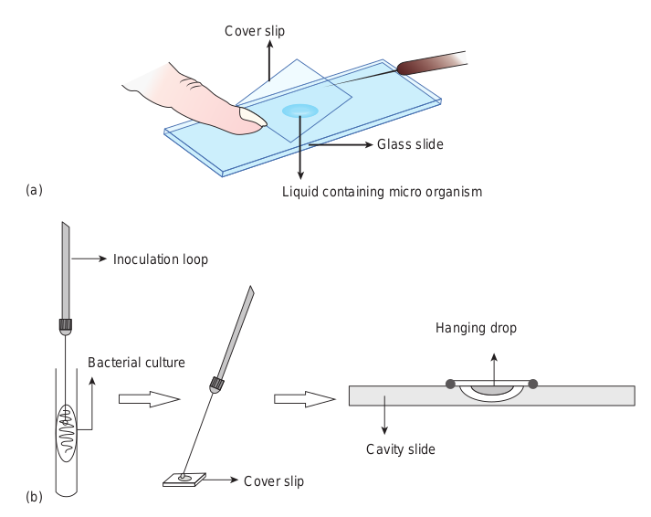
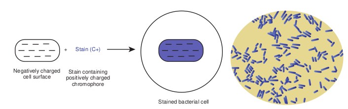
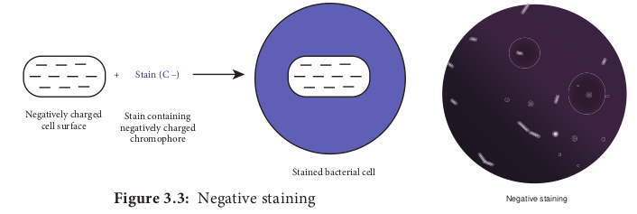
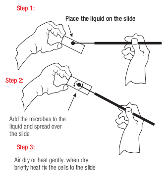
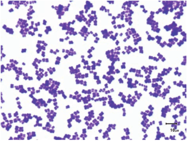
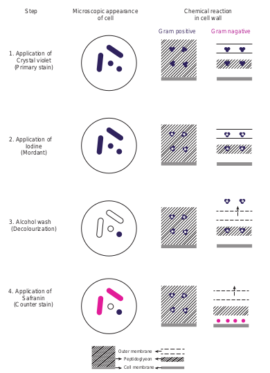
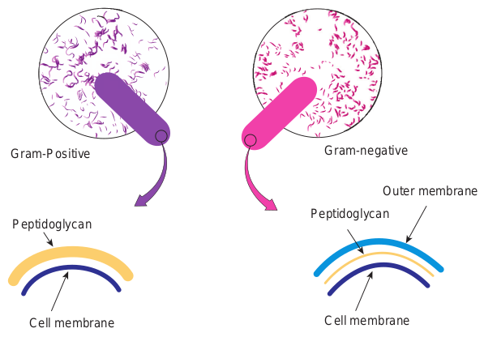
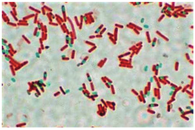

  

**Chapter** 3 **Stains and Staining Methods Chapter Outline**

**3.1** Techniques in Observing Microorganisms

**3.2** Purpose of Staining

**3.3** Stains

**3.4** Principle of Staining

**3.5** Preparation of Materials for Staining

**3.6** Simple Staining Method

**3.7** Differential Staining

**3.8** Special Staining – Endospore Staining

**3.9** Commonly used Stains and its Applications _La_

in use

After studying this chapter the student will be able,

_• To appreciate the need for staining. • To differentiate between an acidic_

_dye and a basic dye and understand the principle of staining._

_• To classify organisms based on staining reaction and differentiate between simple and differential stains._

_• To know smear preparation and heat fixation._

**Learning Objectives**  

_• To describe the procedure of simple, Gram’s and endospore staining methods._

_• To describe the appearance of Gram positive and Gram negative cells after each step of Gram staining procedure._

_• To know the importance of Gram staining and endospore staining in diagnosing and identifying bacteria._

_• To learn a few staining solutions and names of bacteria._

**Unstained and stained** _Lactobacillus sp_. in curd. _ctobacillus_ is a genus of bacteria which can convert lactose milk into lactic acid by means of fermentation. Staining is d to visualize microbial cells under a microscope.

  

Have you ever thought of observing the microorganisms present in rain water when you play? Have you ever wondered how milk turns into curd and which microorganisms are involved? It is clearly understood from previous unit that microorganisms can be seen only under microscopes. But microorganisms do not show much of its structural details under the light microscope due to lack of contrast and poor resolution. To improve the visibility of these tiny living organisms, stains and staining methods are of great use.

## Techniques for Observing Microorganism
 A considerable amount of information can be gained by careful microscopic examination of microorganisms. There are two general techniques used in the preparation of microbial specimens to observe them under microscope. First technique employs the unstained preparation of living cells and second one employs stained preparations of killed microorganisms.

### Examination of Unstained Preparation
 Living microorganisms can be examined directly by wet mount or by hanging drop preparations. Both the techniques are very useful in determining size, shape and motility of the microorganisms. The spirochetes (spiral bacteria) are normally examined in wet preparation through Dark- field microscope. Some cell inclusion bodies such as vacuoles and spores can be readily observed even without staining.

• A wet mount is made by keeping a drop of liquid containing microorganisms (culture) on a microscope slide and placing a cover slip over the drop. (Figure 3.1a)

• A hanging drop mount is made by using a cover slip and a cavity slide. Vaseline is applied on each of the four corner of the cover slip or around the cavity  

using a match stick. A drop of culture (liquid containing microorganisms) is placed on a cover slip. The cavity slide is placed upside down on the cover slip and inverted such that the drop is hanging (Figure 3.1b). Since microbial cells are colourless

and transparent, observation of microorganisms in wet preparation by bright field microscope is difficult. But, dark-field and phase contrast microscopes give contrast and make structures within the cells to appear clear. Therefore, these microscopes are useful for examination of unstained preparation.

### Examination of Stained Preparation
 Staining enables better visualization of microorganisms under a microscope. Microscopic examination of stained cells helps to reveal the size, shape and arrangement of microbial cells. Microbial cell staining is important in the identification of infectious pathogens.

## Purpose of Staining

Staining is very useful for the following reasons:

• To make the microscopic semi transparent microbial cell visible.

• To reveal the size and shape of microorganisms.

• To demonstrate the presence of internal and external structures of microbial cells.

• To distinguish between different types of microorganisms.

• To produce specific chemical and physical reactions.

• To preserve the stained microorganisms as specimen slide.

  

## Stains
 Stains are dyes used to increase colour contrast. Dye is a coloured organic compound that adheres to microbial cells, giving colour to the cell. Today several stains and staining procedures are available to study the morphological details of various microorganisms. The process of imparting colour to the microbial cell is known as staining.

Stains are organic compounds containing chromophore and auxochrome groups linked to benzene ring.

A chromophore group imparts colour to the compound. Compounds of benzene containing chromophore radicals are called chromogens. Such a compound, even though it is coloured, is not a dye. In order for a compound to be a dye, it must

Cover slip

Liquid co

Cover slip

(a)

(b)

Bacterial culture

Inoculation loop  

contain not only a chromophore group but also another group known as auxochrome that imparts the property of electrolytic dissociation. Auxochrome gives salt forming properties to the compound.

Hence, each stain or dye is composed of three components:

(i) Benzene ring: It is the basic colourless structural component of a stain or dye.

(ii) Chromophore: It is the functional group that gives colour.

(iii) Auxochrome: It is the group that gives ionic properties to the stain.

The term stain and dye are not the same. The basic differences between dye and stain are given in Table 3.1.

b) Hanging drop preparation

Glass slide

ntaining micro organism

Cavity slide

Hanging drop

  

**Table 3.1:** Difference between dyes and stains.

**Dyes Stains**

Dyes are a colouring agents used for general purposes.

Stains are colouring agents used for biological purposes.

Dyes are the textile colouring agents that are prepared with lesser specification and they may contain impurities.

Stains are pure. They are prepared with greater care and specification.

### Classification of Stains

1\. On the basis of origin, stains can be classified as natural and synthetic.

(i) Natural stains: • These stains are obtained directly

from natural products. For example, Haematoxylin is obtained from the heartwood of a tree (_Haematoxylon campechianum)_.

• The natural stains are used mainly for histological purposes.

(ii) Synthetic stains:

• These are artificially produced mainly from coal tar products and hence popularly called coal-tar dyes.

Stained b

Stain containing positively charged

chromophore

Negatively charged cell surface

\+ Stain (C+)

• A majority of stains used in microbiology are the synthetic type and manufactured from Aniline. For example, Crystal violet, Safranin, Methylene blue and Acid fuchsin.

2\. On the basis of chemical behavior, dyes are classified as acidic, basic and neutral. • An acidic dye is one in which

the colour bearing ion, the chromophore, is an anion.

• A basic dye is one in which the colour bearing ion, the chromophore, is a cation.

• A neutral dye is a complex salt of a dye acid with a dye base.

Acid dyes generally combine more strongly with cytoplasmic (basic) elements of the cell, and basic dyes combine best with nucleic acid (acidic) elements of the cell. Table 3.2 shows the chemical characteristics of a stain or dye.

## Principle of Staining

**Positive Staining** In positive staining, the surface of the bacterial cell takes on the colour of the stain. When basic stain is applied, there is an attraction between the negatively charged cell surface and positively charged chromophore, which leads to staining of the cell (Figure 3.2).

acterial cell

sitive staining

| D ye s |Sta ins |
|------|------|
| D yes a re aco lo ur in g a gen tsus e d f or g en era lpur p os es. |St ai ns  ar eco lo ur in gagen ts u s e dfor b io log ic a lpur p os es. |
| Dyes are the textile colouring agents that are prepared with lesser specification and they may contain impurities. |St ai ns  ar epur e. Th e y a repre p are d  w it hg re ater c are a ndsp e cif ic at io n. |
  

**Table 3.2:** Chemical characteristic of stain or

**Acid stain Basic s**

Chromogen of acidic stain is negatively charged, so it is also known as anionic stain.

Chromogen or part of basic sta positively charg also known as c

Used to stain the positively charged component of microbial cell.

Used to stain n charged compo microbial cell.

Example: Eosin, Nigrosin, India ink, Acid fuchsin, Congo red.

Example: Meth Safranin, Mala Basic fuchsin, C

On the basis of demonstrating the living some stains are classified as vital stains. Th non-living microbial cells. For example, Tr or cells.

Certain stains will give a different colo original colour. Such stains are called metac of _Corynebacterium diphtheriae_ contain responsible for metachromasia with Toluid

**Infob**

**Negative Staining** In negative staining, the background is coloured and bacteria remains colourless. It is because the acidic dyes are repelled by the negatively charged bacterial surface.

Stained b

Stain containing negatively charged

chromophore

Negatively charged cell surface

\+ Stain (C –)

dye

**tain Neutral stain**

coloured in is ed, so it is ationic stain.

It is a complex salt of dye acid with dye base.

egatively nent of

It stains both positive and negative charged components of microbial cell.

ylene blue, chite green,

rystal violet

Example: Giemsa stain, Leishmanstain.

or non-living status of microorganisms, ese stains differentiate between living and yphan blue selectively colour dead tissues

ur to the cell inclusion bodies from its hromatic stains. Metachromatic granules

polymerized inorganic polyphosphate ine blue or Methylene blue.

**its**

The background gets stained and the cell remains colourless. This technique is useful for revealing the cell shape, size and demonstrating capsule (Figure 3.3).

Negative staining

acterial cell

| Aci d s ta in |Bas i c s ta in |Ne utr a l  s t ai n |
|------|------|------|
| Chromogen of acidic stain is negatively charged, so it is also known as anionic stain. |Chromogen or coloured part of basic stain is positively charged, so it is also known as cationic stain. |It i s a co mplex s a lt o f d yeacid w it h d ye b as e. |
| Us e d t o s t ain t he p osi t ivelycharge d co mp onen t o fmicr obi a l ce l l. |Us e d t o s t ain n ega t ivelycharge d co mp onen t o fmicr obi a l ce l l. |It stains both positive andnegative charged componentsof microbial cell. |
| E xa mple: E osin, N ig rosin,Indi a in k, A cid f uc hsin,C ongo  r e d. |Example: M et hylen e b lue,Saf ranin, M alachite g reen,B asic  fuchsin,  Cr ystal  violet |E xa mple: G iem s a s t ain,L ei shm anst ain. |
  

## Preparation of Materials for Staining
 The essential steps in the preparation of materials to be observed are

1) Preparation of smear 2) Fixation 3) Application of one or more staining

solutions

### Preparation of Smear
 Smears can be made from liquid or solid cultures or from clinical specimens. Smear is prepared by placing a loopful of culture on a clear glass slide with an inoculation loop. The culture is spread on the glass slide so as to form a thin film. This film is allowed to air dry (Figure 3.4).

Step 1:

Step 2:

Step 3:

Place the liquid on the slide

Add the microbes to the liquid and spread over the slide

Air dry or heat gently. when dry briefly heat fix the cells to the slide

### Fixation
 Fixation kills the microorganisms and attaches them to the slide. This prevents washing away of microorganism in further steps of staining procedure. It also preserves various parts of microorganisms in their natural state with only minimal distortion. The two fixation methods that are used to fix microbial cells are heat fixation and chemical fixation.  

**Heat fixation** In this method the slide is gently heated by passed through a flame (Figure 3.5). Heat fixation will preserve the overall morphology of the cell without destroying the internal structures.

**Chemical fixation** It involves the use of chemical fixative to protect the fine cellular structures of delicate microorganisms. For this purpose, Ethanol, Acetic acid, Formaldehyde, Glutaraldehyde and Mercuric chloride are usually used.

### Bacterial Staining Methods
 Different staining methods are employed to study the bacterial morphology and to identify bacteria. Some methods are used for general purposes and others are used for special purposes. There are three categories of staining methods, they are:

**Robert Hooke** was the first to describe the appearance of stained objects under

light microscope. Professor Joseph Von Gerlach of

Germany was the first to use stain in histology.

|------|------|

|------|------|

  

i) Simple staining method ii) Differential staining method

**Flowchart 3.1:** Types of B

**Staining M**

**Simple staining** (For examination of shape,

size and arrangement of bacterial cells)

**Grams staining** To distinguish

Gram positive and Gram negative bacteria

**Acid F** To distinguis such as _Myco_

Non-Ac

**Endospore staining** Demonstrates

spore structure in bacteria. Example: Schaeffer Fulton

method

**Flagella staining** Demonstrates the

presence and arrangement of flagella. Example: Silver nitrate

staining method

**Differenia** (For differ bacterial

## Simple Staining Method

In Simple Staining method only one stain is used. Stain is applied to the smear in one application. The fixed smear on the glass slide is flooded with a staining solution for about one minute. The solution is then washed off with water and the slide is blot dried. The stained slide is examined under a microscope (Figure 3.6). The cells stain uniformly. The simple stains used by the microbiologists for routine purposes are dilute solutions of Methylene blue, Crystal violet, Safranin and Carbol fuchsin.  

acterial Staining methods

**ethods**

**ast staining** h Acid Fast bacteria _bacterium_ sp from

id Fast bacteria

**Capsule staining** Demonstrates the

presence of capsules surrounding the cells using nigrosin stain

**Metachromatic staining**

Demonstrates the presence of

granules. Example: Albert staining

**l staining** entiating groups)

**Special staining** (For visualising the

bacterial external and internal structure)

iii) Special staining method. Different types of bacterial staining methods are summarized in Flowchart 3.1

| gDifferenial stainingf shape, (For differentiating ent of bacterial groups)lls) |
|------|------|------|

| le staining Special stainingDifferenial stainingation of shape,  (For visualising the (For differentiating rrangement of  bacterial external and bacterial groups)ial cells) internal structure)rams staining Acid Fast stainingo distinguish  To distinguish Acid Fast bacteria m positive and  such as Mycobacterium sp from egative bacteria Non-Acid Fast bacteria |
|------|------|------|------|------|

| Endospore staining Demonstrates spore structure in bacteria. Example: Schaeffer Fulton method |Flagella staining Demonstrates thepresence andarrangement of flagella.Example: Silver nitratestaining method |Capsule staining Demonstrates the presence of capsules surrounding the cells using nigrosin stain |Metachromatic staining Demonstrates the presence of granules. Example: Albert staining |
  

Methylene blue is more frequently used than any other stain in Bacteriology. It is used for the rapid survey of bacterial population of milk. It is also used for the diagnosis of Diphtheria. This stain is incorporated along with Eosin in Lactose Agar to distinguish _Escherichia coli_ from other fecal bacteria in contaminated water.

## Differential Staining
 In this method more than one stain is employed. In some method the stains are applied separately, while in other method

_Mycobacterium lep- rae_ which causes leprosy is an uncul- turable bacterium. It

is primarily diagnosed by using a spe- cial bacteriological stain called Acid Fast stain.

_Mycobacterium leprae_ (Acid Fast bacilli) stained with modified Ziehl Neelson stain.

**Table 3.3:** Differences between Simple and D

**Simple staining**

1\. This method uses only one stain.

2\. It imparts only one colour to all bacterial cells.

3\. It reveals the size, shape and arrangement of bacterial cells.

Example: Methylene blue staining method.  

they are mixed and applied in one application. These procedures show differences between the cells or parts of a cell and can be used for of identification. The two most important differential stains used by bacteriologists are Gram stain and Acid Fast stain. The differences between simple and differential staining are shown in Table 3.3.

### Gram’s Staining Method
 The Gram’s stain technique was developed by Danish Bacteriologist Hans Christian Gram in 1884. It is one of the most useful staining methods because it classifies bacteria into two large groups namely Gram positive and Gram negative. In this method, the fixed bacterial smear is subjected to staining reagents in the order of sequence listed below:

Basic fuschsin/Safranin (Counter stain)

Crystal violet (Primary stain)

Iodine (Mordant)

Alcohol/Acetone (Decolourising agent)

ifferential Staining

**Differential staining**

This method uses more than one stain.

It imparts two or more different colours to bacterial cells.

It reveals the size, shape and arrangement. In addition, it differentiates two groups of bacteria.

Example: 1. Gram’s staining method 2. Acid Fast staining method

| Sim p l e s ta inin g |Dif ferenti a l s ta inin g |
|------|------|
| 1. Thi s m et ho d u s es o n ly o ne s t ain. |Thi s m et ho d u s es m ore t han o ne s t ain. |
| 2. It im p ar ts o n ly o ne co lo ur t o a l lb ac ter i a l ce l ls. |It im p ar ts t wo o r m ore dif fer en t co lo ur sto b ac ter i a l ce l ls. |
| 3. It r e ve a ls t he size , s hap e a ndar ra ngem en t o f b ac ter i a l ce l ls. |It r e ve a ls t he size , s hap e  and a r ra ngem en t.In addi t io n, i t dif fer en t i ates t wo g roups o fb ac ter i a. |
| E xa mple: M et hy len e b lue s t ainin gme t ho d. |E xa mple: 1. Gra m’s s t ainin g m et ho d2. Acid F ast s t ainin g m et ho d |
  

Application of Crystal violet

(Primary stain)

1.

Step Microscopic appeara of cell

Application of Iodine

(Mordant)

2.

Alcohol wash (Decolourization)

3.

Application of Safranin

(Counter stain)

Oute

Pe

Ce

4.

The organisms that retain the colour of the primary stain are called Gram positive and those that do not retain the primary stain when decolorised and take on the colour of the counter stain are called Gram negative.

**Mordants:** Mordants are not dyes. They are important to increase the biological specimen’s affinity for a dye. Some stains never stain the cells or its components unless treated with a mordant. The mordant becomes attached to a cell or its components and then combines with the stain to form an insoluble colour complex.  

### Procedure of Gram’s Staining
 Gram’s Staining comprises of four steps: **Step 1:** A heat fixed smear is covered with a basic violet dye, Example: Crystal violet. This stain imparts its colour to all cells. It is referred to as a primary stain, since it is applied first. **Step 2:** After a short time, the slide is washed off and the smear is covered with iodine, a mordant. At this stage both Gram positive and Gram negative bacteria

nce Chemical reaction in cell wall

Gram positive Gram nagative

r membrane

ptidoglyeon

ll membrane

ical reaction of Gram Stained Bacteria

  

appear dark violet. **Step 3:** Next, the slide is decolurized with alcohol or an acetone alcohol solution. This solution is a decolurizing agent, which removes the primary stain from the cells of some species but not from others. **Step 4:** The slide is immediately washed after decolurization and the slide is then counter stained with basic fuchsin or safranin, a basic red dye. The smear is washed again, blot dried and examined under microscope (Figure 3.7).

### Principle of Gram’s Staining
 The exact mechanism of action of this staining technique is not clearly understood. However, the most acceptable explanations are associated with the structure and composition of the cell wall.

The cell wall of Gram positive bacteria have a thicker peptidoglycan (consists of disaccharides and amino acids) than Gram negative bacteria. Figure 3.8 depicts the cell wall of Gram positive

Gram-Positive

Cell membrane

Peptidoglycan

and Gram negative bacteria. In addition, Gram negative bacteria contain a layer of lipo polysaccharide (consists of lipids and polysaccharide) as part of their cell wall. When Crystal violet and subsequently Iodine is applied to both Gram positive and Gram negative cells, the two combine to form CV-I complex.

The cell wall of Gram positive bacteria with lower lipid content get dehydrated during alcohol treatment. The pore size decreases and the permeability is reduced. Thus, the CV-I complex cannot be extracted and the cells remain violet.

The alcohol treatment of Gram negative bacteria extracts the lipid which results in increased porosity or permeability of the cell wall. Thus, the crystal violet iodine \[CV-I\] complex is extracted and the bacteria are decolorized. These cells subsequently take on the colour of the counter stain basic fuchsin or safranin and appears red to pink.

Cell membrane

Outer membrane

Gram-negative

Peptidoglycan

itive and Gram negative Bacteria

  

### Importance of Gram Staining
 This century old staining method still remains as the universal basis for bacterial classification and identification. Even with today’s elaborate and expensive

1\. If the iodine step were omitted in the Gram’s staining procedure, what colour would you expect Gram positive and Gram negative bacteria to stain? a. Gram positive : pink and

Gram negative : purple b. Gram positive : purple and

Gram negative : pink c. Gram positive : purple and

Gram negative : purple d. Gram positive : pink and

Gram negative : pink 2. In a Gram’s staining method, a

step could be omitted and still allow differentiation between Gram positive and Gram negative cells. Name the step.

**HOTS**

**Prof. Hans Christian Gram (September 13, 1853-November 14, 1938)**

In 1884, Prof. Hans Christian Gram while examining lung tissue from patients who  

medical technology, the Gram’s staining remains an important, inexpensive and unbeatable tool in the identification of pathogens.

Examination of Gram stained organisms usually provides the basis for classifying, identifying and characterizing bacteria. Gram staining of clinical specimens, however provides only a preliminary indication of the identity of the etiological agent (the organism causing the disease). Gram nature of common pathogenic bacteria is given in Table 3.4.

Gram stains of clinical specimens or of growth on culture plates are especially important in determining the most effective antibiotic for the ill patients who required immediate therapy.

had died of pneumonia, discovered that certain stains were preferentially taken up and retained by bacterial cells. Gram was a modest man, and in his initial publication he remarked, “I have therefore published the method, although I am aware that as yet it is very defective and imperfect; but it is hoped that also in the hands of other investigators it will turn out to be useful”. Dr. Gram used Bismarck brown instead of Safranin. It was a few years later, German pathologist Carl Weigert (1845- 1904), added the final step of staining with Safranin.

There are several modifications of Gram’s Stain

• Kopeloff and Beerman’s modification.

• Jensen’s modification. • Weigert’s modification. • Preston and Morell’s

modification.

**Infobits**

  

## Special Staining – Endospore Staining
 Endospores are highly resistant structures produced by some bacteria during unfavourable environment conditions. Endospore formation is a distinguishing feature of aerobic genera _Bacillus_ and anaerobic genera _Clostridium_. The size, shape and position of the spore (Figure 3.9) are relatively constant characteristics of a given species and are important in identifying the species within genera. The position of spore in the cell may be terminal, central or sub- terminal. Figure 3.9 shows the position of spores in a vegetative cell.

**Table 3.4:** Gram nature of common pathogen

**Gram positive bacte**

**Cocci** _Staphylococcus aureus, Strep pyogenes_

**Rods(bacilli)** _Mycobacterium tuberculosis Bacillus anthracis, Coryneba diphtheriae, Clostridium teta_

**Spirochaetes**

Central Spores

Subterminal Spores

Terminal spores

Endospores cannot be stained by ordinary methods, such as simple staining and Gram staining, because the dyes do not penetrate the wall of the endospore. If simple stains are used, the vegetative body of the bacillus is deeply coloured, whereas the spore is unstained and appears as a clear area in the organism.

By vigorous staining procedure, the dye can be introduced into the spore. Once  

stained, the spore tends to retain the dye even after treatment with decolorizing agents. The most commonly used endospore staining procedure is the Schaeffer Fulton endospore staining method. Malachite green, the primary stain, is applied to a heat fixed smear and heated to steaming for about 5 minutes. Heat helps the stain to penetrate the endospore wall. Then the preparation is washed for about 30 seconds with water. Next safranin, a counterstain is applied to the smear to stain the portions of the cell other than endospores.

In a properly prepared smear, the endospores appear green within red cells (Figure 3.10). Endospores are highly refractive. They can be detected under the light microscope when unstained, but cannot be differentiated from inclusions of stored material without a special stain.

ic bacteria

**ria Gram negative bacteria**

_tococcus Neisseria gonorrhoeae_

_, cterium ni_

_Escherichia coli, Shigella Salmonella, Pseudomonas aeruginosa_

_Leptospira, Treponema_

and vegetative cell stained pink

| Gr am p os itiv e b ac teri a |Gr am ne g ativ e b ac teri a |
|------|------|------|
| C o c ci |Staphyloc oc c u s  a ure u s ,  S trep toc oc c u spyogen es |Nei ss er ia go nor rhoeae |
| Ro ds(b aci l li) |Mycobac ter ium t uber cu losi s,B aci llu s a nthraci s, C or y nebac ter iumdiph the r iae ,  C lost r idium  te tani |E s cher ichia c oli, S hige llaS almo nella ,  P s e udomo na sae r ug ino s a |
| Spir o chae tes |L epto spira ,  Trepon e ma |
  

**Gram positive cocci** _Staphylococcus Streptococcus_

**Gram nagative bacilli (rod)** _Klebsiella_ sp. _Escherichia. coli_

## Commonly used Stains and its Applications
 Lactophenol cotton blue stain is the most widely used for staining and observing fungi. Giemsa stain is a Romanowsky stain, widely used in microbiology laboratory for staining of blood and blood parasites like malarial protozoans. Calcofluor white stain is commonly used stain to directly detect the fungal elements in tissues and in culture.

Acridine orange stain is used to confirm the presence of bacteria in blood cultures when Gram stain results are difficult to interpret using light microscopy. The stain binds to nucleic acid and stains them. It is also used for the detection of cell wall deficient bacteria example Mycoplasma. Fluorochrome stains such as auramine-rhodamine stains are readily available to detect the bacteria in the specimens through Fluorescent microscopy.

Common Bacteria with  

**Gram positive bacilli (rod)** _Corynebacterium_ sp. _Clostridium_ sp.

**Gram negative diplococci** _Neisseria_ sp.

**Summary** Staining makes microscopic semi transparent bacterial cell visible. It is a substance that adheres to a cell and impart colour. On the basis of the chemical composition, stains or dyes are classified as acidic, basic and neutral. Staining techniques are classified as simple, differential and special. Simple staining uses a single dye and can help to identify the shape and size of an organism. Differential staining use more than one dye to distinguish between structures in a cell or different types of cells. The Gram stain procedure divides bacteria into Gram positive and Gram negative bacteria. Specialized staining such as endospore staining is used to detect the presence of endospores in bacteria.

their Gram reactions

  

**Evaluation**

**Multiple choice questions** 1\. An dye has negative charge.

a. Basic b. Acidic c. Neutral d. None

2\. stain is incorporated with Eosin in Lactose agar to distinguish typical _Escherichia coli_ in contaminated water. a. Crystal violet b. Acid fuchsin c. Methylene blue d. Safranin

3\. Which of the following is not an anionic dye? a. Safranin b. Eosin c. Rose Bengal d. Acid fuchsin

4\. Christian Gram discovered a staining technique to differentiate the bacteria of similar morphology in the year. a. 1857 b. 1880 c. 1884 d. 1881

5\. Which of the following is used for negative staining of microbial cells? a. Nigrosin and Acid fuchsin b. Rose Bengal and malachite green c. Safranin and Eosin d. Nigrosin and Indian Ink

6\. is used as a mordant in Gram staining techniques. a. Iodine b. Crystal violet c. Methylene blue d. Safranin

7\. Which of the following pairs is mismatched? a. Capsule-negative stain b. Cell arrangement-simple stain c. Cell size-albert stain d. Gram stain-bacterial

identification 8. The order of reagents in the gram

staining reactions are: a. Safranin, alcohol, methylene blue,

iodine  

b. Crystal violet, iodine, alcohol, safranin

c. Methylene blue, alcohol, iodine, safranin

d. Crystal violet, alcohol, iodine, safranin

9\. The Schaeffer-Fulton endospore staining usually shows a. Spore green within pink cells b. Spores pink within green cells c. Colourless spores within

pink cells d. Colourless spores within

green cells

**Answer the following** 1\. Define stain. 2. Give examples for basic stain. 3. Why heat fixation is important? 4. What are endospores? 5. Distinguish between a dye and a stain. 6. List out few gram positive bacteria. 7. What is the purpose of a counterstain/

decolorizer in the gram stain? 8. Fill in the following table regarding the

gram stain.

Appearance after this step of gram staining

Steps Gram positive cells

Gram negative cells

Crystal violet Iodine Alcohol Safranin

9\. What is meant by negative staining? 10. What are the uses of staining? 11. Differentiate simple and differential stain. 12. What are acidic stains? Give examples. 13. Why do basic dyes stain bacterial cells?

Why won’t acidic dyes stain bacterial cells?

| App e ara nce a f ter t hi s s tep o fg ra m s t ainin g |
|------|------|------|
| Steps |Gr am p osi t ive ce l ls |Gr am nega t ive ce l ls |
| Cr ys t a lv io let |
| Io din e |
| A l c oh ol |
| Sa f ra nin |
  

**ICT CORNER**

**Step2Step1**

**Gram Stainin**

**URL:** https://www.cellsalive.com/toc\_micro.htm

**STEPS:** • Use the URL OR Scan the QR code to reac • Click ‘module’ and select ‘steps’ and read • Select ‘start’ to enter the ‘Gram Stain’ proc • Leave the slide to dry and heat fix with B

**OBSERVATIONS :** • Select other examples and record your obs

stains.

**Know the Gram Staining process**

14\. For what purpose would you use each of the following? a. Simple stain b. Negative stain c. Acid- fast stain d. Gram stain

15\. The gram stain has been described as the most important stain for microbiologist. Explain why?  

**Step3 Step4**

**g of Bacteria**

h ‘Virtual Interactive bacteriology laboratory’. the procedure to follow. ess and follow the procedure.

unsen burner and view under microscope

ervation on Gram +ve and Gram –ve bacterial

16\. How will you appreciate the need of staining?

17\. Classify staining technique based on their purpose.

18\. Explain the principle of grams staining.

19\. Diagrammatically explain Gram’s staining procedure.

20\. How to visualise an endospore.

