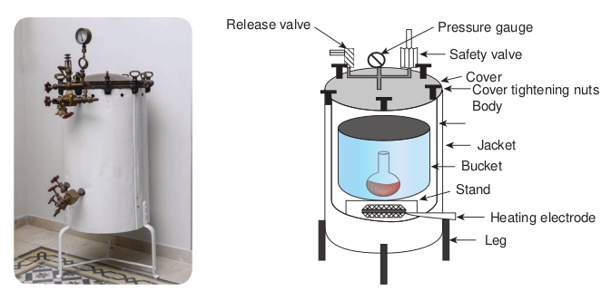

  

**Chapter** 4 **Sterilization Chapter Outline**

**4.1** Need for Sterilization

**4.2** Methods of Sterilization

**4.3** Physical Methods of Sterilization

**4.4** Sterilization by Heat

**4.5** Radiation

**4.6** Filtration

After studying this chapter the student will be able,

_• To understand the concepts of sterilization to maintain aseptic conditions._

_• To compare the effectiveness of dry heat (red heat, flamimg, incineration, hot air oven), and moist heat (boiling, autoclaving, pasteurization)._

_• To learn the uses of pasteurization in the field of food industry._

_• To describe the role of radiation in killing pathogens._

_• To describe how separation of microor- ganism is achieved through filtration._

**Learning Objectives**

Microorganisms are ubiquitous. They can contaminate, infect or decay inorganic and organic matter. Hence, it becomes necessary to kill or remove them from materials or from areas around us. This is the objective of sterilization.

oth aft  

The process of sterilization is used in Microbiology • for preventing contamination by

extraneous organisms • in surgery for maintaining asepsis • in food and drug manufacture for

ensuring safety from contaminating organisms

The choice of methods of sterilization depend on the purpose for which it is carried out: the material to be sterilized and the nature of the microorganisms that are to be removed or destroyed.

The inoculation loop is sterilized with flame or any er heat source, until it becomes red hot before and

er each use.

As early as the stone age, humans used physical methods of microbial control to preserve foods,

like drying (desiccation) and salting (osmotic pressure).

  

Sterilization is defined as the process of complete removal or destruction of all forms of microbial life, including vegetative cells and their spores.

## Need for Sterilization
 The aim of all sterilization strategies is to kill or remove the unwanted microorganisms. In certain cases, microbes are regarded as potential pathogens and therefore it is essential to eliminate these forms (vegetative and spores) of microbial life. All microbiological techniques require appropriate and adequate sterilization.

Sterilization of culture media, containers and instruments is essential in microbiological work for isolation and maintenance of microorganisms. In surgery and medicine, the sterilization of instruments, drugs and other supplies is important for the prevention of infection.

**Flowchart 4.1:** Physical

• Infrare • Ultravi

• Red heat • Flaming • Incineration • Hot air oven

• Temperature below 100°C

• Temperature at 100°C

• Temperature above 100°C

Moist heatDry heat

Heat

Physical m

Non ioni  

## Methods of Sterilization
 Growth and multiplication of microorganisms can be controlled by removing, killing or inhibiting them using various physical or chemical agents.

## Physical Methods of Sterilization
 The various physical methods of sterilization are given in flowchart 4.1

## Sterilization by Heat
 Heat is the most rapid and best method of sterilization. It is the method of choice that the material to be sterilized is stable enough to withstand the required temperature necessary to kill the microbes. The time needed for sterilization depends on the initial number of organisms present, type of materials to be sterilized (hence washed and cleaned items are easier to sterilize than dirty ones) and also on the temperature used. Spores need higher temperatures while vegetative bacteria can be destroyed at lower temperatures.

Methods of Sterilization

d olet

ethods

• X-rays • Gamma rays

Radiation

• Depth filter • Membrane filter • Air filter

Filtration

Ionizing zing

  

Heating process in canning was first used by **Nicholas Appert** in 1890. He described a safe means of preserving all kinds of food substances in containers or in cans. Appert is known as father of cannning.

**Infobits**

Heat resistance varies among different microorganisms. These differences can be expressed in terms of thermal death point. **Thermal Death Point (TDP)** is the lowest temperature at which all the microorganisms in a particular liquid suspension will be killed in 10 minutes.

Another factor to be considered in sterilization is the duration of time required. This is expressed as **Thermal Death Time (TDT)**. TDT is the minimal time required for all microorganism in a particular liquid culture to be killed at a given temperature. Both TDP and TDT are useful guidelines that indicate the degree of treatment required to kill a given population of bacteria.

**Decimal Reduction Time (DRT)** is related to bacterial heat resistance. DRT is the time, in minutes, in which 90% of a population of microorganism at a given temperature will be killed.

Heat is employed either as dry heat or moist heat.

### Sterilization by Dry Heat
 Dry heat is frequently used for the sterilization of glassware and laboratory equipments. In dry heat sterilization, microbial cells are apparently killed by oxidation of their constituents and protein denaturation. Dry heat is applied in the following ways:  

**a) Red heat** Inoculating wires, points of forceps and searing spatulas are sterilized by holding them in the flame of a bunsen burner until they are seen to be red hot.

**b) Flaming** This method is used for sterilizing scalpels, needles, mouths of culture tubes, slides and cover slips. It involves passing the article through the bunsen flame without allowing it to become red hot.

**c) Incineration** This is an excellent method for destroying materials such as contaminated clothes, cotton wool stoppers, animal carcasses and pathological materials. It involves burning of materials in incinerators.

**d) Hot air oven** This is the most widely used method of sterilization using dry heat. The oven is usually heated by electricity and it has a thermostat that maintains the chamber air constantly at the chosen temperature.

It has a fan or turbo-blower to assist the circulation of air and to ensure rapid, uniform heating of the load. In Hot Air Oven, the air is heated at a temperature of 160oC for one hour. Figure 4.1 shows laboratory hot air oven.

Double jacket chamber

Thermometer

Shelves

Temperature indicator valve

Double jacket door

  

This is the best method of sterilizing dry glass ware such as test tubes, petri dishes, flasks, pipettes and instruments such as forceps, scalpels and scissors. It is also used to sterilize some pharmaceutical products such as liquid paraffin, dusting powder, fats and grease.

**Quality control of dry heat sterilization:** The spores of a nontoxigenic strain of _Clostridium tetani_ are used to test the efficiency of dry heat sterlization. ### Sterilization by Moist Heat
 Moist heat kills microorganisms primarily by the coagulation of proteins (denaturation), which is caused by breakage of the hydrogen bonds that hold the proteins in three dimensional structure.

There are three methods employed in moist heat sterilization.

• Temperature below 100°C. • Temperature at 100°C. • Temperature above 100°C.

**a) Temperature below 100°C: Pasteurization** The process of heating a liquid food or beverage either at 62.8°C for 30 minutes or 72°C for 15 seconds to enhance their shelf life and destroy

**Table 4.1:** Comparison between Sterilization

**Sterilization**

Sterilized products have a longer shelf life

Discovered by Nicolas Appert

Eliminates all forms of microorganisms

Can be accomplished in many ways

Applied in food industry, medical, surgery and packaging  

harmful microorganisms. It should be noted that pasteurization process kills only vegetative cells but not the spores. Pasteurization named in honour of its developer Louis Pasteur. Table 4.1 gives comparison between Sterilization and Pasteurization.

Raw milk can harbour dangerous m i c r o o r g a n i s m s , such as _Salmonella, Escherichia coli_ and

_Listeria_, that can pose serious health risk, and children are particularly susceptible to the potential infection of unpasteurized or raw milk

Pasteurization can be done in the following methods,

**• Low Temperature Holding Method (LTH)** In this method milk, beer and fruit juices are maintained at 62.8°C for 30 minutes.

**• High Temperature Short Time Method (HTST)** Products are held at 72°C for 15 seconds.

**• Ultra High Temperature (UHT)**

and Pasteurization

**Pasteurization**

Pasteurized products have shorter shelf life

Discovered by Louis Pasteur

Eliminates pathogenic microorganisms only

Can be accomplished with heat

Mainly applied in food industry

| Steri liza ti on |Pas te uriza ti on |
|------|------|
| Ster i lize d p ro duc ts h ave a lo nger s helf lif e |Pasteur ize d p ro duc ts h ave s hor ter s helflif e |
| Di s co ver e d b y N ico l as A pp er t |Di s co ver e d b y L oui s P asteur |
| E limin ates a l l f or ms o f micr o orga ni sm s |E limin ates p at hog enicmicr o orga ni sm s o n ly |
| C an b e acco mpli she d in m any wa ys |C an b e acco mpli she d w it h h e at |
| Applie d in f o o d in dust r y, m e dic a l,sur ger y a nd p ac ka g in g |Main ly a pplie d in f o o d in dust r y |
  

Milk can be treated at 141°C for 2 seconds (This method employ temperature above 100°C).

**b) Temperature at 100°C: i) Water at 100°C (Boiling):** Boiling is one of the moist heat

sterilization methods. It kills vegetative forms of bacterial pathogens, almost all viruses and fungi (including their spores) within 10 minutes, usually much faster.

• Most vegetative bacteria will die in 5-10 minutes when immersed in boiling water, but some spores will survive at this temperature for several hours.

• Articles sterilized by this method cannot be stored for a long time.

**ii) Steaming at 100°C (Tyndallization):** It is a process discovered by John Tyndall

in 19th century for sterilizing substances to kill the spores of bacteria. The process of exposure of materials to steam at 100°C for 20 min for three consecutive days is known as tyndallization. First exposure kills all the vegetative forms and in the intervals between heating, the remaining spores germinate into vegetative forms which are killed on subsequent heating. Tyndallization is also called fractional sterilization or intermittent boiling.

**c) Temperature above 100°C:** Moist heat sterilization can be carried out at temperature above 100°C in order to destroy bacterial endospores. This requires the use of saturated steam under pressure. This is achieved using autoclave.

**Autoclave** Sterilization using an autoclave is most effective when the organisms are either contacted by the steam directly or contained in a small volume of aqueous liquid (primarily water). The temperature used  

in autoclave is 121°C at 15 lbs (pounds) pressure for 15 minutes (Figure 4. 2a & b).

Autoclaving is used in sterilizing culture media, instruments, dressings, applicators, solutions, syringes, transfusion equipment, pharmaceutical products, aqueous solutions and numerous other items that can withstand high temperatures and pressures. The same principle of autoclaving applies for the common household pressure cooker used for cooking food.

**Factors influencing sterilization by heat:** Sterilization by heat depends upon various factors such as time, temperature employed, number of microorganisms, spores and nature of material to be sterilized. **Quality control of moist heat sterilization:** To check the efficiency of moist heat sterilization, the indicator commonly used is the paper strips containing spores of _Bacillus stearothermophilus._

## Radiation
 Radiation is commonly employed for sterilizing heat sensitive materials such as disposable plastic products and materials that cannot withstand moisture. The most effective type of radiation to sterilize or reduce the microbial burden in the substance is through the use of electromagnetic radiations. Figure 4.3 shows different types of electromagnetic radiations. Radiation has various effects on cells, depending on its wavelength, intensity and duration of explosure (Flowchart 4.2). Radiation that kills microorganism is of two types namely ionizing and nonionizing. **a) Non-ionizing radiation** Infra-red rays and ultra-violet rays are non ionizing radiation.

  

Source

Effects

Type of radiation Extremely

low frequency

Types of radiation in the e

Non-thermal

Induces low currents

In

???

Static field

Power line

AM ladio

Radio

Release valve

**i) Infra-red radiation** These are electromagnetic rays with wavelengths longer than those of visible light. These are low energy type. It kills microorganisms by oxidation of molecules as a result of heat generated. Infrared radiation is used for rapid mass sterilization of pre-packed items such as syringes and catheters.  

in electromagnetic spectrum

Microwave x-ray

Gamma raysVi si

bl e

lig ht

lectromagnetic spectrum

Non-ionizing

duces high currents

Damages DNA

Heating

FM radio TV

Microwave oven

Heat lamp

tanning booth

Medical x-rays

Ionizing

Thermal Optical Broken bonds

UltravioletInfrared

Photo- chemical effects

Excites electrons

ve (b) Components of autoclave

Stand

Heating electrode

Bucket

Jacket

Cover tightening nuts Body

Cover

Safety valve

Pressure gauge

Leg

• Infrared radiation • UV radiation

• X-Rays • Gamma Rays

Ionizing radiationNon ionizing radiation

Radiation

**Flowchart 4.2:** Radiation

  

**ii) Ultra-violet radiation** The ultraviolet (UV) portion of the electromagnetic spectrum includes all radiations from 150-3900A°, UV radiation around 2600A° is most lethal to microorganisms. UV has a very little ability to penetrate matter. Thus, only the microorganisms on the surface of an object, exposed directly to the ultraviolet light are susceptible to destruction. UV radiations are used to sterilize operation theaters, laboratories and entry ways.

**b) Ionizing radiation** Ionizing radiations (X-rays, Gamma rays and Cosmic rays) are an excellent sterilizing agents and they penetrate deep into the objects. These radiations do not produce heat on the surface of materials. Hence, sterilization using ionizing radiations is referred as cold sterilization. It will destroy bacterial endospores and vegetative cells, both Prokaryotic and Eukaryotic; however ionizing radiation is not always effective against viruses. Gamma radiation from

_Deinococcus radiodu- rans_ is an extremo- philic bacterium. It is one of the most radiation- resistant or-

ganisms known.  

Cobalt 60 source is used in the cold sterilization of antibiotics, hormones, sutures and plastic disposables supplied such as syringes and in pasteurization of meat.

## Filtration
 Filtration is an effective and reasonably economical method of sterilization. It is used to sterilize heat-sensitive fluids, and air. It is particularly useful for solutions containing toxins, enzymes, drug, serum and sugars. Sugar solutions used for the cultivation of microorganisms tend to caramelise during autoclaving and so they are best sterilized by filtration. Filtration is also used extensively in beer and wine industries. Filters with known pore sizes which are sufficiently small to hold back bacteria are employed. Recently filters that can remove viruses are also available.

Filtration is an excellent way to remove the microbial population from solution containing heat sensitive material.

There are two types of filters namely (Figure 4.4):

i) Membrane filter (surface filtration) and

ii) Depth filter

**Membrane filters** Membrane filtration is used for preparing heat-labile culture media components. It

iple of filtration

  

is also useful in removing bacteria from heat-sensitive pharmaceutical products and biological solutions.

Membrane filters are made up of either cellulose acetate, cellulose nitrate, polycarbonate, polyvinylidene fluoride or other synthetic porous materials. These filters remove microorganisms by screening them out, such as a sieve separates large sand particles from small ones. Membranes with pore size of 0.2µm in diameter are used to remove most vegetative cells but not viruses. These filters are used to sterilize pharmaceutical products, ophthalmic solutions, culture media, oils, antibiotics, and other heat sensitive solutions (Figure 4.5a, b & c).

**Depth filters** Depth filters are the oldest type of filters and they consist of overlapping layers of fibrous sheets of paper, asbestos or glass fibers. The overlapping fibers create

Sample to be filtered

Membrane transferred to culture medium

Membrane filter retains cells

(a)

(b)

(c)

To vacuum

Incubation

Colonies

microbial colonies  

random paths through the filter that trap many particles. Depth filter are made up of diatomaceous earth (Berkefeld filters) which are used as water purifiers. Examples of types of depth filters (Figure 4.6) contains unglazed porcelain (Chamberl and filters) and asbestos (Seitz Filter).

**Air filtration** Air also can be sterilized by filtration.

2.5 mLM

ratus (b) Light microscope image of ne filter (c) Membrane filters showing on culture media

Give a reasonable method of sterilization for the following. 1. Operation theatre 2. Serum 3. Pot of soil 4. Plastic Petri Dishes 5. Rubber gloves 6. Disposable syringes. 7. Metal instruments 8. Flask of nutrient agar 9. Milk 10. Papers with spores.

**HOTS**

  

The air is freed from infection by passing it through High Efficiency Particle Arrester (HEPA) filter. Laminar air flow biological safety cabinets are one of the most important air filtration systems (Figure 4.7). It employes HEPA filters which remove 99.97% of 0.33µm particles  

s of depth filters

Outside Safety glass viewscreenExhaust

HEPA fiter

Blower

Supply HEPA filter

Light

High-velocity air barrier

inar air flow

size. Some operation theaters and rooms occupied by burn patients receive filtered air to lower the numbers of airborne microbes. HEPA filters remove almost all microorganisms above 0.3µm in diameter.

Various physical methods of sterlization is summarized in Table 4.2

  

Table 4.2: Physical methods used to contr

**Method Mechanism**

**of action C He**

1 **Dry** a. Direct

flaming Burning contaminants to ashes

Very effe sterilizat

b. Incineration Burning to ashes

Very effe sterilizat

c. Hot –air sterilization

Oxidation Very effe sterilizat tempera about 1 h

2 **Moi** a. Boiling or

flowing steam

Protein denaturation

Kills veg and fung and almo within 1 effective

b. Autoclaving Protein denaturation

Very effe of steriliz 15 lbs of all vegeta their end killed in

c. Pasteurization Protein denaturation

Heat trea (72°C fo that kills and mos

3 **Rad**

a. Ionizing Destruction of DNA

Not wide routine s

b. Nonionizing Damage to DNA

Radiatio penetrat penetrat  

ol microbial growth

**omment Preferred for**

**sterilizing at**

**heat** ctive method of ion

Inoculating loops

ctive method of ion

Paper cups, contaminated dressings, animal carcasses, bags, and wipes

ctive method of ion, but requires ture of 160°C for

our

Empty glassware, instruments, needles, and glass syringes

**st heat** etative bacterial al pathogens st all viruses

0 min; less on endospores

Dishes, basins, pitchers, various equipment

ctive method ation; at about pressure (121°C), tive cells and ospores are about 15 min

Microbiological media, solutions, linens, utensils, dressings, equipment, and other items that can withstand temperature and presure

tment for milk r about 15 sec) all pathogens t nonpathogens

Milk, cream, and certain alcoholic beverages(beer and wine)

**iation**

spread in terilization

Used for sterilizing pharmaceuticals and medical and dental supplies

n not very ing (non ing)

Control of closed environment with UV

| Me tho d |Me cha nis mof  a c ti on |C omme nt |Prefe r re d  fo rsteri lizin g |
|------|------|------|------|------|
| He at |
| 1 |Dr y he at |
| a.  Dir e c tf l amin g |Bur nin gco nt amin antsto  a she s |Ver y ef fe c t ive m et ho d o fster i liza t io n |Ino c u l at in g lo ops |
| b. Incin era t io n |Bur nin g t oashe s |Ver y ef fe c t ive m et ho d o fster i liza t io n |Pap er c ups,co nt amin ate d dr es sin gs,anim a l c arc ass es, b ags,and w ip es |
| c. Hot –a irster i liza t io n |Oxid at io n |Ver y ef fe c t ive m et ho d o fster i liza t io n, b ut r e quir estem p era tur e o f 160°C f orab out 1 h our |Em pt y g l asswa re,in st r um en ts, n e e d les,and g l ass sy r in ges |
| 2 |Mois t he at |
| a. B oi lin g o rf lo w in gste am |Proteinden atura t io n |Ki l ls v eg et at ive b ac ter i a land f un ga l p at hog en sand a lm os t a l l v ir us esw it hin 10 min; les sef fe c t ive o n en dos p ores |Di shes, b asin s, p itcher s,va r io us e qui pmen t |
| b. Auto cl av i ng |Proteinden atura t io n |Ver y ef fective methodof sterilization; at about15 lbs of pressure (121° C),all vegetative cells andtheir endospores arekilled in about 15 min |Micr obio log ic a l m e di a,s olut io ns, lin en s,uten si ls, dr es sin gs,e qui pmen t, a nd o t heritem s t hat c an w it hst andtem p era tur e a ndpre su re |
| c. Pasteur iza t io n |Proteinden atura t io n |He at t re at men t f or mi l k(72°C f or a b out 15 s e c)t hat k i l ls a l l p at hog en sand m os t n onp at hog en s |Mi l k, cr e am, a ndcer t ain a lco holicb e vera ges(b e er a ndw in e) |
| 3 |R adi ati on |
| a. Ionizin g |D es t r uc t io nof  D NA |Not w ides pre ad inrout in e s ter i liza t io n |Us e d f or s ter i lizin gphar maceu t ic a ls a ndme dic a l a nd den t a lsupplies |
| b. Nonio nizin g |D amage  t o DNA |R adi at io n n ot v er yp en et ra t in g (n onp en et ra t in g) |C ont rol o f c los e denv ir onm en t w it h UV |

  

**Summary** Physical methods of microbial control include heat, radiation, drying and filtration.

Heat is the most widely used method of microbial control. It is used in both forms: moist and dry. The thermal death time (TDT) is the time required to kill all microbes at a specific temperature. The thermal death point (TDP) is the lowest temperature at which all microbes are killed in a specified duration of time.

Autoclaving, or steam sterilization, is the process by which steam is heated under pressure to sterilize a wide range of materials in a comparatively short time.

Dry heat kills the microorganisms under specified time and temperature. Dry heat is applied in the following ways: Red heat, incineration and Hot air oven.

Ionizing radiation (cold sterilization) by X rays and gamma rays is used to sterilize medical products and meat. It damages DNA and cell organelles by producing disruptive ions. Ultraviolet light, or nonionizing radiation, has limited penetrating ability. It is therefore restricted to sterilize suface of the materials.

Decontamination by filtration removes microbes from heat sensitive liquids and circulating air. The pore size of the filter determines what kinds of microbes are removed.

**Evaluation Multiple choice questions**

1\. Which of the following does not kill endospores? a. Autoclaving b. Incineration  

c. Hot-air sterilization d. Pasteurization

2\. Which of the following is most effective for sterilizing Petri dishes? a. Chlorine b. Ethylene oxide c. Autoclaving d. Nonionizing radiation

3\. kills organisms by coagulation and denaturing their proteins a. Dry heat b. Moist heat c. Both a & b d. None of the above

4\. In which method, temperature of 160°C for 1 hour is employed? a. Red heat b. Infrared radiation c. Hot air oven d. Flaming

5\. Which of the following temperature and time are employed in autoclave for sterilization of materials? a. 16 lbs 120°C for 18 min b. 18 lbs 180°C for 20 min c. 22 lbs 170°C for 35 min d. 15 lbs 121°C for 15 min

6\. Wavelength used for the absorption of UV spectrum is a. 4000A° b. 2600A° c. 20A° d. None of the above

  

**Answer the following**

1\. Define Pasteurization. 2. What is Incineration? 3. Define membrane filters? 4. What is Sterilization? 5. Explain the principle of moist heat

sterilization? 6. Differentiate the mechanism of

operation employed in autoclave and hot air oven.

7\. Discuss ionizing radiation. 8. How do you sterilize heat sensitive

materials? 9. Define Tyndallization.

10\. Describe the sterilization in an autoclave.

11\. Explain the methods of sterilization by dry heat.

12\. Explain the methods of radiation.  

**Student Activity**

1\. Collect samples of raw milk (unpasteurized) and boiled milk, place them in open containers separately. Observe the changes after a few hours in both and infer.

2\. Making a working model of depth and membrane filters and demonstrating their uses.

