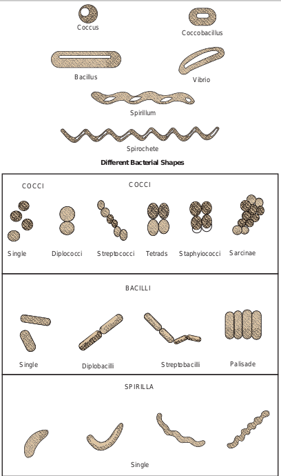
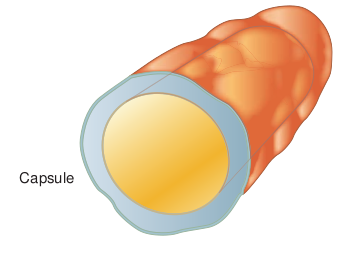
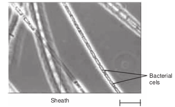
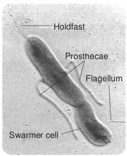
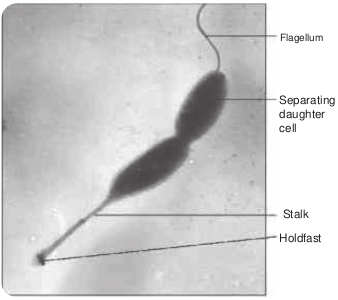
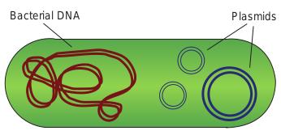

  

**Chapter** 7 **Morphology of Bacteria Chapter Outline**

**7.1** Bacterial Size, Shape and Arrangement

**7.2** Structures External to Cell Wall of Bacteria

**7.3** Cell Envelope of Bacteria **7.4** Structures Internal

to Cell Membrane of Bacteria

**7.5** Eukaryotic Cell Structure

is am me pro

After studying this chapter the student will be able,

_• To know the size, shape and arrangement of bacteria._

_• To list a few examples of bacteria with their shapes._

_• To understand and describe the role of the structures external to the cell wall._

_• To understand the structure, function and arrangement of bacterial flagella._

_• To describe the role of capsule, slime layer, pili, flagella and fimbriae in a prokaryotic cell._

_• To describe the structure and function of cell wall, outer membrane and cell membrane._

_• To know the significance of Cell Envelope._

**Learning Objectives**  

The distinction between **prokaryotes** and **eukaryotes** considered to be the most important distinction ong groups of organisms. Eukaryotic cells contain mbrane bound organelles, such as mitochondria, while karyotic cells do not.

_• To differentiate between Gram positive and Gram negative bacteria._

_• To know the structures and functions internal to cell membrane._

_• To differentiate between prokaryotic and eukaryotic cell structure._

Living organisms are differentiated from non living matter by their (1) ability to reproduce (2) ability to ingest or assimilate food and metabolize them for energy and growth (3) ability to excrete waste products (4) ability to react to changes in their environment (irritability) and (5) susceptibility to mutation. The living organisms include a variety of micro and macro organisms of different size, shape, morphology and behaviour. They include tiny bacteria, protozoans, worms, plants and animals.

  

Bacteria, cyanobacteria (blue green algae) microalgae, protozoa, yeasts and fungi represent the microorganisms. Prokaryotes are organisms with primitive type of nucleus lacking a well defined membrane (Figure 7.1). The nuclear material is a DNA molecule in prokaryotes compared to chromosomes of higher organisms. Eukaryotes are organisms with cells having true nuclei enclosed in a nuclear membrane and are structurally more complex than prokaryotes. There exists varying degree of localization of cellular functions in eukaryotes that occur in distinct membrane bound intracellular organelles like nuclei, mitochondria, chloroplasts. The cells of living organisms are either prokaryotic or eukaryotic in nature and there is not any intermediate condition. The size, shape, morphology and the internal cellular organizations are different in these two groups.

Satisfactory criteria to differentiate bacteria, fungi and algae could not be

Infolding of plasma

membrane

Generalized structure o

Capsule Cell wall

CytoplaPlasma membrane

Pili

Cytoplasmic inclusion

made until the development of electron microscope, which depicted the internal structure of these organisms. The absence of membrane bound internal structures in bacteria and their presence in fungi, algae, protozoa, plant and animal cells was taken as criterion to differentiate prokaryotes and eukaryotes.

## Size, Shape and Arrangement of Bacteria

### Size of Bacteria

Bacteria are minute living bodies and represent one of the lowest orders of living cells. The determination of size of the different forms is originally carried out by comparison with known RBC. A more accurate estimation is now obtained by the use of a special micrometer eye-piece, containing a graduated scale. The unit of measurement of bacteria is called micron (µ or µm). 1 micron is equal to 1 thousand of millimeter. Resolution of unaided eye is 200µm. The size of bacteria is constant but

f a bacterium

DNA coiled into nucleoid

Basal body

Ribosomes

sm

Flagellum

structure of a bacterium

  

100 pm 1 nm 10 nm 100 nm

Atom Small Molecules

Lipids

Proteins

BaVirus

Electron Micro

depends upon environmental and growth condition. Medically important bacteria ranges from 0.2 – 1.5 µm in diameter and 3-5µm in length (Figure 7.2).

The smallest bacteria is _Mycoplasma genital_ The largest and longest bacterium is _Thio_ the ocean sediments in the continental sh be visible to the naked eye. The previously _fishelsoni_ is found only in the intestinal trac _Epulopiscium_ means “guest at the table of fi

_Epulopiscium fishelsoni_

**Infob**  

1 µm 10 µm 100 µm 1 µm

Eye

cteria

Organelles

Eukaryotic Cells

Light Microscope

scope

nit of measurement

1 metre (m) = 1000mm (millimeter) 1mm (10-3m) = 1000 µm (micrometer) 1 µm (10-6m) = 1000nm (nanometer) 1nm (10-9m) = 1000pm (picometer) 1A0 (10-10m) (angstrom)

_ium_, which has a diameter of 200-300nm. _margarita namibiensis_ (750µm) found in elf of Namibia. They are large enough to known largest bacterial cell _Epulopiscium_ t of certain topical fish over 500µm long.

sh”.

_Mycoplasma genitalium_

**its**

| 1 m et re (m) |= |1000mm (mi l lim et er) |
|------|------|------|
| 1mm (10 m)-3 |= |1000 µm (micr omet er) |
| 1 µm (10 m)-6 |= |1000nm (n anomet er) |
| 1nm (10 m)-9 |= |1000p m (p ico met er) |
| 1A (10 m) (a ngs t rom)0  -10 |
  

### Cell Shape and Arrangement of Bacteria

The shape of a bacterium is governed by its rigid cell wall. Typical bacterial cells are spherical (called cocci), straight rods (called bacilli) and helically curved rods (called spiral). These shapes are constant for the particular species or genus but there are bacterial cells that are pleomorphic in nature. They exhibit a variety of shapes.

• Cocci appear in several characteristic arrangements, depending on the plane of cellular division and whether daughter cells remain together with the parents even after cell division. The cells may occurs in pairs (diplococci), in groups of four (tetracocci), in clusters (_Staphylococcus_), in a bead like chain (_Streptococci_) or in cuboidal arrangement of cells (_Sarcinae_).

• Bacilli are rod shaped organism (Singular, bacillus = stick) usually ranging between 1 and 10 µm in length. Some bacilli are so short and stumpy that they appear ovoid and are referred to as coccobacilli. Bacilli are not arranged in patterns as complex as those of cocci and mostly occur as singles or in pairs (diplobacilli, Example: _Bacillus subtilis)_ or in the form of chains (_Streptobacilli_). Some form trichomes, which are similar to chains. In other _Bacilli_ such as _Corynebacterium diphtheria_ the cells are lined side by side like matchsticks (pallisade arrangement). Some bacilli are curved into a form resembling a comma. These cells are called vibrios as in _Vibrio cholera_.

• Spiral bacteria: They are divided into two groups, spirilla (singular spirillum)  

and spirochetes (agent of syphilis). Although these two are similar in shape spirochetes are flexible in nature. Spiral bacteria are far too thin to be seen with the standard Brightfield microscope but are readily observed by Darkfield microscope (Figure 7.3).

**Filamentous bacteria** Bacteria tend to form long strands composed of many cells. In these cases, an occasional single cell may be seen after it breaks away from a long filament. These organisms resemble the threadlike strands of fungi but their internal structure is typical of bacteria. Filamentous soil bacteria include _Streptomyces_ species.

**Pleomorphic bacteria** A few bacteria lack rigid cell walls, and their flexible plasma membrane allows them to change shape. These are called pleomorphic bacteria (pleo-more; morph-form). Example: _Mycoplasma_.

## Structures External to Cell Wall of Bacetria

### Appendages

**Flagella** Flagella (singular flagellum) are threadlike, long, thin helical filaments measuring 0.01- 0.02nm in diameter. These appendages extend outward from the plasma membrane and cell wall. Flagella are so thin that they cannot be observed directly with a bright field microscope, but must be stained with special techniques (example: Fontana’s silver staining technique) that increase their thickness. The detailed structure of a flagellum can only be seen in the electron microscope.

  

Coccus

Bacillus

Spir

Spiro

**Different Bac**

COCCOCCI

Single Diplococci Streptococci

BACIL

Single Diplobacilli

SPIRI

Sing

Coccobacillus

Vibrio

illum

chete

**terial Shapes**

CI

Staphyiococci SarcinaeTetrads

LI

Streptobacilli

LLA

le

Palisade

rrangement of bacteria

  

The bacterial flagellum is composed of three parts: a basal body (associated with the cytoplasmic membrane and cell wall), a short hook and a helical filament (which is usually several times as long as the cell). Filament is external to cell wall and is connected to the hook at cell surface; the hook and basal body are embedded in the cell envelope (Figure 7.4). Hook and filament are composed of protein subunits called as flagellin.

One can generalize that all spirilla, about half of the bacilli and a small number of cocci are flagellated. Some bacteria do not have flagella. Flagella vary both in number and arrangement on the cell surface. Flagella are arranged generally in two patterns.

1\. In polar arrangement, the flagella are attached at one or both ends of the cell. Bacteria with polar flagellar arrangement are further classified into monotrichous, lophotrichous, and amphitrichous.

F

Outer membrane

Rod

Peptidoglycan portion of cell wall

2\. In lateral arrangement, flagella are arranged randomly all over the surface of the cell. Bacteria with lateral flagellar arrangement are called peritrichous. (Table 7.1)

Various types of mobility are observed based on the arrangement of the flagella. Serpentine motility is seen with _Salmonella_, darting motility with _Vibrio_ and tumbling motility with _Listeria monocytogenes_. Some bacteria like _Cytophaga_ exhibit a gliding motility, which is slow sinuous flexing motion. This occurs when the cells come in contact with solid surface.

Some bacteria have the ability to move toward or away from chemical substance. This movement is called chemotaxis. Positive chemotaxis is the movement of a cell in the direction of a favorable chemical stimulus (usually a nutrient). Negative chemotaxis is the movement away from a chemical substance (usually harmful compound). Some photosynthetic bacteria exhibit phototaxis, movement in response to light rather than chemicals.

lagellum

Hook

Basal Body

Filament

of bacterial flagella

  

**Table 7.1:** Arrangement of bacterial flagella

**Structure Flagella type** Monotrichous( flagella on one

Lophotrichous flagella on one

Amphitrichous tuft on both en

Peritrichous(fl throughout the

A. If a bacterium loses its flagella, does it survive?

B. If you remove the cell wall from a flagellated bacterium, the organism loses the ability to move. Explain.

**HOTS**

The presence of motility is one piece of information used to identify a pathogen in the laboratory. One way to detect motility is to stab a tiny mass of cells into soft (semi solid) medium in a test tube. Growth spreading rapidly through the entire medium is indicative of motility. Alternatively, cells can be observed microscopically by a hanging drop method.

**Pili** Pili (singular pilus) are straight, short and thin and more numerous than flagella around the cell. They can be observed only by electron microscopy. They are found only  

**Example** single side)

_Vibrio cholera_

(tuft of end)

_Pseudomonas fluorescens_

(single or ds)

_Aquaspirillum serpens_

agella cells)

_Salmonella typhi_

in certain species of Gram negative bacteria. Pili play no role in motility. Pili originate from the plasma membrane and are made up of a special protein called pilin (Figure 7.5).

Pili play a major role in human infection by allowing pathogenic bacteria to attach to epithelial cells lining the respiratory, intestinal or genitourinary tracts. This attachment prevents the bacteria being washed away by body fluids, thus helps in establishment of infection. One specialized type of pilus (sex pilus) helps in the transfer of genetic material between the bacterial cells. This process is called conjugation.

**Fimbriae** Fimbriae (singular: fimbria) is another term used for short pili that occur in great number around the cell. They enable bacteria to attach to surfaces and to each other, so that the bacteria form clumps or films called pellicles on the surface of liquid in which they are growing. Fimbriae are found in Gram positive as well as in Gram negative bacteria.

| Str uct u re |F l age l l a t y p e |E x amp l e |
|------|------|------|
| Monot r ic hous(sin g lef l agel l a o n o ne side) |Vibr io  c hol e ra |
| L ophot r ic hous(t uf t o ff l agel l a o n o ne en d) |Ps eu domonas f luores cens |
| Amphi t r ic hous(sin g le o rtuf t o n b ot h en ds) |Aquas pir illum s er pens |
| Per it r ic hous(f l agel l at hr oug hout t he ce l ls) |S almon ella  t y phi |
  

Table 7.2 compares the pili and fimbriae.

### Extracellular Polymeric Substance (EPS)

Many bacteria secrete high molecular weight polymers that adhere to the exterior of the cell wall to form a capsule or slime layer. Glycocalyx is often used to refer to any polysaccharide material outside the cell wall. Capsules and slime layer are considered to be glycocalyxes (Table 7.3).

**Capsules** Some bacterial cells are surrounded by a viscous substance forming a covering layer or envelope around the cell wall called capsule (Figure 7.6). Capsule is usually made up of polysaccharide. It may be

Sex pilus

Flagella

Fimbriae

**Table 7.2:** Comparison of pili and fimbriae

**Characteristics Pili Appearance** Hair like, straight

appendages. **Length** Longer than fimbriae **Numbers per cell** 1-10/cell **Presence** Present only in Gram

negative bacteria **Made -up of** Pilin protein  

s of pili and fimbriae

Fimbriae Flagellum

Pilus

homopolysaccharide (made up of a single kind of sugar) or heteropolysaccharide (made up of several kinds of sugars). These are synthesized from sugars within the cell, transported and polymerized outside the cell. The capsule of some bacteria is made of polypeptides. The capsule of Bacillus _anthracis_ has polymer of D-glutamic acid. Capsules are highly impermeable. Capsules can be demonstrated using special staining technique utilizing Indian ink or with Nigrosin stain. The presence of capsule in fresh isolates gives a moist and shiny appearance to the bacterial colonies on an agar medium. Capsular material is antigenic and may be demonstrated by serological methods.

**Fimbriae** Tiny bristle like fibers arising from the surface of bacterial cell. Shorter than pili 200-400/cell Present in both Gram positive and Gram negative bacteria Fimbrillin protein

| C ha r ac teris ti cs |Pi l i |Fim bri ae |
|------|------|------|
| App e ar an c e |Hair li ke, s t ra ig htapp en d ages. |Tiny b r ist le li ke f ib er s a r isin g f rom t hesur face o f b ac ter i a l ce l l. |
| L eng t h |L onger t han f im br i ae |Shor ter t han p i li |
| Num b ers p er c el l |1-10/ce l l |200-400/ce l l |
| Pres enc e |Pres en t o n ly in G ra mnega t ive b ac ter i a |Pres en t in b ot h G ra m p osi t ive a ndGra m n ega t ive b ac ter i a |
| Mad e -u p o f |Pi lin p rotein |Fim br i l lin p rotein |
  

**Table 7.3:** Difference between Capsule and S

**Capsule** Capsule is a glycocalyx layer, consisting of firmly associated polysaccharide molecules with the cell wall. It is a well-organized layer, difficult to be washed off. It is tightly bound to the cell wall. It is thicker than slime layer. It acts as a virulence factor that helps to escape phagocytosis.

The role of the capsule varies depending on the bacterium. • A thick capsule protects cells from

dehydration. • Capsules protect the pathogenic

bacteria from being engulfed and destroyed by white blood cells (phagocytes).

• Capsules are virulence factors of many pathogenic bacteria, such as _Streptococcus pneumoniae_, _Haemophilus influenzae_ and _Bacillus anthracis_. Encapsulated bacterial cells generally have greater virulence.

Capsule

lime layer

**Slime layer** Slime layer is a glycocalyx layer that consists of loosely associated glycoprotein molecules. It is an unorganized layer and can be easily washed off. It is loosely bound to the cell wall. It is a thin glycocalyx layer. It mainly helps in adherence. It protects the cell from dehydration and nutrient loss.

**Slime layer** Some bacteria are covered with a surface layer that is loosely distributed around the cell and diffuses into the medium, this surface layer is referred to as slime layer. (Figure 7.7) The slime layer is a structure that is easily washed off. Slime layer protects bacteria from loss of water and nutrients. Slime has little affinity for basic dyes and is ivisible in Gram stained smears.

Slime layer

### Other Appendages

**Sheath** Sheathed bacteria are bacteria that grow as long filaments in the form of chain or trichome. These bacteria are enclosed by a hollow tube like structure known as sheath

| C ap su l e |Slime l ayer |
|------|------|
| C aps u le i s a g lyco c a lyx l ayer, co nsi st in gof f ir m ly a ss o ci ate d p olys acc har idemole c u les w it h t he ce l l wa l l. |Slim e l ayer i s a g lyco c a lyx l ayer t hatco nsi sts o f lo os ely a ss o ci ate d g lyco proteinmole c u les. |
| It i s a w el l-o rga nize d l ayer, dif f ic u lt t o b ew ashe d  o f f. |It i s a n un orga nize d  l ayer  and c an  b e  e asi lyw ashe d  o f f. |
| It i s t ig ht ly b oun d t o t he ce l l wa l l. |It i s lo os ely b oun d t o t he ce l l wa l l. |
| It i s t hic ker t han s lim e l ayer. |It i s a t hin g lyco c a lyx l ayer. |
| It ac ts a s a v ir u len ce fac tor t hat h elps t oes c ap e p hago c yt osi s. |It m ain ly h elps in ad her en ce . I t p rote c tst he ce l l f rom de hydra t io n a nd n ut r ien tlos s. |
  

(Figure 7.8). Within the shealth, the bacteria are capable of growth and division. Aquatic bacteria mostly form sheath. Examples of sheathed bacteria include _Leptothrix discophora_ (also known as iron bacteria), _Sphaerotilus_ and _Clonothrix_.

Sheath

Bacterial cels

**Biofilms:** Microbial adhesion to animate or inani surfaces can be mediated by polysaccha capsules or slime. These adherence polymer collectively called as adhesions. Microorga tend to adhere to any surface and the layer produce is called Biofilm. Biofilm can be har or beneficial to humans. Biofilm formation critical issue for almost all surfaces in health and food preparation settings. Biofilms may on a wide variety of surfaces, including liv portable water piping system, etc., Biofilm with attachment to a surface, then formation ending with maturation and detachment. D bacteria are able to communicate with one a quorum sensing.

Surface

First colonies

Organic surface coating

Cells sticks to coating

As cell dense m

by sticky

Glycocalyx slime

**Infob**  

mate rides s are nism they mful is a care

form ing tissues, medical devices, industrial or formation is a multi-step process starting of three dimensional structure and finally uring biofilm formation many species of

nother through specific mechanism called

Glycocalyx

s divide, they form a at bounded together

extracellular deposits

Additional microorganisms are attached to developing film and create a mature community with complex functions

**its**

**Function:** • It provides mechanical support. • In a few bacteria, shealth is

strengthened by the deposition of ferric and manganese hydroxides.

**Prosthecae** They are semi rigid extensions of cell wall and cell membrane. Some bacteria may contain more than one prosthecae ( Figure 7.9). Aerobic bacteria in fresh water and marine environment possess prosthecae. Some of the prosthecate bacteria are _Caulobacter, Stellar, Prosthecobacter and Hyphomicrobium_.

Surface

First colonies

Organic surface coating

Cells sticks to coating

Glycoc

As cells divide, dense mat boun

by sticky extrace

Glycocalyx slime

Catheter surface

Cell cluster

  

Holdfast

Prosthecae

Flagellum

Swarmer cell

**Function:** • Prosthecae increase surface area for

absorption of nutrients from the dilute aquatic environment.

• Helps in adhesion. • Some prosthecae develop bud at the tip

and helps in asexual reproduction.

**Stalk** It is a nonliving ribbon like tubular structure. It is formed by excretory product of bacteria. Some of the stalked bacteria are _Gallionella, Planctomyces_ ( Figure 7.10).

Flagellum

Holdfast

Separating daughter cell

Stalk  

**Function:** • Stalk helps in attachment of cells to

solid surface.

## Cell Envelope of Bacteria

**Cell envelope** is an external covering that lies outside the cytoplasm. It is composed of two or three basic layers: the cell wall, the cell membrane and in some bacteria the outer membrane.

### Structure of Prokaryotic Cell Wall

Prokaryotic cells almost always are bounded by a chemically complex cell wall. Cell wall lies beneath the external structures (capsules, sheaths and flagella). Cell wall lies external to the plasma membrane (cell membrane). Cell wall of eubacteria is made up of **peptidoglycan** or **murein**, whereas that of Archaeobacteria is composed of proteins, glycoproteins or polysaccharides. A few genera such as _Methanobacterium_, have cell walls composed of **pseudomurein**, a polymer whose structure superficially resemble eubacteria peptidoglycan of eubacteria but differs markedly in chemical composition.(Note: Ordinary or typical bacteria are sometimes called eubacteria to distinguish them from the phylogenetically distinct group known as archaeobacteria). Peptidoglycan is a cross linked polymer of enormous strength and rigidity. It is a polymer composed of many identical subunits ( Figure 7.11). Peptidoglycan differs somewhat in composition and structure from one species to another, but it is basically a polymer of N-acetylglucosamine(NAG), N-acetylmuramic acid(NAM), L-alanine, D-alanine, D-glutamate, and a diamino acid (LL- or meso-diaminopimelic acid, L-lysine, L-ornithine, or L- diaminobutyric acid).

  

Cell wall may contain other substances in addition to peptidoglycan. For instance, _Staphylococcus aureus_ and _Streptococcus fecalis_ contain **teichoic acids** (polymer of acidic polysaccharides) covalently linked to peptidoglycan. Cell wall of Gram positive bacteria contain very little lipid but _Mycobacterium_ and _Corynebacterium_ cell walls are rich in **mycolic acid** (or Cord factor) which make them acid fast. When stained, the cells cannot be decolorized easily despite treatment with dilute acids. _Mycoplasma_ lack cell wall.

**Protoplast** is a bacterial cell consisting of cell material bound by a cytoplasmic membrane.

**Spheroplast** is a bacterial cell with two membranes namely the cytoplasmic

Peptidoglycan

Cell Membrane

Membrane proteins

Cell envelope of Gram positive bacteria

Periplasm

membrane and the outer membrane but no cell wall.

**Functions of cell wall**

• It gives shape to bacteria like a bicycle tyre that maintains the necessary shape and prevents the more delicate inner tube (the cytoplasmic membrane) from bursting when it is expanded.

• It protects bacteria from osmotic lysis in dilute solutions (hypotonic environment).

• It protects cell from toxic substances.

How do bacteria maintain their shape?

**HOTS**

Peptidoglycan

Outer Membrane

**Lipopolysaccharide** O-Polysaccharide

Lipid A

Core Polysaccharide

Lipoprotein

Cell Membrane

Membrane proteins

Cell envelope of Gram positive bacteria

ositive and Gram negative bacteria

|------|

  

### Structure of Outer Membrane

Eubacteria and Archaeobacteria (Gram positive and Gram negative) differ with respect to their cell walls. Gram negative cell walls are more complex. An outer membrane surrounds a thin underlying layer of peptidoglycan (Table 7.4). Outer membrane is bilayered, consisting mainly of phospholipids, proteins and lipopolysaccharide (LPS).

LPS is composed of three parts which are covalently linked to each other. They are

1\. **Lipid A which is firmly embedded in the** membrane,

2\. **Core polysaccharide** that is located at the membrane surface and

3\. **Polysaccharide O antigens** that extend like whiskers from the membrane surface into the surrounding medium

**Table 7.4:** Difference between Gram positiv

**Gram positive bacteri** Gram reaction The bacteria that retain

colour of the primary s (crystal violet) are Gra positive

Cell wall The cell wall is thick (20-30nm thick)

Peptidoglycan layer Thick (multilayered) LPS content Lipopolysaccharide

None

Periplasmic space Absent Outer membrane Absent Lipid and lipoprotein content

Low (acid fast bacteria have lipids linked to peptidoglycan)

Teichoic acids Present in many Example: _Streptococcus, Staphylo_

_Corynebacterium, Baci Clostridium_  

Special protein channels called porins span the membrane. The points of contact between outermembrane and cytoplasmic membrane are known as adhesions. Outer membrane is anchored to peptidoglycan layer by means of **Braun’s** lipoprotein. Periplasmic space between the cell membrane and the outer membrane.

**Functions of outer membrane**

• It serves as an impermeable barrier to prevent the escape of important enzymes (such as those involved in cell wall growth) from the periplasmic space.

• It serves as a barrier to various external chemicals and enzymes that could damage the cell. For example, the walls of many Gram positive bacteria can be easily destroyed by treatment with an enzyme called lysozyme, which selectively

e and Gram negative bacteria

**a Gram negative bacteria** the tain m

The bacteria that cannot retain the primary stain but takes on the colour of the counterstain safranin are called Gram negative The cell wall is thin (8-12nm thick) Thin (single layered) High

Present Present

High due to the presence of outer membrane

Absent _coccus, llus,_

_Escherichia coli, Pseudomonas, Haemophilus, Salmonella, Shigella._

| Gra m r e ac t io n |Th e b ac ter i a t hat r et ain t heco lo ur o f t he p r im ar y s t ain(cr ys t a l v io let) a re G ra mp osi t ive |Th e b ac ter i a t hat c ann ot r et aint he p r im ar y s t ain b ut t a kes o nt he co lo ur o f t he co un ter st ains af ra nin a re c a l le d G ra m n ega t ive |
|------|------|------|
| C ell  w all |Th e ce l l wa l l i s t hic k(20-30nm t hic k) |Th e ce l l wa l l i s t hin (8-12nmt hic k) |
| Pep t idog lyc an l ayer |Thic k (m u lt i l ayer e d) |Thin (sin g le l ayer e d) |
| LPS co nten tL ip op olys acc har ide |None |Hi g h |
| Per ipl asmic s p ace |Abs en t |Pres en t |
| O uter m em bra ne |Abs en t |Pres en t |
| L ipi d  a ndli p oprotein co nten t |L ow (acid fa st b ac ter i ahave li pid s lin ke d t op ep t idog lyc an) |Hig h d ue t o t he p res en ce o f o uterme mbr ane |
| Teic hoic acid s |Pres en t in m any |Abs en t |
| E xa mple: |Strep toc oc c u s ,  S taphyloc oc c u s ,C or y nebac ter ium, B aci llu s,C lostr idium |E s cher ichia c oli, P s eu domonas,Hae mo philu s ,  S almo nella ,Shige lla. |
  

dissolves peptidoglycan. However, Gram negative bacteria are refractory to this enzyme because large protein molecules of enzyme cannot penetrate the outer membrane. Only when outer membrane is damaged the enzyme can penetrate.

• Porins allow the smaller molecules, such as amino acids, monosaccharides to pass across.

• Adhesions are export sites for newly synthesised LPS and porins, and are sites at which pili and flagella are made.

### Structure of Cytoplasmic Membrane

Immediately beneath the cell wall is the cytoplasmic membrane also known as plasma membrane or cell membrane. It is composed of phospholipids and proteins. The phospholipids form a bilayer. Integral proteins are embedded within this bilayer. Surface proteins or peripheral proteins are loosely attached to the bilayer. The lipid matrix of the membrane has fluidity, allowing the components to move around laterally. In eubacteria, the phospholipids are phosphoglycerides, in which straight chain fatty acids are ester linked to glycerol. In archaeobacteria, the lipids are polyisoprenoid branched-chain lipids, in which long-chain branched alcohols (phytanols) are ether linked to glycerol.

**Functions of the cell membrane**

• Prokaryotes do not have intracellular membrane bound organelles as present in eukaryotic organelles. Thus cell membrane provides a site for functions  

such as energy reactions, nutrient processing and synthesis.

• It regulates transport, the passage of nutrients into the cell and the discharge of wastes. It is a selectively permeable membrane.

• It is also involved in secretion or discharge of a metabolic product into extracellular environment.

• Cell membrane is an important site for a number of metabolic activities. Most enzymes of respiration and ATP synthesis reside in the cell membrane since prokaryotes lack mitochondria.

**Significance of cell envelope** • It has toxic properties (Example: LPS) • It stimulates antibody production by

immune system • The cell walls of many pathogens have

components that contribute to their pathogenicity. Example mycolic acids of _Mycobacterium tuberculosis_

• Cell wall is a site of action of several antibiotics.

• Many of the serological properties of Gram negative bacteria are attributable to O antigens; they can also serve as receptors for bacteriophage attachment.

## Structures Internal to Cell Membrane of Bacteria

Cytoplasm is called as the internal matrix of the cell inside the cell membrane. Its major component is water (70-80%). It also contains proteins carbohydrates, lipids, inorganic ions, and certain low molecular weight compounds. Inorganic ions are present in much higher concentrations in cytoplasm than in most media.

  

Prokaryotic Ribosome

70S

50S subunit

30S subunit

5S RNA

23S RNA

16S RNA

Cytoplasm is thick, aqueous, semi- transparent and elastic. The major structures in the cytoplasm of prokaryotes are nucleoid (containing DNA), ribosomes and reserve deposits called inclusions. Prokaryotic cytoplasm lacks certain features of eukaryotic cytoplasm such as a cytoskeleton and cytoplasmic streaming.

**Ribosomes**

All living cells contain ribosomes. They are the sites of protein synthesis. High number of ribosomes represents the high rate of protein synthesis. Prokaryotic ribosomes are freely found in the cytoplasm, whereas eukaryotic ribosomes are attached to the cell membrane. Prokaryotic ribosomes consists of protein and a type of RNA called ribosomal RNA. They are smaller and less dense than the eukaryotic ribosomes. The ribosomes of prokaryotes are 70S where as that of eukaryote are 80S (Figure 7.12).  

18S RNA

80S

60S subunit

Eukaryotic Ribosome

40S subunit

5.8S

5S RNA

28S RNA

nd Eukaryotic Ribosomes

**Nucleus**

The nuclear area has the hereditary material of most bacteria. It contains a single, circular, long, continuous, thread like double stranded DNA called the bacterial chromosome. Some bacteria with linear chromosome also exist. It carries the information required for the cells structure and function. They are not surrounded by a nuclear envelope and are devoid of highly conserved histone proteins. The nuclear area can be spherical, elongated or dumbbell shaped. In actively growing bacteria, as much as 20% of the cell volume is occupied by DNA, because such cells presynthesize nuclear material for future cells. The chromosome is attached to the cell membrane. Proteins in the plasma membrane are believed to be responsible for the replication of the DNA and segregation of the new chromosomes to daughter cells in cell division.

  

**Plasmids**

Apart from the bacterial chromosome, bacteria also contain small circular, double stranded DNA molecules called plasmids (Figure 7.13). Plasmids are self replicating extra chromosomal genetic elements. Plasmids may carry genes for activities such as antibiotic resistance and tolerance to toxic metals. Examples: Fertility plasmid (F plasmid), Resistance plasmid (R plasmid) and colicin plasmid (Col plasmid). Bacterial DNA Plasmids

**Molecular Chaperones**

They are the helper proteins which recognize the newly formed polypeptides and fold them into their proper shape of secondary and tertiary structure. Many chaperones are involved in proper folding of bacteria. They were first identified in Escherichia coli mutant. Example: Heat shock proteins are produced in _Escherichia coli_ cells subjected to live at high temperatures, or in any other stressful unfavorable conditions.

**Inclusions**

The cytoplasm of prokaryotic cells has several kinds of reserve deposits known as inclusions. Cells may accumulate certain nutrients when they are plentiful and use them when they are deficient. Some inclusions are common to a wide variety of bacteria whereas others are limited to certain species (Table 7.5).  

**Endospores:** Some species of bacteria produce metabolically dormant structures called spores. They are highly durable and dehydrated resting bodies produced inside the cells. They are formed by bacteria only when there is lack of water or depletion of essential nutrients in the environment. Endospores are coated with a specific chemical compound diaminopimelic acid. It binds with the Calcium and forms Calcium dipicolinate which removes the water from it and makes the spore resistant to extreme conditions Example: _Bacillus anthracis_ and _Clostridium tetani_ possess endospores.

**Mesosomes** Generally prokaryotes do not have cytoplasmic organelles like mitochondria and chloroplast. It contains mesosome as their organelle. They are the invaginations of the cell membrane and they are in the form of tubules, vesicles or lamellae. They are seen in both Gram positive and Gram negative bacteria, generally more in Gram positive bacteria. They are located next to the septa or cross walls in dividing bacteria (Figure 7.14). They may be involved in cell wall formation during division or play a role in chromosome replication and distribution to daughter cells. If they are located near to the surface they are called peripheral mesosomes and if they are located deep into the cytoplasm they are called central mesosomes.

Cell wall

Plasma Membrane

Mesosome Sac

Tubules

  

**Table 7.5:** Different types of inclusion bodie

**Type of inclusion bodies**

**Example of organ possessing**

Polyhydroxybutyrate (PHB)

_Bacillus megaterium_

Polyphosphate (volutin granules) or metachromatic granules

_Corynebacterium diphtheriae_

Sulphur globules Phototrophic bact Like purple and g Sulphur bacteria Example: _Thiobac_

Gas vesicles Aquatic bacteria, _Cyanobacterium_

Parasporal crystals Genus _Bacillus_

Magnetosomes _Aquaspirillum magnetotacticum_

Carboxysomes Photosynthetic Bacteria, cyanoba Autotrophic bacte

Phycobilisomes or cyanophycin Granules

Cyanobacteria

Chlorosomes Green bacteria

Why are endospores so difficult to destory?

**HOTS**  

s in bacteria

**isms Significance** Reserve of Carbon and energy sources. Sudan dye is used to observe lipid inclusions Reserve of phosphate

eria reen

_illus_

Elemental sulphur, reserve of electrons in phototrophs. Reserve of energy source in lithotrophs

They are protein shells filled with gases. They provide buoyancy and keep the cells floating in vertical water column It is a proteinaceous compound, It is toxic to certain insects They are like intracellular chains of magnetite particles. They help the bacteria to swim to nutrient rich sediments. It protects the cell against H2O2 accumulation

cteria ria

They contain the enzyme Ribulose 1-5 bisphosphate carboxylase which is involved in Carbon dioxide fixation during photosynthesis They have a long polypeptide with equal proportion of Arginine and Aspartic acid. They store Nitrogen They contain bacteriocholorophyll pigments which are involved in bacterial photosynthesis

| Ty p e o f incl us i onb o di es |E xa mp l e o f o rg anis msp oss ess in g |Sig nif i c anc e |
|------|------|------|
| Poly hydr oxy but y ra te(P HB) |B ac ill u smeg ate r ium |R es er ve o f C arb on a nd en er g ys our ces. Sud an dye is us e d to obs er veli pid in clusio ns |
| Poly ph o sph ate(v olut in g ra nu les) o rmet ac hr omat ic g ra nu les |C or y nebac te r ium diph the r iae |R es er ve o f p hos phate |
| Su lphur g lo bu les |Photot rophic b ac ter i aL i ke p ur ple a nd g re enSu lphur b ac ter i aE xa mple:  T hiob ac illu s |E lem en t a l s u lphur, r es er ve o fele c t rons in p hotot rophs. R es er ve o fen er g y s our ce in li t hot rophs |
| Ga s v esic les |Aqu at ic b ac ter i a,Cyanob ac te r ium |Th e y a re p rotein s hel ls f i l le d w it hga s es.  Th e y  prov ide  buo ya nc y  andke ep t he ce l ls f lo at in g in v er t ic a lwa ter co lumn |
| Para sp ora l cr ys t a ls |G en us  B ac ill u s |It i s a p rotein ace ous co mp oun d, It i stoxic t o cer t ain in s e c ts |
| Mag net os omes |Aqua spir illummag net otac tic um |Th e y a re li ke in t race l lu l ar c hain s o fmag net ite  p ar t ic les.  Th e y  help  t heb ac ter i a t o sw im t o n ut r ien t r ic hs e dim en ts. It prote c ts t he cel l aga in stH O acc um u l at io n2 2 |
| C arb oxys omes |Photosy nt het icB ac ter i a, c ya nob ac ter i aAutot rophic b ac ter i a |Th e y co nt ain t he enzy me R ibu los e1-5 b isphos phate c arb oxy l as e w hic his in volve d in C arb on dio xidef ixa t io n d ur in g p hotosy nt hesi s |
| Phyco bi li s omes o rc ya nophycin G ra nu les |Cya nob ac ter i a |Th e y h ave a lo ng p olyp ep t ide w it he qu a l p rop or t io n o f A rg inin e a ndAsp ar t ic acid . Th e y s tore N it rog en |
| C h lo ros omes |Gre en b ac ter i a |e y co ntain  b ac ter io cholorophyllpig ments w hic h a re  in volved inbac ter ial p hotosy nthesi s |
  

## Eukaryotic Cell Structure
 As mentioned earlier, eukaryotic organisms include algae, protozoa, fungi, higher plants and animals. The eukaryotic cell is typically larger and structurally more complex than the prokaryotic cell (Flowchart 7.1).

Prokaryotes and Eukaryotes are chemically similar, in the sense that they both contain nucleic acids, proteins, lipids, and carbohydrates (Figure 7.15). They use the same kinds of chemical reactions to metabolize food, build proteins, and store energy.

Appendages • Flagella • Cilia Glycocalyx • Capsule • Slime layer

• Cell Wall • Cytoplasm

membrane

Eukaryo

External Structures Cell Env

**Flowchart 7.1:** Eukar  

It is primarily the structure of cell walls and membranes, and the absence of organelles (specialized cellular structures that have specific functions), that distinguish prokaryotes from eukaryotes (Table 7.6).

The general, eukaryotic microbial cells have a cytoplasmic membrane, nucleus, mitochondria, endoplasmic reticulum, Golgi apparatus, vacuoles, cytoskeleton, and glycocalyx. A cell wall, locomotor appendages and chloroplasts are found only in some groups. The structure and functions of the eukaryotic cells are discussed in (Table 7.7).

Nucleus Organelles • Endoplasmic

reticulum • Golgi apparatus • Ribosome • Lysosomes • Mitochondria • Chloroplasts Cytoskeleton • Microtubules • Microfilaments

ic

tic Cell Structure

elope Internal Structures

yotic Cell Structure

  

**Table 7.6:** Differences between prokaryotic

**S. No Characteristic Prokaryotic**

1 Size of cell Typically 0.2-2. diameter

2 Nucleus No nuclear mem or nucleoli

3 Membrane enclosed organelles

Absent

4 Flagella Consist of two p building blocks

5 Glycocalyx Present as a cap slime layer

6 Cell wall Usually present chemically com (typical bacteri cell wall includ peptidoglycan)

7 Plasma membrane No carbohydrat generally lacks

8 Cytoplasm No cytoskeleton cytoplasmic str

9 Ribosomes 70S

CytoplasmNucleoid

Glycocalyx (capsule)

Cell wall

Metachromatic granules Pili

Cell membrane

(a) Prokaryotic Cell

Ribosome

Flagellum

M

en r

and eukaryotic cell

**Eukaryotic**

0nm in Typically 10-100 nm diameters

brane True nucleus, consisting of nuclear membrane and nucleoli

Present. Example: lysosomes, Golgi complex, endoplasmic reticulum, mitochondria and chloroplasts

rotein Complex, consist of multiple micro tubules

sule or Present in some cells that lack cell wall

and is plex al es

When present, chemically simple

es and sterols

Sterols and carbohydrates that serve as receptors are present

or eaming

Has cytoskeleton and shows cytoplasmic streaming

80S (70S in organelles)

_(Continued)_

(b) Eukaryotic Cell Nucleus containing

chromosomes

Lysosomes

Cell membrane

Rough endoplasmic

reticulum RibosomesNucleolus

Golgi complex

itochondria

Smooth doplasmic eticulum

Cytoplasm

karyotic and eukaryotic cell

| S. No |C ha r ac teris ti c |Pro k ar yot i c |Eu k ar yot i c |
|------|------|------|------|
| 1 |Size o f ce l l |Typ ic a l ly 0.2-2.0nm indi amet er |Typ ic a l ly 10-100 nm di amet er s |
| 2 |Nuc leu s |No n uc le ar m em bra neor n uc le oli |Tr ue n uc leu s, co nsi st in g o fnuc le ar m em bra ne a nd n uc le oli |
| 3 |Mem bra neen clos e d o rga nel les |Abs en t |Pres en t. E xa mple: l ys os omes,G olg i co mplex, en do pl asmicret ic u lum, mi to chondr i a a ndch lo ropl asts |
| 4 |F la gel la |C onsi st o f t wo p roteinbui ldin g b lo cks |C omplex, co nsi st o f m u lt iplemicr o t ubu les |
| 5 |Gly c o c a ly x |Pres en t a s a c aps u le o rslim e l ayer |Pres en t in s ome ce l ls t hat l ac k ce l lw all |
| 6 |C ell  w all |Usu a l ly p res en t a nd i schemic a l ly co mplex(t yp ic a l b ac ter i a lce l l wa l l in cludesp ep t idog lyc an) |When p res en t, c hemic a l ly sim ple |
| 7 |Pl asm a m em bra ne |No c arb ohydra tes a ndgen era l ly l ac ks s ter ols |Ster ols a nd c arb ohydra tes t hats er ve a s r e cep tors a re p res en t |
| 8 |Cy top l as m |No c yt os kelet on o rc yt opl asmic s t re amin g |Has c yt os kelet on a nd s howsc yt opl asmic s t re amin g |
| 9 |R ib o s ome s |70S |80S (70S in o rga nel les) |
  

**Table 7.7:** Functions of Eukaryotic organell

**Eukaryotic organelles Functions**

Plasma membrane Mechanical c barrier with interactions

Cytoplasmic matrix Environmen metabolic pr

Microfilaments, intermediate filaments, and Microtubules.

Cell structur

Endoplasmic reticulum Transport of

Ribosome Proteins synt

Golgi apparatus Packaging an purposes, lys

Lysosomes Intracelluar d

Mitochondria Energy prod acid cycle, el hosphorylati

Chloroplasts Photosynthe carbohydrate

Nucleus Repository fo

Cell wall and pellicle Strengthen a

Cilia and flagella Cell attachm

Vacuole Temporary s vacuoles), wa

10 Chromosome (DNA)

Single circular chromosome, la histone

11 Cell division Binary fission

12 Sexual recombination

No meiosis (tra of DNA fragme only)

**Table 7.6:** Differences between prokaryotic a  

es

ell boundary, selectively permeable transport systems, mediates cell to cell and adhesion to surfaces, secretion

t for other organelles, location of many ocesses

e and movements from the cytoskeleton

materials, protein and lipid synthesis

hesis

d secretion of materials for various osome formation

igestion

uction through use of the tricarboxylic ectron transport, oxidative on, and other path ways

sis, trapping light energy and formation of from CO2 and water

r genetic information, control center for cell

nd give shape to the cell

ent and Cell movement

torage and transport, digestion (food ter balance(contractile vacuole)

cks Multiple linear chromosomes with histone arrangement

Mitosis

nsfer nts

Involves meiosis

nd eukaryotic cell _(Continued)_

| 10 |C h rom o s om e(D NA) |Sin g le cir c u l archr omos ome, l ac ksh iston e |Mu lt iple lin e ar c hr omos omesw it h hi stone a r ra ngem en t |
|------|------|------|------|
| 11 |C el l di v isio n |Bin ar y f issio n |Mitosi s |
| 12 |S exu a lre c om bi nat i on |No m eiosi s (t ra nsf erof D NA f ra g men tson ly ) |Involves m eiosi s |

| Eu k ar yoti c o rg ane l l es |Func ti ons |
|------|------|
| Pl asm a m em bra ne |Me chanic a l ce l l b oun d ar y, s ele c t ively p er me ableb ar r ier w it h t ra nsp or t sys tem s, m e di ates ce l l t o ce l lin terac t io ns a nd ad hesio n t o s ur faces, s e cr et io n |
| Cyt opl asmic m at r ix |Env ir onm en t f or o t her o rga nel les, lo c at io n o f m anymet ab olic p ro ces s es |
| Micr of i l amen ts, in ter me di atef i l amen ts, a nd M icr otubu les. |C el l s t r uc tur e a nd m ovem en ts f rom t he c yt os kelet on |
| En do pl asmic r et ic u lum |Tra nsp or t o f m ater i a ls, p rotein a nd li pid sy nt hesi s |
| R ib o s ome |Protein s sy nt hesi s |
| G olg i a pp ara tus |Pac ka g in g a nd s e cr et io n o f m ater i a ls f or va r io uspur p os es, l ys os ome f or mat io n |
| Lys os omes |Int race l lu ar dig es t io n |
| Mit o chon d r i a |En er g y p ro duc t io n t hr oug h u s e o f t he t r ic arb oxy licacid c ycle , e le c t ron t ra nsp or t, o xid at ivehos phor y l at io n, a nd o t her p at h wa ys |
| C h lo ropl asts |Photosy nt hesi s, t ra ppin g lig ht en er g y a nd f or mat io n o fc arb ohydra te f rom  CO  a nd wa ter2 |
| Nuc leu s |Repositor y for genetic information, control center for cell |
| C el l wa l l a nd p el lic le |St ren gt hen a nd g ive s hap e t o t he ce l l |
| Ci li a a nd f l agel l a |C el l a tt ac hm en t a nd C el l m ovem en t |
| Vac uo le |Tem p ora r y s tora ge a nd t ra nsp or t, dig es t io n (f o o dvac uo les), wa ter b a l ance(co nt rac t i le vac uo le) |
  

_Staphylococcus aureus Streptococcus p_

_Vibrio c_

_Escherichia coli; Salmonella_

_Bordetella pertussis Corynebacterium_

_Clostridium tetaniClostridium botulinum_

**Different Shap**  

_yogenes_

_Streptococcus pneumoniae_

_Klebsiella pneumoniae holerae_

_diphtheriae Helicobacter pylori_

_Treponema pallidumNeisseria gonorrhoeae_

**es of Bacteria**

|------|------|

  

**ICT CORNER**

**Step2Step1**

**Bac**

**URL:** https://play.google.com/store/apps/ details?id=com.rendernet.bacteria&hl=en

**Know the various shapes of Bacteria**

**STEPS:** • Use the URL or scan the QR code to dow

VR 3D app. • Select sphere, rod and spiral to observ • Select ‘structure’ tab and note the inter • Click cell wall and note the difference  

**Step3**

**teria**

nload the Bacteria interactive educational

e the structure of bacteria shapes. nal structure of bacteria. between different shapes.

  

**Summary**

Most prokaryotes have one of three general shapes coccus (round), bacillus (rod), or spiral, based on the configuration of the cell wall. Two types of spiral cells are spirochetes and spirlla. Shape and arrangement of cells are key factors for describing prokaryotes. Arrangements of cells are based on the number of planes in which a given species divides.

Cocci can divide in many planes to form pairs, chains, packets, or clusters. Bacilli divide only in the transverse plane. If they remain attached, they form chains or palisades.

Some bacterial cell walls are covered by capsules or slime which protect the cell from phagocytosis, drying and nutrient loss. Fimbriae and Pili are involved in attachment and in transfer of genetic information between bacterial cells. Flagella are involved in cell motility.

The cell envelope is the complex boundary structure surrounding a bacterial cell. In Gram negative bacteria, the envelope consists of outer membrane, the cell wall, and the cell membrane. Gram positive bacteria have only cell wall and cell membrane. Gram positive bacteria have thick murein and teichoic acid. The cell walls of Gram negative bacteria are thinner and have wide periplasmic space. The outer membrane of Gram negative cells contains LPS toxic to mammalian hosts. The cell membrane is typically composed of phospholipids and proteins, and it performs many metabolic functions as well as transport activities.

The cytoplasm of bacterial cell serve as a solvent for material used  

in all functions. The genetic material of bacteria is DNA and the genes are arranged on larger, circular chromosomes. Additional genes are carried on plasmid. Bacterial ribosomes are dispersed is the cytoplasm in chains and are also embedded in the cell membrane.

Bacteria may store nutrients in their cytoplasm, in form of inclusions. Inclusion vary in structure and the materials that are stored. A few bacteria produce dormant bodies called endospores, which are the hardiest of all life forms, survival for hundreds or thousands of years. The genus _Bacillus_ and _Clostridium_ are spore forming deadly pathogens.

Eukaryotes are cells with nucleus and membrane bound organelles. Cell structures common to most eukaryotes are the cell membrane, nucleus, vacuoles, mitochondria, endoplasmic reticulum, golgi apparatus and a cytoskeleton. Cell wall, chloroplast and locomotory organelles are present in some eukaryote groups.

**Evaluation**

**Multiple choice questions**

1\. The arrangement of flagella on cell surface can sometimes help in the identification of an organism for example, _Escherichia coli_ to has flagella throughout the cell surface that is referred to as. a. Lophotrichous b. Monotrichous c. Peritrichous d. None of the above

  

2\. The movement of an organism toward or away from a chemical substance in its environmentis called. a. Tracking b. Chemotaxis c. Tumbling d. Tumbling of none of the above.

3\. Bacterial cell wall is composed of a. Lipid b. Murein c. Cellulose d. Chitin

4\. Cell wall shows a. Semipermeability b. Complete permeability c. Differential permeability d. Impermeability

5\. Gram positive differ from Gram negative in having a. Thick wall b. Absence of wall lipids c. Complete wall d. Simple wall

6\. Lipopolysaccharide is found in cell wall of a. Gram positive bacteria b. Gram negative bacteria c. Both Gram positive and Gram

negative d. Algae

7\. Cell wall of archaeobateria contain a. Peptidoglycan b. Murein c. Pseudomurein d. All the above

8\. Endotoxin present in a. Outer membrane b. Plasma membrane  

c. Murein d. All the above.

9\. has fluidity a. Cell wall b. Cell membrane c. Outer membrane d. All the above

10\. The organelle of prokaryote involved in active cell division. a. Mesosomes b. Mitochondria c. Ribosomes d. Endoplasmic reticulum

11\. The metachromaticgranules are seen in the bacteria a. _Escherichia coli_ b. _Corynebacterium diptheriae_ c. _Pseudomonas aeroginosa_ d. _Bacillus antharcis_

12\. The extra chromosomal DNA is called a. Plasmid b. Episome c. Nucleus d. Nucleoid

13\. The siderophores has high affinity towards. a. Iron b. Magnesium c. Chloride d. Copper

14\. The molecular chaperones are involved in a. Folding of proteins b. Folding of carbohydrates c. Folding of lipids d. Folding of fatty aids

  

**Answer the following**

1\. What is Glycocalyx?

2\. What is a capsule? What are its functions?

3\. What is a pilus, what is its function?

4\. What is chemotaxis?

5\. Explain the arrangement of flagella in bacteria with example.

6\. Define carboxysomes

7\. State volutin granules

8\. What is called magnetosomes?

9\. What is the role of ribosomes involved in protein synthesis?

10\. Define periplasmic space.

11\. What is LPS composed of?

12\. List functions of cell wall a. Cell membrane b. Outer membrane  

13\. Discuss why a cell lyses without cell wall

14\. Give the significance of cell envelope.

15\. What is the role of siderophores?

16\. Differentiate between capsule and slime/pili and fimbriae.

17\. Diagrammatically explain structure of cell wall.

18\. Differentiate Gram positive and Gram negative bacteria.

19\. Explain any five cytoplasmic inclusions

20\. Differentiate between Prokaryotes and Eukaryotes.

**Student Activity**

1\. Students will prepare clay model of bacteria.

2\. Students will collect the pictures of different Eukaryotic microorganisms.

